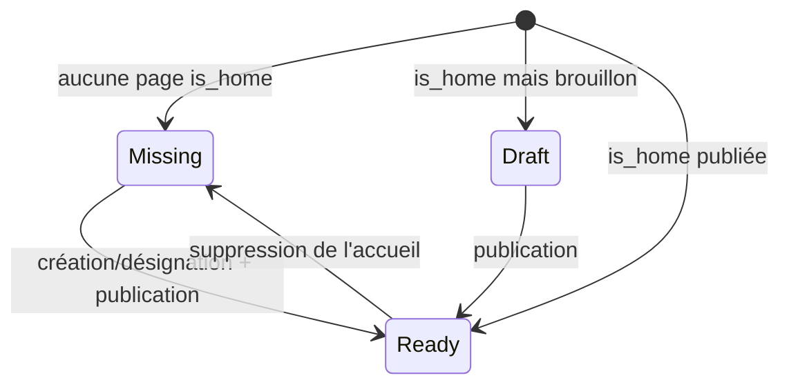

# Plan — ROADMAP Étape 10.1 : Démarrage de site & Onboarding public

## 0. Objectif

Rendre possible un **site réellement vierge** et supprimer les **données fantômes**
(seed) affichées alors qu'elles n'existent pas dans le Dashboard :

1. la BDD vide n'est **plus ré-amorcée automatiquement** ;
2. `/` n'affiche **plus** de contenu de démo inventé en mémoire ;
3. à la place, un écran public **`WelcomeOnboarding`** (200 + `noindex`) guide le
   visiteur vers la connexion et l'administrateur vers la configuration ;
4. la **page d'accueil** est désignée explicitement (`is_home`), ce qui **débloque
   le parcours « page blanche »** (aujourd'hui impossible : slug vide interdit) ;
5. le **seed reste disponible** en mode démo/secours, mais **uniquement quand la
   BDD est injoignable** (ou via un seed explicite en ligne de commande).

---

## 1. Principe directeur (la clé de la solidité)

> **Le seed n'est jamais un défaut implicite côté client. C'est un fallback
> serveur explicite, utilisé seulement si la BDD est injoignable.**

Aujourd'hui le seed est injecté à **4 endroits** (2 BDD + 3 mémoire) ; demain il
n'en reste qu'**un seul**, maîtrisé :

| Source actuelle | Emplacement | Devient |
| --- | --- | --- |
| Auto-seed BDD | [`loadInitialData`](../src/db/load-initial-data.ts:62) → `ensureTenantSeeded` | **Supprimé du chemin de lecture** (opt-in CLI/flag) |
| Fallback public | [`getPublicPage`](../src/lib/public-page.ts:167) (`seedPages`) | **Supprimé** quand la BDD répond |
| Défaut store Pages | [`PagesStoreProvider.createInitialState`](../src/components/backoffice/PagesStoreProvider.tsx:100) | **État vide** par défaut |
| Défaut store Navigation | [`navigation-store.ts:41`](../src/lib/navigation-store.ts:41) (`buildSeedNavigation()`) | **Navigation vide** par défaut |
| — | — | **Nouveau** : fallback seed centralisé dans `loadInitialData` **si `dbAvailable === false`** |

Conséquence : « vide » devient une valeur **explicite et déterministe** issue de la
BDD, et non plus un « absent ⇒ seed ». Aucun flag `site_mode` n'est nécessaire en
v1 (il n'aurait servi qu'à distinguer démo/vierge alors que la BDD répond).

---

## 2. Décisions d'architecture

### D-1 — Contrat du loader SSR (`loadInitialData`)
`SiteInitialData` devient explicite :
- **BDD joignable** (`dbAvailable: true`) : `pages` et `navigation` sont
  **toujours fournis**, même **vides** (`{ pages: [], modulesByPage: {} }` et
  `{ header: [], footer: [] }`) + `hasHomepage: boolean`.
- **BDD injoignable** (`dbAvailable: false`) : retourne le **seed explicite**
  (pages + navigation seed) → l'expérience démo actuelle est préservée.
- Ajout de `hasHomepage` (résolu via D-2) pour piloter l'UI et le chrome.

### D-2 — `is_home` : source de vérité de la page d'accueil (option la plus solide)
- Nouvelle colonne **`pages.is_home boolean NOT NULL DEFAULT false`**.
- **Un seul accueil par photographe** : index unique **partiel**
  `unique (photographer_id) where is_home` (déclaré en Drizzle si le `.where()`
  de `uniqueIndex` type-checke, sinon écrit en **SQL brut** dans la migration —
  même approche que les policies RLS de 0003/0004).
- **Backfill** : `UPDATE pages SET is_home = true WHERE slug = ''` (les accueils
  existants sont conservés tels quels).
- **Désignation transactionnelle** (`setHomePage`) :
  1. ancien accueil → `is_home = false` (+ slug renommé s'il était vide, ex.
     `accueil-ancien`, pour rester unique) ;
  2. nouvelle page → `is_home = true` **et `slug = ""`** (normalisation).
  → Compatibilité totale : le slug vide reste l'URL de l'accueil, **tout le code
  existant (`pageHref`, navigation, presets, seed) continue de fonctionner**.
- `getHomepageState()` retourne **3 états explicites** : `ready | draft | missing`
  (le simple `null` actuel confond « pas de page » et « page en brouillon » —
  corrige un bug latent : un accueil **brouillon** ne doit **pas** déclencher
  l'onboarding, mais un 404/« bientôt en ligne »).

### D-3 — `WelcomeOnboarding` (écran public `/`)
- **Server Component** (détection d'auth serveur via
  [`getCurrentPhotographerId`](../src/lib/supabase/session.ts:48), pas de provider client).
- Rendu **uniquement** si `getHomepageState() === "missing"`.
- **Deux variantes** :
  - *Visiteur non connecté* — titre « Site en cours de configuration » +
    explication + CTA **« Se connecter au Dashboard »** → **`/admin/login`**
    (la route est `/admin/login`, pas `/login`).
  - *Administrateur connecté* — titre « Bienvenue sur votre nouveau site ! » +
    explication pédagogique (pourquoi cet écran) + 2 options :
    - **Page blanche** → CTA vers `/admin/pages` ;
    - **Preset / Starter** → CTA vers `/admin/navigation` — avec une **copie
      exacte** : les presets sont **de navigation uniquement** (ils ne créent ni
      pages ni contenus ; cf. [`NAV_PRESETS`](../src/lib/navigation.ts:438)).
- **SEO/robustesse** : HTTP **200**, `robots: { index: false }`, route dynamique
  (pas de cache) pour que l'écran disparaisse dès la création de l'accueil.
- **Chrome** : quand `hasHomepage === false`, le layout front-office rend un
  **shell sans Header/Footer** (sinon une barre de nav vide paraîtrait cassée).
  Le layout charge déjà les données : il connaît l'état.

### D-4 — Débloquer « page blanche » (fin du blocage de slug)
- L'utilisateur crée une page **normale** (slug auto depuis le titre), puis
  clique **« Définir comme page d'accueil »** (D-5) → `is_home + slug ""`.
- Suppression du besoin de hack : plus de slug vide obligatoire pour être accueil.
- [`PageMetadataForm`](../src/components/backoffice/pages/PageMetadataForm.tsx:112)
  : la règle `slug vide interdit sauf isHome` devient obsolète (le slug vide
  n'est plus qu'un **résultat** de D-2) — assouplissement ciblé et documenté.

### D-5 — UI « Définir comme page d'accueil »
- Bouton/action dans la liste [`PagesManager`](../src/components/backoffice/pages/PagesManager.tsx:70)
  (+ éventuellement l'éditeur) ; badge **« Accueil »** sur la page concernée.
- Store : nouvelle action `setHomePage(id)` dans [`PagesStoreProvider`](../src/components/backoffice/PagesStoreProvider.tsx:108).
- API : **`POST /api/pages/[pageId]/home`** (transaction côté repository) +
  `persistSetHomePage(pageId)` dans [`persistence-client`](../src/lib/persistence-client.ts:102).

### D-6 — FK du tenant de démo
- `ensureTenantSeeded` garantissait la ligne `profiles` (ancre FK). En mode démo
  **sans auth**, appeler `ensurePhotographerProfile(photographerId, null)` à la
  demande (dans `loadInitialData` quand la BDD répond, ou dans le chemin
  d'écriture pages) **avant** toute insertion.

### D-7 — Seed : opt-in explicite, pas de magie
- `ensureTenantSeeded` **n'est plus appelé** par `loadInitialData`.
- Le seed reste disponible : `npm run db:seed` ([`seed.ts`](../src/db/seed.ts)) et,
  si souhaité, un flag `SEED_ON_EMPTY=true` (opt-in) pour les environnements de
  démonstration.
- **Filet de sécurité** : rien ne devient irréversible — `git revert` suffit, et
  le seed est toujours accessible manuellement.

### D-8 — Hors périmètre (v2, non nécessaires)
`site_mode` en BDD, « Danger zone » de reset in-app, starters qui créent
pages+modules, support `?redirect=` complet après login.

---

## 3. Migration 0005 (esquisse SQL)

```sql
-- Étape 10.1 — page d'accueil explicite
ALTER TABLE "pages" ADD COLUMN "is_home" boolean NOT NULL DEFAULT false;
--> statement-breakpoint
-- Backfill : les accueils existants (slug vide) deviennent is_home = true
UPDATE "pages" SET "is_home" = true WHERE "slug" = '';
--> statement-breakpoint
-- Un seul accueil par photographe (index partiel)
CREATE UNIQUE INDEX "pages_home_unique" ON "pages" ("photographer_id") WHERE "is_home";
```
> RLS : **inchangée** (`pages` possède déjà ses policies 0001). Aucune policy
> supplémentaire requise.

---

## 4. Fichiers impactés

**BDD / serveur**
- [`src/db/schema.ts`](../src/db/schema.ts) : colonne `isHome` (+ index partiel).
- `drizzle/0005_*.sql` (généré + édité, comme 0003/0004).
- [`src/db/repositories/pages.repository.ts`](../src/db/repositories/pages.repository.ts) : `isHome` en lecture, `setHomePage()` transactionnel, `getHomePage()`, `ensurePhotographerProfile` avant écriture.
- [`src/db/load-initial-data.ts`](../src/db/load-initial-data.ts) : contrat D-1 (`pages`/`navigation` toujours fournis si BDD OK, seed explicite si BDD down, `hasHomepage`).

**Domaine / client**
- [`src/lib/pages.ts`](../src/lib/pages.ts) : `SitePage.isHome`, helper `pageHrefFor(page)` (accueil → `/`).
- [`src/lib/public-page.ts`](../src/lib/public-page.ts) : `getHomepageState()` (`ready|draft|missing`), suppression du fallback seed quand la BDD répond.
- [`src/lib/persistence-client.ts`](../src/lib/persistence-client.ts) : `persistSetHomePage`.

**Stores**
- [`PagesStoreProvider`](../src/components/backoffice/PagesStoreProvider.tsx:100) : état initial **vide** (plus de seed implicite) + `setHomePage(id)`.
- [`navigation-store.ts`](../src/lib/navigation-store.ts:41) : snapshot par défaut **vide** (le seed arrive par `initialData` explicite).

**Routes / UI**
- [`src/app/(front-office)/page.tsx`](../src/app/(front-office)/page.tsx) : 3 états (rendu / onboarding / 404-brouillon).
- `src/components/onboarding/WelcomeOnboarding.tsx` (nouveau, serveur).
- [`src/app/(front-office)/layout.tsx`](../src/app/(front-office)/layout.tsx) : shell sans chrome si `!hasHomepage`.
- [`PagesManager`](../src/components/backoffice/pages/PagesManager.tsx:70) : badge « Accueil » + action ; `PageMetadataForm` assoupli.
- `src/app/api/pages/[pageId]/home/route.ts` (nouveau).

**Non modifié** : Header/Footer (hors condition de chrome), modules, média, profil, identité visuelle, `/demo` (autonome).

---

## 5. Étapes d'implémentation (ordre)

1. **Schéma + migration 0005** (`isHome`, index partiel, backfill) → `db:generate` → édition → `db:migrate`.
2. **Repository** : mapping `isHome`, `getHomePage`, `setHomePage` (transaction), `ensurePhotographerProfile` avant écriture.
3. **Domaine** : `SitePage.isHome`, `pageHrefFor`, `getHomepageState` (`ready|draft|missing`) et retrait du fallback seed de `getPublicPage`.
4. **Loader** : contrat D-1 (toujours `pages`/`navigation` si BDD OK ; seed explicite si BDD down ; `hasHomepage`).
5. **Stores** : défauts **vides** (Pages + Navigation) ; `setHomePage(id)` + `persistSetHomePage`.
6. **API** `POST /api/pages/[pageId]/home`.
7. **UI Pages** : badge + action « Définir comme page d'accueil » ; assouplissement du formulaire.
8. **`WelcomeOnboarding`** + intégration `/` (3 états) + **shell sans chrome** si pas d'accueil.
9. **Validation** : `tsc`, `eslint`, `build` + scénarios du §7 + CHANGELOG.

---

## 6. Risques & mitigations

| Risque | Mitigation |
| --- | --- |
| Flash visuel en **mode démo** (store vide → hydratation seed) | Uniquement si la BDD est injoignable ; assumé et documenté (le produit cible = BDD) |
| Violation FK à la 1ʳᵉ création (démo sans auth) | `ensurePhotographerProfile` à la demande (D-6) |
| Deux accueils / collision de slug lors de la désignation | Transaction + index unique partiel + renommage de l'ancien accueil |
| Un accueil **brouillon** déclenche l'onboarding à tort | 3 états explicites (`draft` ≠ `missing`) — D-2 |
| Perte de l'expérience démo | Seed conservé (flag/CLI) et rendu si BDD down |
| Régression navigation/presets | Le slug vide reste l'URL de l'accueil → `pageHref` inchangé |

---

## 7. Critères d'acceptation (DoD) & vérifications



1. Supprimer **toutes** les pages → `F5` sur `/` → **aucune** recréation en BDD.
2. `/` affiche `WelcomeOnboarding` (ni seed, ni 404, ni crash) ; **menu vide**.
3. **Anon** : CTA de connexion visible et fonctionnel (**`/admin/login`**).
4. **Admin** : liens `/admin/pages` et `/admin/navigation` fonctionnels, explication claire.
5. Créer une page en mode « vierge » **sans erreur FK** ; la **désigner accueil** ;
   la **publier** → `/` la sert **immédiatement**.
6. Accueil existant mais **brouillon** → 404/« bientôt », **pas** d'onboarding.
7. `npm run db:seed` restaure un site de démonstration complet (opt-in).
8. `tsc --noEmit` / `eslint` / `npm run build` verts ; `CHANGELOG.md` à jour.

---

## Amendement 10.1.a — Liens de navigation orphelins (site vierge)

### Constat (diagnostic)
[`PagesNavigationSync`](../src/components/backoffice/navigation/PagesNavigationSync.tsx:123)
supprime déjà les entrées **liées à une page** (points 3 & 4) — et la FK
`navigation_entries.page_id → pages.id ON DELETE CASCADE` nettoie la BDD. Mais les
entrées **`custom` (`pageId === null`)** — ancres du seed
(`/portfolio#mariages`…), placeholders de presets (`/series`, `/galeries`),
liens manuels — **ne sont jamais nettoyées**, ni en mémoire ni en BDD. D'où des
liens résiduels visibles dans `/admin/navigation` **et** dans le Header (même sur
l'écran d'onboarding).

### D-10.1.a.1 — Helper de détection (domaine pur)
Dans [`src/lib/navigation.ts`](../src/lib/navigation.ts) (ou `nav-orphans.ts`) :
```ts
/** Slug interne ciblé par un href : "/portfolio#mariages" → "portfolio" ; "/" → "" ;
 *  "#ancre" ou "https://…" → null (jamais orphelin). */
export function internalHrefSlug(href: string): string | null;

/** Vrai si l'entrée pointe vers une page interne inexistante. */
export function isOrphanNavEntry(
  entry: NavMenuEntry,
  slugs: ReadonlySet<string>
): boolean;
```

### D-10.1.a.2 — Purge serveur (au chargement, **uniquement si 0 page**)
- [`pages.repository.ts`](../src/db/repositories/pages.repository.ts) : nouveau
  `listPageSlugs(photographerId): Promise<string[]>` (select léger).
- [`navigation.repository.ts`](../src/db/repositories/navigation.repository.ts) :
  nouveau `pruneOrphanNavigation(photographerId)` → `getNavigation()` + filtre
  récursif (Header racine/enfants + Footer) puis `saveNavigation()` **si** des
  entrées ont été retirées.
- [`load-initial-data.ts`](../src/db/load-initial-data.ts) : appeler la purge
  **si et seulement si** `pages.length === 0` (cas « site vierge »), avant de
  retourner la navigation — évite toute suppression abusive de placeholders
  volontaires quand le site contient des pages.

### D-10.1.a.3 — Nettoyage client immédiat
[`PagesNavigationSync`](../src/components/backoffice/navigation/PagesNavigationSync.tsx:74) :
étape 5 (après les points 3 & 4) — pour `[...headerEntries, ...footer]`,
`removeEntry()` si `isOrphanNavEntry(entry, new Set(pages.map(p => p.slug)))`
(les liens **externes** et les **ancres locales** sont conservés).

### D-10.1.a.4 — Bouton « Vider la navigation »
- [`NavigationStoreProvider`](../src/components/backoffice/navigation/NavigationStoreProvider.tsx:217) :
  action `clearNavigation(area: NavArea | "all")` → `setNavigationState` avec
  Header/Footer vidés (`appliedPresetId: null`) ; la persistance débouncée du
  Provider envoie déjà `PUT /api/navigation` (`saveNavigation` remplace tout).
- [`NavigationManager`](../src/components/backoffice/navigation/NavigationManager.tsx) :
  carte **« Zone de réinitialisation »** + `Dialog` de confirmation
  (« Cette action supprime toutes les entrées du menu — irréversible ») →
  `clearNavigation("all")`.

### D-10.1.a.5 — Onboarding **sans chrome**
[`(front-office)/layout.tsx`](../src/app/(front-office)/layout.tsx:41) :
```ts
const isEmptySite =
  initial.dbAvailable &&
  initial.hasHomepage === false &&
  (initial.pages?.pages.length ?? 0) === 0;
```
Si `isEmptySite` → rendre `{children}` **sans** `Header`/`Footer` (et sans
`NavigationStoreProvider`) : l'écran d'onboarding est autonome, aucune barre de
nav vide/résiduelle n'apparaît.

### D-10.1.a.6 — Lisibilité des « liens morts » (informatif, non destructif)
Dans `/admin/navigation`, badge **« Lien mort »** sur une entrée `custom` dont
`isOrphanNavEntry()` est vrai quand le site **a** des pages → l'utilisateur
décide (corriger ou vider), sans suppression automatique.

### D-10.1.a.7 — Fichiers & étapes d'implémentation
1. Helper `internalHrefSlug` / `isOrphanNavEntry` ([`navigation.ts`](../src/lib/navigation.ts)).
2. `listPageSlugs` ([`pages.repository.ts`](../src/db/repositories/pages.repository.ts)) + `pruneOrphanNavigation` ([`navigation.repository.ts`](../src/db/repositories/navigation.repository.ts)).
3. Appel conditionnel dans [`load-initial-data.ts`](../src/db/load-initial-data.ts) (0 page).
4. Étape 5 dans [`PagesNavigationSync`](../src/components/backoffice/navigation/PagesNavigationSync.tsx).
5. `clearNavigation` (Provider) + carte de réinitialisation ([`NavigationManager`](../src/components/backoffice/navigation/NavigationManager.tsx)).
6. `isEmptySite` → layout sans chrome ([`(front-office)/layout.tsx`](../src/app/(front-office)/layout.tsx)).
7. Badge « Lien mort » (facultatif v1.1).
8. `tsc` / `eslint` / `build` + CHANGELOG.

### D-10.1.a.8 — Acceptation
- Supprimer toutes les pages → **menu Navigation vide** (admin), **aucune barre
  de nav** au chargement de `/`, `F5` → état stable (BDD nettoyée).
- « Vider la navigation » → Header/Footer vides, persistés après `F5`.
- Liens **externes** et **ancres locales** préservés ; placeholders d'un site
  **avec** pages non supprimés (badge informatif à la place).
- Aucune migration BDD (réutilise `saveNavigation`).
