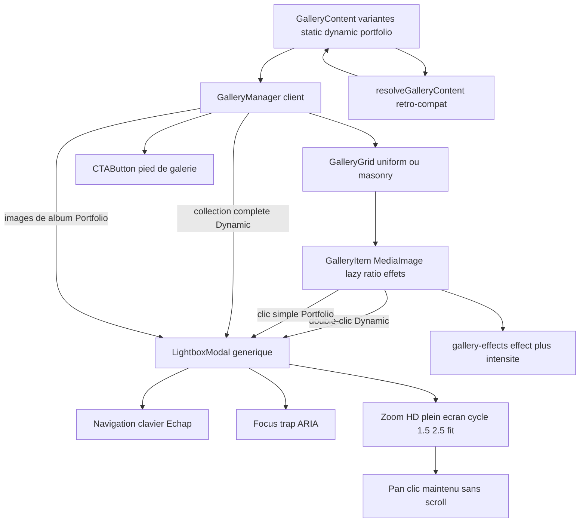

# Plan — ROADMAP Phase 11 : Rubrique « Galeries & Portfolio »

> Trois modules de galerie réutilisables, paramétrables et responsives, hérités du
> module existant « Galerie photo masonry », avec effets de finition communs,
> CTA de pied de galerie et une **Lightbox générique unique** (`LightboxModal`).

---

## Objectif

Livrer la rubrique « Galeries & Portfolio » sous forme d'une **famille à variantes**
`type: "gallery"` (pattern éprouvé de la rubrique Héro, Étapes 7.x) :

1. **Gallery Static** — décor / mosaïque fixe, aucune interactivité de clic ;
2. **Gallery Dynamic** — grille interactive, **double-clic** → diaporama unique
   contenant **toutes** les images de la galerie, ouvert sur l'image cliquée ;
3. **Gallery Portfolio** — couvertures thématiques, **clic simple** → diaporama
   **exclusif à l'album** de la thématique.

Fonctionnalités communes : animation d'entrée, animation au survol, colonnes,
écarts H/V, arrondi, import multiple + dossier complet non compressé, ombre
(light/medium/normal/strong), radius, bordure (épaisseur + couleur), CTA de pied
paramétrable, et **3 effets de finition exclusifs** (Passe-partout de Musée,
Sous-Verre, Polaroid papier glacé) déclinés en light/normal/strong.

Héritage direct : calcul **Masonry** (colonnes CSS + hauteurs naturelles), import
média et gestion de grille du composant existant
[`GalleryGrid.tsx`](../src/components/modules/GalleryGrid.tsx).

---

## Arbitrages validés (à l'entrée du plan)

| Sujet | Décision validée |
| --- | --- |
| **Modèle** | **Option B** : 3 variantes de la famille `gallery` (`static` / `dynamic` / `portfolio`), **sans migration BDD** (`module_type` reste `gallery`), la carte legacy « Galerie photo masonry » est **remplacée** ; un contenu `gallery` sans `variant` bascule automatiquement vers `static` (resolveur). |
| **Effets de finition** | **Exclusifs** : un seul actif à la fois (Aucun / Passe-partout / Sous-Verre / Polaroid), chacun avec intensité `light` / `normal` / `strong` + panneau de paramétrage contextuel. Ombre, radius et bordure restent **indépendants et cumulables**. |
| **Albums Portfolio** | **Option A** : structure imbriquée dans le JSONB `albums: [{ id, label, coverImageId, images }]`. Un dossier importé = un album ; label, cover et ordre éditables ; lightbox exclusive à l'album ; badge = label + nombre de photos. Aucune migration. |
| **Cycle de zoom** | `Niveau 1 = 1,5×` → `Niveau 2 = 2,5×` → `3e double-clic = fit (100 %)`. Déplacement au **clic maintenu** (pointer events), scroll neutralisé en mode zoomé, déplacement borné. |
| **CTA** | Mêmes « conditions habituelles » que la rubrique Héro : rendu si `cta.show && cta.label && cta.href` non vides ; styles `primary` / `secondary` / `outline`. |

---

## 0. Décisions d'architecture

### D-1 — Domaine : famille `gallery` à variantes (aucune migration BDD)
- `module_type` est un `pgEnum` figé (`hero`, `about`, `services`, `cta-banner`,
  `gallery`, `faq`, `contact`) → ajouter des types exigerait une migration ; les
  variantes héritées dans le **JSONB** l'évitent totalement.
- Le contenu galerie devient une **union discriminée par `variant`**, comme
  `HeroContent`.
- **Collision de nommage à lever** : `GalleryVariant` désigne aujourd'hui le
  **mode d'affichage** (`uniform` / `masonry`). Renommage en
  `GalleryDisplayMode` + champ `layout.display`, avec **lecture rétro-compatible**
  de l'ancien `layout.variant` dans le resolveur JSONB.

```ts
/** Variantes de la rubrique galerie (famille `gallery`). */
export type GalleryModuleVariant = "static" | "dynamic" | "portfolio";

/** Mode d'affichage de la grille (anciennement GalleryVariant). */
export type GalleryDisplayMode = "uniform" | "masonry";

/** Effets de finition exclusifs. */
export type GalleryEffectId = "none" | "museum-pass" | "glass" | "polaroid";
export type GalleryEffectIntensity = "light" | "normal" | "strong";

/** Ombre : aucun + 4 niveaux du cahier des charges. */
export type GalleryShadowLevel = "none" | "light" | "medium" | "normal" | "strong";

export interface GalleryBorderSettings {
  enabled: boolean;
  width: number;   // px
  color: string;   // hex
}

export interface GalleryCtaSettings {
  show: boolean;
  label: string;
  href: string;
  style: "primary" | "secondary" | "outline";
}

export interface GalleryLightboxSettings {
  /** Zoom HD + cycle de zoom au double-clic (dynamic/portfolio). */
  zoomEnabled: boolean;
  zoomLevel1: number;   // 1.5 par défaut
  zoomLevel2: number;   // 2.5 par défaut
  showExif: boolean;
  /** Légendes (titre/description) dans la Lightbox uniquement. */
  showCaption: boolean;
}

/** Paramétrage contextuel de l'effet de finition sélectionné. */
export interface GalleryEffectSettings {
  effect: GalleryEffectId;
  intensity: GalleryEffectIntensity;
  /** Passe-partout : couleur de la marge + biseau interne. */
  matColor: string;
  matBevel: boolean;
  /** Sous-Verre : flou (px) + teinte du voile. */
  glassBlur: number;
  glassTint: string;
  /** Polaroid : légende de la bande blanche + rotation légère. */
  polaroidCaptionShow: boolean;
  polaroidRotation: boolean;
}

export interface GalleryLayoutOptions {
  display: GalleryDisplayMode;      // ex-`variant` (lecture legacy `variant`)
  columns: number;
  gapHorizontal: number;
  gapVertical: number;
  radius: number;
  shadow: GalleryShadowLevel;       // défaut "normal" sur les 3 variantes
  border: GalleryBorderSettings;
  hoverAnimation: GalleryHoverAnimation;
  /** Voile dégradé sombre au survol — false par défaut sur la Dynamic. */
  hoverOverlay: boolean;
}

/** Socle commun des 3 variantes de galerie. */
export interface GalleryBaseShared {
  heading: string;
  subheading: string;
  layout: GalleryLayoutOptions;
  effect: GalleryEffectSettings;
  cta: GalleryCtaSettings;
  lightbox: GalleryLightboxSettings;
}

export interface GalleryStaticContent extends GalleryBaseShared {
  variant: "static";
  images: GalleryImage[];
}

export interface GalleryDynamicContent extends GalleryBaseShared {
  variant: "dynamic";
  images: GalleryImage[];
}

export interface GalleryAlbum {
  id: string;
  label: string;               // ex. Mariage, Portrait, Corporate, Paysage
  description: string;
  coverImageId: string | null; // id d'image dans `images`
  images: GalleryImage[];
}

export interface GalleryPortfolioContent extends GalleryBaseShared {
  variant: "portfolio";
  albums: GalleryAlbum[];
}

export type GalleryContent =
  | GalleryStaticContent
  | GalleryDynamicContent
  | GalleryPortfolioContent;

/** Branche galerie de ModuleContent (discriminé par `type`). */
// | ({ type: "gallery" } & GalleryContent)
```

### D-2 — Défauts par variante (comportements imposés par le cahier des charges)

| Réglage | Static | Dynamic | Portfolio |
| --- | --- | --- | --- |
| `layout.shadow` | `normal` (activé) | `normal` (activé) | `normal` (activé) |
| `layout.hoverAnimation` | `none` (désactivée) | `active` | `active` |
| `layout.hoverOverlay` (voile sombre) | `false` | **`false`** (aucun titre/légende au survol) | `false` |
| Interaction | aucune (`cursor: default` / `pointer-events: none` sur les médias) | **double-clic** → diaporama complet | **clic simple** sur cover → album |
| `lightbox.zoomEnabled` | `false` | `true` | `true` |
| Badges thème + nb photos | n/a | n/a | activés par défaut (visibilité/style/position paramétrables) |

### D-3 — Résolution JSONB rétro-compatible
`resolveGalleryContent(raw: unknown): GalleryContent` (même approche que
`resolveHeroStaticContent`) :
- absence de `variant` → **`static`** (legacy « Galerie photo masonry ») ;
- `layout.variant` (ancien) → `layout.display` ;
- `clickable` legacy → dérivé du variant (`static` → false) ;
- fusion des défauts manquants, copie profonde des albums (aucune référence partagée) ;
- tolérance totale : jamais de throw, jamais de `any`.

### D-4 — Unicité de la Lightbox
**Un seul** composant `LightboxModal` partagé par **Dynamic** et **Portfolio**.
Il reçoit la collection à afficher (`images`) et l'index initial : la Dynamic lui
passe **toutes** les images de la galerie, la Portfolio lui passe **uniquement**
les images de l'album cliqué. Aucune duplication de la logique diaporama.

### D-5 — Responsivité complète (grille + typographie)
- Les **colonnes configurées** correspondent au desktop ; dégradation automatique :
  `≤1024 px → min(cols, 3)` ; `≤640 px → min(cols, 2)` ; `≤400 px → 1`.
  Implémentation via variables CSS `--gallery-columns` recalculées par media queries.
- **Typographie fluide** via `clamp()` (titre de section, légendes, badges) — la
  taille des polices reste lisible de < 350 px à 4K.
- `prefers-reduced-motion` : animations d'entrée / survol désactivées.

### D-6 — Anti-CLS et performance
- `MediaImage` (existant) : `sizes` adaptatifs, `priority` sur la 1re image,
  `blurDataURL` si disponible.
- Ratio réservé par `aspect-ratio` (dimensions naturelles `width`/`height` connues
  à l'upload, sinon ratio mesuré) → **aucun saut de mise en page**.
- Effets rendus en **CSS uniquement** (transform/opacity/box-shadow/backdrop-filter),
  aucun JS par frame. Pas d'animation coûteuse au-dessus du fold.

---

## 1. Inventaire des composants

### 1.1 Public — `src/components/modules/gallery/`
- **`GalleryManager.tsx`** (client) — orchestrateur unique : choisit le rendu
  selon `variant`, détient l'état Lightbox (collection + index) et les handlers
  (double-clic Dynamic / clic Portfolio). Point d'entrée du renderer public.
- **`GalleryGrid.tsx`** — calcul de grille **extrait de l'existant** (uniform vs
  masonry CSS columns, colonnes, écarts, responsive) ; rend les `GalleryItem`.
- **`GalleryItem.tsx`** — vignette : `MediaImage` lazy + ratio réservé + effets
  (passe-partout / sous-verre / polaroid), ombre, bordure, radius, hover,
  overlay/badge, curseur et interactions selon la variante.
- **`GalleryAlbumBadge.tsx`** — badge surimpression « nom du thème + nombre de
  photos » (visibilité, style, position paramétrables).
- **`LightboxModal.tsx`** — **Lightbox générique unique** (voir §2).
- **`CTAButton.tsx`** — CTA de pied de galerie réutilisable (`Button` shadcn).

### 1.2 Helpers partagés
- **`src/lib/gallery-effects.ts`** — mapping pur `effet + intensité → CSSProperties`
  (styles Passe-partout / Sous-Verre / Polaroid repris de l'exemple HTML fourni),
  classes d'ombre et de bordure. Aucune dépendance UI, testable.
- **`src/lib/pages.ts`** — types, libellés/ordres (effets, intensités, ombres),
  fabriques (`createGalleryStaticContent`, `…DynamicContent`, `…PortfolioContent`),
  `resolveGalleryContent`, `galleryImageSources`, catalogue.

### 1.3 Back-Office — `src/components/backoffice/pages/modules/gallery/`
- **`ImportMediaPanel.tsx`** — **extraction** de l'UI d'import existante
  (multiple + dossier complet non compressé, filtres MIME, 15 Mo max, barre de
  progression, synthèse d'erreurs). Réutilisé par les 3 éditeurs.
- **`EffectSettingsPanel.tsx`** — sélecteur d'effet + intensité + menu contextuel
  (paramètres passe-partout / sous-verre / polaroid) + ombre / radius / bordure.
- **`GalleryLayoutPanel.tsx`** — display (uniform/masonry), colonnes, écarts,
  radius, animation au survol, voile au survol (masqué pour Dynamic).
- **`GalleryCtaPanel.tsx`** — `show` / label / href / style (conditions habituelles).
- **`LightboxSettingsPanel.tsx`** — zoom HD, niveaux de zoom, EXIF, légendes.
- **`AlbumManagerPanel.tsx`** (portfolio) — création/renommage/suppression
  d'albums, choix de la cover, ordre, import par album (via `ImportMediaPanel`).
- **`ModuleGalleryEditor.tsx`** — routeur par `variant` vers les panneaux communs
  + panneaux spécifiques (`ModuleGalleryStaticEditor`, `…DynamicEditor`,
  `…PortfolioEditor` ou sections conditionnelles d'un même formulaire).

---

## 2. `LightboxModal` — spécifications détaillées

- **Props** : `images: GalleryImage[]`, `initialIndex: number`, `open: boolean`,
  `onClose: () => void`, `exifByUrl?`, `settings: GalleryLightboxSettings`,
  `title?: string` (ex. nom du thème).
- **Navigation** : boutons Précédent / Suivant + flèches `←`/`→` ; compteur
  `n / total`.
- **Fermeture** : touche `Échap`, bouton X, clic sur l'arrière-plan.
- **Interactions** : bouton **Zoom HD** (bascule fit ↔ dernier niveau de zoom) et
  bouton **Plein écran** (Fullscreen API, avec repli si indisponible).
- **Cycle de zoom (double-clic)** : `fit` → `1,5×` → `2,5×` → `fit`. Le changement
  d'image réinitialise le zoom.
- **Déplacement (pan) en mode zoomé** : `pointerdown` + `setPointerCapture`,
  `pointermove`, `pointerup` — la photo suit le curseur (`translate`), **jamais de
  scroll**, `touch-action: none` quand zoomé, `preventDefault` sur `wheel`,
  déplacement **borné** aux limites de l'image. Curseur `grab` / `grabbing`.
- **Accessibilité** : `role="dialog"`, `aria-modal="true"`, `aria-label`,
  **focus trap** (Tab/Shift+Tab cycliques), focus initial sur le bouton Fermer,
  **restauration du focus** à la fermeture, `aria-live` pour le compteur,
  verrouillage du scroll de page (`overflow: hidden` sur `body`).
- **Médias** : `MediaImage` (lazy, `sizes="100vw"`), ratio réservé, EXIF optionnels.

---

## 3. Impacts sur l'existant (fichiers touchés)

**Domaine / schémas**
- [`src/lib/pages.ts`](../src/lib/pages.ts) : nouveaux types galerie, renommage
  `GalleryVariant` → `GalleryDisplayMode`, `GalleryLayoutOptions` enrichi,
  fabriques, `resolveGalleryContent`, catalogue (3 cartes au lieu d'une),
  `createModuleContent("gallery", variant)`, généralisation de
  `ModuleCatalogEntry.variant` (`HeroVariant` → union des variantes de modules).
- [`src/lib/schemas/persistence.ts`](../src/lib/schemas/persistence.ts) : ajout de
  `galleryContentSchema` (union discriminée `static` / `dynamic` / `portfolio`),
  miroir du domaine, à l'image de `heroContentSchema`.
- [`src/lib/public-page.ts`](../src/lib/public-page.ts) : collecte des images
  galerie pour SEO/OG à adapter au nouveau contenu (albums inclus).

**Rendu public**
- [`src/components/modules/PublicModules.tsx`](../src/components/modules/PublicModules.tsx) :
  la branche `gallery` délègue à `GalleryManager` (client) au lieu de `GalleryGrid`.
- [`src/components/modules/GalleryGrid.tsx`](../src/components/modules/GalleryGrid.tsx) :
  **démantelé** — la logique Masonry/grille migre vers
  `src/components/modules/gallery/GalleryGrid.tsx`, la Lightbox vers
  `LightboxModal` (plus de Lightbox inline).
- [`src/components/common/MediaImage.tsx`](../src/components/common/MediaImage.tsx) :
  réutilisé tel quel (aucun changement attendu).

**Back-Office**
- [`ModuleContentEditor.tsx`](../src/components/backoffice/pages/modules/ModuleContentEditor.tsx) :
  aiguillage `gallery` par `variant`.
- [`ModuleSettingsForm.tsx`](../src/components/backoffice/pages/modules/ModuleSettingsForm.tsx) :
  réglages d'animation au survol adaptés à la nouvelle structure
  (`layout.hoverAnimation`).
- [`ModuleGalleryEditor.tsx`](../src/components/backoffice/pages/modules/ModuleGalleryEditor.tsx) :
  refonte en routeur de variantes + panneaux (import extrait).
- [`AddSectionSheet.tsx`](../src/components/backoffice/pages/AddSectionSheet.tsx) et
  [`ModuleIcon.tsx`](../src/components/backoffice/pages/ModuleIcon.tsx) : gèrent
  déjà `entry.variant` / l'icône par type — vérifier l'affichage des 3 cartes.

**Démo & suivi**
- [`src/app/(front-office)/demo/page.tsx`](../src/app/(front-office)/demo/page.tsx) :
  montage des 3 galeries (static, dynamic, portfolio avec albums) pour la
  validation visuelle.
- [`ROADMAP.md`](../ROADMAP.md) : nouvelle **Phase 11** (la feuille de route
  s'arrête actuellement à l'Étape 6.3 et doit être complétée).
- [`CHANGELOG.md`](../CHANGELOG.md) : résumé de la sous-tâche validée.

**Non modifié**
- Enum BDD `module_type`, [`src/db/schema.ts`](../src/db/schema.ts),
  [`pages.repository.ts`](../src/db/repositories/pages.repository.ts) (le contenu
  galerie reste du JSONB) ; aucune route API nouvelle.

---

## 4. Découpage en sous-étapes (ordre d'exécution)

- **11.1 — Domaine & persistance** : types (`GalleryContent`, effets, ombre,
  bordure, CTA, Lightbox, albums), renommage display, fabriques par variante,
  `resolveGalleryContent` (rétro-compat.), catalogue 3 cartes, généralisation
  `ModuleCatalogEntry.variant`, `galleryContentSchema` (Zod).
- **11.2 — Effets & briques visuelles** : `src/lib/gallery-effects.ts` (mapping
  effet+intensité → styles, repris de l'exemple HTML fourni), ombre, bordure,
  radius ; `CTAButton.tsx`.
- **11.3 — Grille & vignettes** : `GalleryGrid` (migration Masonry depuis
  l'existant + responsive colonnes), `GalleryItem` (effets, hover, overlay,
  curseurs, ratio anti-CLS), `GalleryAlbumBadge`.
- **11.4 — `LightboxModal` générique** : navigation clavier, focus trap, ARIA,
  Échap, zoom HD, plein écran, cycle de zoom 1,5×/2,5×/fit, pan au clic maintenu
  sans scroll.
- **11.5 — `GalleryManager` & variantes** : orchestration static / dynamic /
  portfolio, états et handlers, branchement dans `PublicModules.tsx`.
- **11.6 — Éditeurs Back-Office** : `ImportMediaPanel` (extraction),
  `EffectSettingsPanel`, `GalleryLayoutPanel`, `GalleryCtaPanel`,
  `LightboxSettingsPanel`, `AlbumManagerPanel`, routeur `ModuleGalleryEditor` +
  aiguillage `ModuleContentEditor`.
- **11.7 — Démo & validation** : `/demo` (3 galeries), contrôle visuel
  mobile / tablette / desktop, `npx tsc --noEmit`, `npx eslint src`,
  `npm run build`.
- **11.8 — Suivi** : `ROADMAP.md` (Phase 11) et `CHANGELOG.md`.

---

## 5. Diagramme d'architecture



---

## 6. Critères d'acceptation

- **Stabilité de la grille** : uniform et masonry sans saut de mise en page
  (ratio réservé) ; colonnes et écarts respectés de < 350 px à très grand écran.
- **Unicité de la Lightbox** : un seul `LightboxModal` partagé Dynamic + Portfolio,
  aucune duplication.
- **Activation indépendante des effets** : effets de finition exclusifs
  (light/normal/strong) + ombre/radius/bordure cumulables.
- **Cycle de zoom** : fit → 1,5× → 2,5× → fit au double-clic ; **pan au clic
  maintenu**, sans scroll, borné.
- **Dynamic** : aucun titre/légende ni voile dégradé au survol ; double-clic →
  diaporama complet ouvert sur l'image cliquée.
- **Portfolio** : clic simple sur cover → diaporama **exclusif à l'album** ;
  badge thème + nombre de photos paramétrable (visibilité, style, position).
- **Static** : aucune interactivité (pas de zoom, pas d'ouverture), curseur
  standard / `pointer-events: none` sur les médias.
- **Import** : sélection multiple **et** dossier complet non compressé, sur les 3
  variantes (et par album en Portfolio).
- **CTA** : affiché uniquement selon les conditions habituelles (show + label + href).
- **Responsivité** : mobile / tablette / desktop, **taille des polices comprise**.
- **Qualité** : `tsc --noEmit`, `eslint`, `next build` sans erreur ; aucune
  migration BDD ; `prefers-reduced-motion` respecté.
