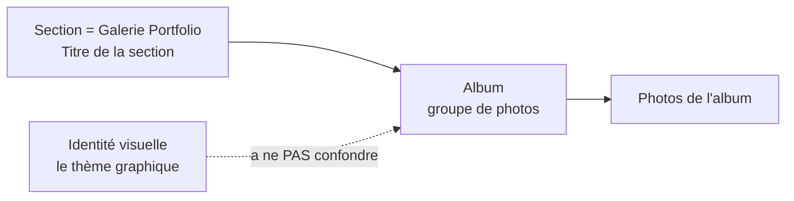
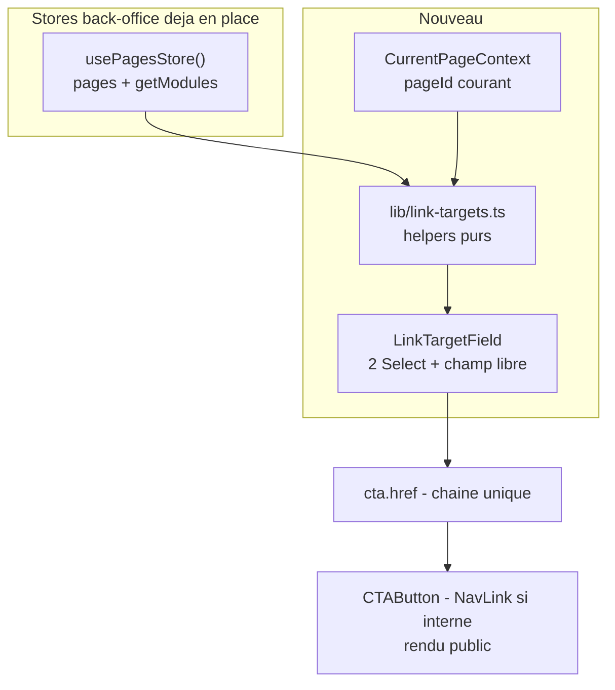

# ROADMAP — Étape 11.16 : UX « Galeries & Portfolio » — vocabulaire « Album » et sélecteur de lien du CTA

> **Statut** : PLANIFIÉ
> **Périmètre** : Back-Office (libellés + champ de lien) et rendu public du CTA de galerie.
> **Aucune migration BDD** : aucune clé persistée n'est renommée.
> **Aucun impact SEO public** : le site public n'affiche jamais le mot « thématique »
> (uniquement `album.label`, ex. « Mariage »).

---

## 0. Contexte et objectif

Deux demandes d'optimisation UX, regroupées en deux lots indépendants :

- **Lot A — Vocabulaire « Album ».** Les libellés du panneau Portfolio emploient
  « thématique » / « thème », alors que tout le code, le schéma zod, les specs
  (`plans/ROADMAP-11.1-galleries-portfolio.md`) et le CHANGELOG parlent déjà
  d'**album** (`GalleryAlbum`, `AlbumManagerPanel`, `GalleryAlbumBadge`,
  `createGalleryAlbum`, `galleryAlbumSchema`). L'UI contredit le code.
  Aggravant : « thème » est **déjà réservé à l'identité visuelle** du site
  (`moduleAnimationLabels.default` = « Par défaut du thème », `heroTextTone`,
  écran `VisualIdentityScreen`). Un utilisateur peut croire qu'on lui demande de
  nommer le thème graphique du site.
  **Décision** : adopter « Album » partout dans l'UI.

- **Lot B — Sélecteur de lien du CTA.** Sous le libellé « Lien du bouton »
  (`GalleryCtaPanel`), remplacer la saisie libre d'URL par **deux menus
  déroulants** — pages du site, puis sections (ancres) — avec un **champ libre
  conservé** pour les liens externes. Objectif : un utilisateur non technique ne
  doit plus avoir à connaître un slug ni un identifiant d'ancre généré
  (`hero-1`, `gallery-2`…).

Corrections actées lors de la phase d'analyse :

| Demande initiale | Correction retenue |
|---|---|
| `THEMATIQUE 1` → `Galerie de photos thématique 1` | → **`Album 1`** (plus court, aligné sur le code) |
| `Photos de la thématique` → `Photos de la galerie thématique` | → **`Photos de l'album (n)`** |
| 2 menus déroulants seuls | 2 menus **+ un champ libre conservé** (sinon régression : les URL externes `https://`, `mailto:`, `tel:` deviendraient impossibles) |

---

## 1. Lot A — Vocabulaire « Album » (risque nul)

### 1.1 Table de renommage

| # | Fichier | Ligne | Texte actuel | Texte cible |
|---|---|---|---|---|
| 1 | [`AlbumManagerPanel.tsx`](../src/components/backoffice/pages/modules/gallery/AlbumManagerPanel.tsx) | 146 | `Thématique {albumIndex + 1}` | `Album {albumIndex + 1}` |
| 2 | idem | 225 | `` `Photos de la thématique (${album.images.length})` `` | `` `Photos de l'album (${album.images.length})` `` |
| 3 | idem | 81 | `Thématiques ({albums.length})` | `Albums de la galerie ({albums.length})` |
| 4 | idem | 85 | `Ajouter une thématique` | `Ajouter un album` |
| 5 | idem | 92 | `Badge de thématique` | **`Affichage sur les couvertures`** (+ infobulle) — voir §7 (D-12) |
| 6 | idem | 96 | `Afficher le nom du thème` | `Afficher le nom de l'album` |
| 7 | idem | 186 | `Nom du thème` | `Nom de l'album` |
| 8 | idem | 216 | `Description du thème` | `Description de l'album` |
| 9 | idem | 156, 167, 177 | `aria-label` : « Monter / Descendre / Supprimer la thématique » | « … l'album » |
| 10 | idem | 129-132 | « Aucune thématique. Cliquez sur « Ajouter une thématique »… » | « Aucun album. Cliquez sur « Ajouter un album »… » |
| 11 | idem | 74 | `createGalleryAlbum("Nouvelle thématique")` | `createGalleryAlbum("Nouvel album")` |
| 12 | [`pages.ts`](../src/lib/pages.ts) | 1800 | `readString(record.label, "Thématique")` | `readString(record.label, "Album")` |
| 13 | [`demo/page.tsx`](../src/app/(front-office)/demo/page.tsx) | 162 | `"Gallery Portfolio — albums thématiques"` | `"Gallery Portfolio — albums"` |
| 14 | [`pages.ts`](../src/lib/pages.ts) | 1286, 1294, 1298, 1356, 1372, 1375, 1383, 1539, 1733 | JSDoc « badge de thématique », « nom du thème », « albums thématiques » | « badge d'album », « nom de l'album », « albums » |
| 15 | [`GalleryAlbumBadge.tsx`](../src/components/modules/gallery/GalleryAlbumBadge.tsx) | 8 | JSDoc « nom du thème » | « nom de l'album » |
| 16 | [`LightboxModal.tsx`](../src/components/modules/gallery/LightboxModal.tsx) | 48 | JSDoc « nom de la thématique » | « nom de l'album » |
| 17 | [`GalleryItem.tsx`](../src/components/modules/gallery/GalleryItem.tsx) | 55 | JSDoc « Badge de thématique » | « Badge d'album » |
| 18 | [`GalleryGrid.tsx`](../src/components/modules/gallery/GalleryGrid.tsx) | 33 | JSDoc « Badge de thématique » | « Badge d'album » |
| 19 | [`GalleryManager.tsx`](../src/components/modules/gallery/GalleryManager.tsx) | 26-27 | JSDoc « badge thème », « album de la thématique » | « badge album », « album » |
| 20 | [`ModuleGalleryEditor.tsx`](../src/components/backoffice/pages/modules/ModuleGalleryEditor.tsx) | 26 | JSDoc « albums thématiques » | « albums » |
| 21 | [`persistence.ts`](../src/lib/schemas/persistence.ts) | 221, 269 | Commentaires zod « Badge / titre de thématique », « Album thématique » | commentaires uniquement — cosmétique |

**Conserver** [`ModuleGalleryEditor.tsx`](../src/components/backoffice/pages/modules/ModuleGalleryEditor.tsx:64)
`label="Titre de la section"` : c'est le titre du **module** (la galerie), pas d'un album.

### 1.2 À NE PAS renommer (données persistées / contrat)

- **Clés** de [`galleryAlbumSchema`](../src/lib/schemas/persistence.ts:269) et
  [`galleryBadgeSchema`](../src/lib/schemas/persistence.ts:221) :
  `label`, `description`, `coverImageId`, `images`, `albums`, `badge`,
  `showLabel`, `showCount`, `position`, `style`.
- Nom de la variante `"portfolio"`, champ `ModuleContent.type = "gallery"`.
- Nom du type `GalleryBadgeSettings` (TS pur) : renommage **différé**, hors périmètre.
  Les libellés visibles suffisent au gain UX.

### 1.3 Clarification à documenter dans l'UI (hiérarchie du vocabulaire)

Deux ambiguïtés résiduelles sont neutralisées par le choix des libellés :



- **Galerie vs Album** : « Albums de la galerie (n) » au lieu de « Albums (n) » lève
  toute synonymie apparente avec le module « Galeries & Portfolio ».
- **Dossier vs Album** : `folderLabel = "Importer un dossier (album)"` est déjà
  cohérent (un dossier disque → un album). À assumer dans le message d'aide.

---

## 2. Lot B — Sélecteur de lien du CTA

### 2.1 Décisions d'architecture

- **D-1 — Stockage inchangé.** On continue de persister **une seule chaîne** :
  `GalleryCtaSettings.href`. Zéro migration, zéro évolution de
  [`resolveGalleryContent`](../src/lib/pages.ts). Compatibilité totale avec les
  données existantes.

- **D-2 — Le mode est DÉRIVÉ de `href`, jamais stocké.** C'est le point clé :
  cela garantit qu'aucune donnée existante n'est invalide et qu'il n'existe
  jamais d'état « mode ≠ valeur ».

  | Forme de `href` | Mode déduit |
  |---|---|
  | `http://…`, `https://…`, `mailto:…`, `tel:…` | `custom` |
  | `#ancre` | `anchor` (page courante) |
  | `/slug#ancre` | `anchor` (autre page) |
  | `/slug` **correspondant à une page existante** | `page` |
  | toute autre valeur, ou chaîne vide | `custom` |

  Un `href` orphelin (slug renommé) retombe automatiquement en `custom` :
  aucun lien n'est silencieusement perdu ou remplacé.

- **D-3 — Source du menu 1.** Les **pages du site**
  ([`usePagesStore().pages`](../src/components/backoffice/PagesStoreProvider.tsx:53)),
  triées alphabétiquement sur `title`. Le modèle [`SitePage`](../src/lib/pages.ts:37)
  est **plat** (pas de `parentId`) : il n'existe pas de notion de « sous-page ».
  Les « sous-pages » évoquées dans la demande correspondent en réalité aux
  **sous-menus de navigation** ([`NavMenuEntry.children`](../src/components/backoffice/navigation/NavigationStoreProvider.tsx:42)),
  qui pointent majoritairement vers des **ancres** — donc déjà couverts par le
  **menu 2**. Décision : ne pas dupliquer ces cibles dans le menu 1.

  > **D-3 révisée — vocabulaire INTERDIT dans l'UI du sélecteur.**
  > Les mots « **sous-page** », « **page de niveau 1** » et « **page de niveau 2** »
  > sont **proscrits**, pour deux motifs :
  > 1. **Faux ami factuel.** « Niveau 1 / Niveau 2 » qualifie une **position dans un
  >    menu**, pas une page. Preuve : les items de niveau 2 livrés par défaut sont
  >    des liens `custom` pointant vers des **ancres** de la page Portfolio
  >    ([`lib/navigation.ts:384`](../src/lib/navigation.ts:384)), pas des pages.
  >    De plus [`SitePage`](../src/lib/pages.ts:37) est plat : il n'existe aucune
  >    « page de niveau 2 » dans le modèle.
  > 2. **Collision de vocabulaire.** « Niveau 1 / Niveau 2 » est le vocabulaire
  >    attitré du module **Navigation** ([`SPECIFICATIONS-V8.md:209`](../SPECIFICATIONS-V8.md:209),
  >    [`ROADMAP.md:28`](../ROADMAP.md:28), [`ROADMAP-4.3`](ROADMAP-4.3-navigation-advanced.md),
  >    [`NavigationStoreProvider.tsx`](../src/components/backoffice/navigation/NavigationStoreProvider.tsx)).
  >    Le réutiliser ici créerait deux sens pour la même expression.
  >
  > Couvrir les entrées de menu reste possible mais **abandonné** : elles pointent
  > majoritairement vers des ancres déjà listées dans le menu 2 (doublons visuels).
  > Un tel ajout devrait alors s'intituler « **Liens du menu (niveau 1 et 2)** » —
  > « niveau » ne qualifiant un lien, jamais une page.

- **D-4 — Source du menu 2.** Les **ancres de tous les modules de toutes les pages**
  (`module.anchorId` non vide), dédoublonnées, groupées par page
  (`SelectGroup` + `SelectLabel` = titre de la page), et triées par page puis par
  libellé de module. Une ancre de la **page courante** produit `#ancre` ;
  une ancre d'une **autre page** produit `/slug#ancre`.
  Génération du chemin via [`pageHrefFor()`](../src/lib/pages.ts:58) — **jamais**
  [`pageHref()`](../src/lib/pages.ts:50) seul, sinon un ancien accueil produit
  `/accueil-ancien-xxxx`.

- **D-5 — Radix Select n'accepte ni `value=""` ni valeur hors options.** Chaque
  menu possède donc une **option sentinelle** `« — Aucune — »` (valeur technique
  `__none__`). Règles de transition :

  | Action | Effet sur `href` |
  |---|---|
  | Choisir une page (menu 1) | `href = /slug` ; le menu 2 repasse sur « Aucune » |
  | Choisir une ancre (menu 2) | `href = #ancre` ou `/slug#ancre` ; le menu 1 repasse sur « Aucune » |
  | Choisir « Aucune » sur le menu **actif** | `href = ""` (CTA incomplet → alerte existante) |
  | Choisir « Aucune » sur le menu **inactif** | aucun effet (pas de destruction) |
  | Saisir dans le champ libre | `href = saisie` ; les **deux** menus repassent sur « Aucune » |

  L'exclusion mutuelle est **automatique** grâce à D-2 : aucun état local à
  synchroniser.

- **D-6 — Champ libre conservé.** Un [`TextField`](../src/components/backoffice/pages/modules/form-fields.tsx:109)
  « ou lien personnalisé (https://…, mailto:, tel:) » reste **toujours visible**
  sous les deux menus. Sans lui, on perdrait une capacité existante
  ([`CTAButton.tsx`](../src/components/modules/gallery/CTAButton.tsx:35) gère déjà
  l'ouverture en nouvel onglet des URL externes).

- **D-7 — Contexte de page courante.** La chaîne d'éditeurs ne transmet pas la page
  courante :
  `PageEditor(pageId)` → `ModuleDndList(pageId)` → `ModuleRow(✗)` →
  `ModuleContentEditor(✗)` → `ModuleGalleryEditor(✗)` → `GalleryCtaPanel(✗)`.
  → Créer un petit **contexte React** `CurrentPageContext` exposant `pageId`,
  injecté dans [`PageEditor.tsx`](../src/components/backoffice/pages/PageEditor.tsx),
  plutôt que de propager une prop sur 4 niveaux. Le slug est dérivé du store
  (`usePagesStore().getPage(pageId)`).
  `ModuleDndList` reçoit déjà `pageId` : le Provider peut y être posé

  Le champ est utilisé aussi bien par :
  - la variante **portfolio** (`AlbumManagerPanel` → `GalleryImagesPanel`),
  - les variantes **static / dynamic** (`GalleryImagesPanel` seul).

- **D-8 — Non filtrant, mais informatif.** Aucune cible n'est masquée. En revanche :
  - une page `status === "draft"` → suffixe « (brouillon) » ;
  - un module `hidden === true` → suffixe « (masqué) ».
  L'utilisateur est averti sans être bloqué.

- **D-9 — Défilement.** [`CTAButton.tsx`](../src/components/modules/gallery/CTAButton.tsx:45)
  rend aujourd'hui un `<a href>` brut : `/page#ancre` fonctionnera (saut natif)
  mais **sans** le défilement lissé ni la compensation du Header fixe
  (`HEADER_OFFSET = 88`) qu'implémente [`NavLink`](../src/components/common/NavLink.tsx:37).
  → Router les liens internes du CTA via `NavLink`, conserver `<a target="_blank"
  rel="noopener noreferrer">` pour les URL externes.
  `CTAButton` est un Server Component : importer un Client Component y est valide
  (frontière client).

- **D-10 — Libellés validés (orientés « non technique »).** Le critère n'est pas
  la rigueur du modèle mais le **verbe d'action** : le photographe ne raisonne pas
  en « type de cible », il se demande *« quand on clique, on arrive où ? »*.

  | Contrôle | Libellé exact |
  |---|---|
  | Menu 1 | **« Aller vers une page du site »** |
  | Menu 2 | **« Aller vers une section de page »** |
  | Champ libre | **« Ou collez un lien »** |
  | Option neutre des deux menus | **« — Aucune — »** |

  Règles associées :
  - Le mot « **ancre** » n'apparaît **jamais** dans un libellé : il est réservé à
    l'infobulle « i » du menu 2, qui fait le pont avec l'écran des réglages de
    section (« Ancre #id », [`ModuleSettingsForm.tsx:98`](../src/components/backoffice/pages/modules/ModuleSettingsForm.tsx:98)) :
    *« Une section est une partie de votre page : bannière, galerie, tarifs…
    Son identifiant technique (appelé « ancre ») est réglé dans les paramètres
    de chaque section. »*
  - **« — Aucune — »** plutôt que « Personnalisé » : « Personnalisé » est un faux
    ami (l'utilisateur croit qu'il reste à configurer quelque chose) ; « Aucune »
    se lit comme « je ne me sers pas de ce menu », exactement l'état réel.
  - Aide du champ libre : *« Adresse d'un site externe, d'un e-mail ou d'un
    téléphone. Le bouton s'ouvrira dans un nouvel onglet. »* — la seconde phrase
    lève l'inquiétude « est-ce que je perds mon visiteur ? ».
  - Les items du menu 2 reprennent le **titre lisible de la section** (celui du
    bandeau de la section), jamais l'identifiant technique (`gallery-2`).
  - Le groupe correspondant à la **page en cours** est suffixé « (page en cours) »,
    sans casser le tri alphabétique demandé.
  - Si le site ne contient aucune section, afficher *« Aucune section disponible
    pour l'instant. »* — jamais un menu vide sans explication.
  - Cohérence différée (bonus, hors périmètre) : aligner plus tard les libellés de
    [`NavEntryForm.tsx:212-217`](../src/components/backoffice/navigation/NavEntryForm.tsx:212)
    (« Lien personnalisé (ancre / URL) ») sur cette formulation plus accessible.

- **D-11 — Aperçu de la destination (validé).** Sous les deux menus, afficher une
  ligne de confirmation en clair, ex. :
  *« ➜ Vous serez emmené vers : Portfolio › Galerie mariage »*.
  C'est le point le plus rentable en confiance : le photographe n'a pas besoin de
  déchiffrer `/portfolio#mariages`. Le même emplacement signale une cible
  **brouillon** / **masquée**, ou l'absence de cible (`href` vide) — l'alerte
  existante de [`GalleryCtaPanel`](../src/components/backoffice/pages/modules/gallery/GalleryCtaPanel.tsx)
  (lignes 32-38 et 54-65) reste la source de vérité pour les champs manquants.

### 2.2 Nouveaux fichiers

| Fichier | Rôle |
|---|---|
| `src/lib/link-targets.ts` | Helpers **purs** (sans React, testables) : `collectPageTargets(pages)`, `collectAnchorTargets(pages, modulesByPage, currentPageId)`, `detectCtaTargetMode(href, knownHrefs)`, `sortByLabelFr()`. Collator `fr` avec `sensitivity: "base"` et `numeric: true` pour un tri correct des accents. |
| `src/components/backoffice/pages/CurrentPageContext.tsx` | `CurrentPageProvider` + hook `useCurrentPage()` retournant `{ pageId }`. Erreur explicite hors Provider (même convention que [`useNavigationStore`](../src/components/backoffice/navigation/NavigationStoreProvider.tsx:400)). |
| `src/components/backoffice/pages/modules/LinkTargetField.tsx` | Composant contrôlé : 2 `Select` (Pages / Sections) + 1 `TextField` libre. Props : `value`, `onChange`, `label`, `tip`, `hint`. Placé sous `modules/` et non dans `gallery/` pour être réutilisable par le CTA du **Héro** (rubrique « 📝 Textes & Bouton ») dans une étape ultérieure. |

### 2.3 Fichiers modifiés

| Fichier | Modification |
|---|---|
| [`GalleryCtaPanel.tsx`](../src/components/backoffice/pages/modules/gallery/GalleryCtaPanel.tsx) | Ligne 75-80 : le `TextField` « Lien du bouton » est remplacé par `<LinkTargetField>` (les 2 menus + champ libre). Le calcul `missing` existant (lignes 32-38) reste inchangé. |
| [`PageEditor.tsx`](../src/components/backoffice/pages/PageEditor.tsx) | Envelopper le contenu de `CurrentPageProvider pageId={pageId}` (ou le poser dans `ModuleDndList`, qui possède déjà `pageId`). |
| [`CTAButton.tsx`](../src/components/modules/gallery/CTAButton.tsx) | Liens internes via `NavLink` ; externes via `<a target="_blank" rel="noopener noreferrer">` (inchangé). |

### 2.4 Flux de données



### 2.5 États et transitions du composant

| État `href` | Menu « Aller vers une page du site » | Menu « Aller vers une section de page » | Champ libre | Aperçu (D-11) |
|---|---|---|---|---|
| `""` | `— Aucune —` | `— Aucune —` | vide | *Aucune destination choisie* |
| `/prestations` | `Prestations & Tarifs` | `— Aucune —` | vide | *➜ Vous serez emmené vers : Prestations & Tarifs* |
| `/portfolio#mariages` | `— Aucune —` | `Portfolio (page en cours) › Galerie mariage` | vide | *➜ Vous serez emmené vers : Portfolio › Galerie mariage* |
| `https://exemple.fr` | `— Aucune —` | `— Aucune —` | `https://exemple.fr` | *➜ Lien externe (nouvel onglet)* |

### 2.6 Accessibilité

- Deux labels **distincts** (« Aller vers une page du site », « Aller vers une
  section de page ») : un `<Label htmlFor>` unique ne peut pas cibler deux contrôles.
- `SelectGroup` / `SelectLabel` pour le regroupement par page dans le menu 2.
- **Prérequis à vérifier avant implémentation** : ces deux exports existent-ils
  dans [`src/components/ui/select.tsx`](../src/components/ui/select.tsx) ? S'ils
  sont absents, les ajouter (wrapper Radix trivial) ou retomber sur un préfixe
  textuel `Page — libellé`.
- Volumétrie : une ancre par module. Au-delà de ~20 options dans le menu 2, le
  `Select` non filtrable devient pénible. Mitigation retenue : regroupement par
  page. Si le besoin se confirme, une combobox filtrable serait nécessaire — mais
  `cmdk` **n'est pas** dans les dépendances ([`package.json`](../package.json:15)).
  **Hors périmètre de cette étape.**

---

## 3. Hors périmètre (assumé et documenté)

- **Stockage structuré `{ pageId, anchorId }`** à la place d'un `href` brut : ce
  serait la solution durablement robuste au renommage de slug, mais elle exige une
  migration, une compatibilité legacy dans `resolveGalleryContent` et une résolution
  au rendu. À traiter dans une étape dédiée si le besoin est confirmé.
- Combobox filtrable (`cmdk`).
- Renommage du type `GalleryBadgeSettings`.
- Application du nouveau sélecteur au CTA du **Héro** (réutilisation future de
  `LinkTargetField`, non incluse ici).
- Champ « Ouvrir dans un nouvel onglet » (le comportement actuel dépend du type
  d'URL, pas d'un réglage utilisateur).

---

## 4. Critères d'acceptation

**Lot A**
- [ ] Aucune occurrence de « thématique » / « thème » ne subsiste dans les libellés
      du back-office au sens « album » (grep de contrôle).
- [ ] Un album créé puis un rechargement affiche bien ses libellés « Album n »
      et « Photos de l'album (n) » (le libellé par défaut est bien « Nouvel album »).
- [ ] Un site dont les albums ont été enregistrés **avant** ce lot s'affiche sans
      rupture (le champ persisté est `label`, inchangé).
- [ ] Les 3 `aria-label` de réordonnancement/suppression disent « album ».

**Lot B**
- [ ] Les libellés affichés sont exactement « Aller vers une page du site »,
      « Aller vers une section de page », « Ou collez un lien » et l'option neutre
      « — Aucune — » (D-10).
- [ ] Le mot « ancre » n'apparaît dans aucun libellé visible (uniquement dans
      l'infobulle « i ») et les mots « sous-page », « niveau 1 », « niveau 2 » sont
      absents de l'écran (D-3 révisée) — vérifiable par recherche.
- [ ] L'aperçu « ➜ Vous serez emmené vers : … » reflète la cible en clair et
      signale une page brouillon ou une section masquée (D-11).
- [ ] Le menu 1 liste toutes les pages du store, triées par titre (accents
      correctement ordonnés), avec la page d'accueil en `/`.
- [ ] Le menu 2 liste toutes les ancres, groupées par page, triées par page puis
      par libellé de module, dédoublonnées.
- [ ] Sélectionner une ancre de la page courante produit `#ancre` ; une ancre d'une
      autre page produit `/slug#ancre`.
- [ ] Sélectionner dans un menu remet l'autre sur « Aucune » (exclusion mutuelle).
- [ ] Un `href` externe existant reste éditable et fonctionnel (ouverture nouvel
      onglet), et un `href` orphelin (slug inexistant) retombe en champ libre au
      lieu d'être perdu.
- [ ] Un clic sur le CTA interne vers une ancre déclenche un défilement lissé avec
      compensation du Header fixe (comportement `NavLink`).
- [ ] « Aucune » sur le menu inactif ne détruit pas la valeur courante.
- [ ] Les pages brouillon et les modules masqués sont signalés, non filtrés.

---

## 5. Validation

```bash
npx tsc --noEmit
npm run lint
npm run build
```

Parcours manuel :
1. `/admin/pages/{id}` d'une page contenant une galerie **portfolio** :
   créer 2 albums, renommer, réordonner, vérifier les libellés.
2. Onglet CTA : activer le bouton, choisir une page dans le menu 1 → vérifier
   `/slug` ; choisir une ancre de la page en cours → `#ancre` ; d'une autre page
   → `/slug#ancre` ; saisir une URL externe → champ libre.
3. Publier la page, cliquer le bouton sur le site public : vérifier la navigation
   et le défilement vers l'ancre (offset Header).
4. Recharger : la cible est bien conservée à l'identique (aucune perte).
5. Cas limite : renommer le slug d'une page cible → le lien retombe en champ libre
   (pas de perte silencieuse).

---

## 6. Suivi documentaire

- Mettre à jour [`ROADMAP.md`](../ROADMAP.md) (Étape 11.16) et
  [`CHANGELOG.md`](../CHANGELOG.md) selon la convention du projet.
- Mentionner la clarification de vocabulaire (Album vs thème graphique) dans le
  CHANGELOG, car elle change la compréhension de l'UI Portfolio.

---

## 7. Amendements post-implémentation (validés par l'utilisateur)

### D-12 — Libellé du bloc de couverture : « Affichage sur les couvertures »

« Badge de l'album » a été **rejeté** pour trois motifs :
1. « **Badge** » est du jargon web, illisible pour un non-technicien ;
2. le bloc n'est pas *dans* un album mais **global à la galerie** (rendu une seule
   fois, au-dessus de la liste des albums ; réglage issu de `resolved.badge`) ;
3. ce n'est pas l'album qu'on règle, mais **ce qui s'affiche par-dessus sa photo
   de couverture**.

Retenu : **« Affichage sur les couvertures »** — pluriel volontaire (portée
globale), mot connu de tous, et **cohérent avec le champ « Photo de couverture »**
du même panneau. Écartés : « Étiquette de la couverture » (masque la portée),
« Texte sur la couverture » (réducteur), « Légende de la couverture » (le mot
« légende » est déjà pris pour les commentaires de photos),
« Habillage » / « Pastille » / « Surimpression » (jargon).

Le bloc est **restructuré en trois questions** successives :
1. **« Quand afficher ces informations ? »** → `badge.display` ;
2. **« Que faut-il afficher ? »** → « Le nom de l'album » / « Le nombre de photos » ;
3. **Position** et **Style** → inchangés, comme demandé.

### D-13 — Nouveau réglage `badge.display`

| Valeur | Libellé affiché | Effet |
|---|---|---|
| `always` (défaut) | « Affiché en permanence » | Comportement historique — aucun contenu existant ne change |
| `hover` | « Affiché au survol de la photo » | Texte révélé au survol (et au focus clavier) |
| `none` | « Aucun affichage » | Aucun texte sur les couvertures |

- Champ **optionnel** dans `galleryBadgeSchema` (`z.enum([...]).optional()`) et
  repli sur `"always"` dans `resolveGalleryBadge` → **aucune migration BDD**.
- Séparation nette : `display` = **quand**, `showLabel`/`showCount` = **quoi**.
- Quand `display = "none"`, les réglages de contenu, de position et de style sont
  **masqués** et remplacés par une phrase explicative : aucun réglage
  contradictoire n'est possible.

### D-14 — Repli tactile du mode « au survol » (point critique)

Tailwind compile `group-hover:` dans `@media (hover: hover)`. Sur un appareil
**tactile**, le mode « au survol » aurait donc rendu le texte **définitivement
invisible** — personne n'aurait jamais vu le nom de l'album sur mobile.

L'opacité est donc pilotée par un utilitaire CSS dédié `.cover-text-hover`
([`globals.css`](../src/app/globals.css)), volontairement **hors `@layer`** pour
primer sur les utilitaires Tailwind d'opacité :

- masquage **uniquement** sous `@media (hover: hover) and (pointer: fine)` ;
- révélation au `:hover` **et** au `:focus-within` (souris, clavier, navigation) ;
- `prefers-reduced-motion: reduce` → transition supprimée ;
- **sur tactile, le texte reste visible en permanence** (comportement sûr).

Réutilisation : `LinkTargetField` et ce mode de survol sont documentés comme
génériques, mais seule la galerie Portfolio les emploie à ce stade.
