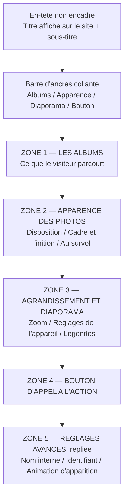

# ROADMAP — Étape 11.17 : Ergonomie des éditeurs de modules — zones, portée et libellés

> **Statut** : PLANIFIÉ — en attente de validation
> **Périmètre** : Back-Office uniquement (`ModuleRow`, `ModuleSettingsForm`, éditeurs de modules).
> **Aucun impact public** : ni rendu du site, ni schéma de données, ni clé persistée.
> **Aucune migration BDD.**
> **Aucune dépendance nouvelle** (`@radix-ui/react-collapsible` n'est pas installé).

---

## 0. Contexte : pourquoi ce chantier

Retour d'usage du propriétaire du produit, après recette du module « Galeries & Portfolio » :
le formulaire est jugé **déroutant**, avec une crainte explicite — *« l'utilisateur va se perdre,
ce qui est grave car la facilité de prise en main est au cœur de la promesse de l'app »*.

Recevabilité du constat : le panneau Portfolio déplié enchaîne **≈ 35 contrôles** dans une seule
colonne, sans indicateur de niveau. Sept remarques formulées par l'utilisateur prennent toutes la
forme « de quoi ? » — ce qui désigne **la même cause**.

### 0.1 Cause racine n°1 — quatre échelles imbriquées, jamais nommées

| Échelle | Ce qu'on y règle | Où c'est rendu aujourd'hui |
|---|---|---|
| **Le bloc** | nom interne, ancre, animation d'entrée, titre de section, CTA | `ModuleSettingsForm` + `ModuleGalleryEditor` |
| **La galerie** | disposition, finitions, diaporama | `GalleryLayoutPanel`, `EffectSettingsPanel`, `LightboxSettingsPanel` |
| **Les albums** | liste, nom, couverture, description, photos | `AlbumManagerPanel` |
| **La photo** | titre, description, texte alternatif, masquage | `GalleryImagesPanel` (Dialog) |

Tout est rendu dans un même `grid gap-4`
([`ModuleGalleryEditor.tsx:61`](../src/components/backoffice/pages/modules/ModuleGalleryEditor.tsx))
sans un seul marqueur de niveau. L'œil ne peut pas savoir à quoi s'applique ce qu'il lit.

### 0.2 Cause racine n°2 — un découpage hérité du code

« RÉGLAGES » puis « CONTENU » ([`ModuleRow.tsx:217`](../src/components/backoffice/pages/ModuleRow.tsx)
et [`ModuleRow.tsx:233`](../src/components/backoffice/pages/ModuleRow.tsx)) recopie la structure
technique : champs **scalaires** du module d'un côté, **JSONB `content`** de l'autre. Aucun sens
pour l'utilisateur, qui voit simplement un formulaire coupé en deux par un filet.

### 0.3 Cause racine n°3 — jargon anglais et collisions de vocables

| Emplacement | Affiché | Problème |
|---|---|---|
| [`pages.ts:1424`](../src/lib/pages.ts) | `Masonry` | Jargon de mise en page |
| [`pages.ts:1458-1460`](../src/lib/pages.ts) | `Light` / `Normal` / `Strong` | Anglais, échelle non signifiante |
| [`pages.ts:1475-1478`](../src/lib/pages.ts) | `Light` / `Medium` / `Normal` / `Strong` | Anglais **+ ordre contre-intuitif** : « Normal » annoncé *après* « Medium » |
| [`pages.ts:1217`](../src/lib/pages.ts) | `Animation active` | Ne dit pas ce qui est animé |
| [`pages.ts:1416-1418`](../src/lib/pages.ts) | `Gallery Static` / `Dynamic` / `Portfolio` | Anglais, visible dès le catalogue d'ajout |

Deux collisions qui égarent légitimement :

- **« Animation au survol »** ([`GalleryLayoutPanel.tsx:69`](../src/components/backoffice/pages/modules/gallery/GalleryLayoutPanel.tsx))
  vs **« Animation d'entrée »** ([`ModuleSettingsForm.tsx:153`](../src/components/backoffice/pages/modules/ModuleSettingsForm.tsx)) :
  deux animations distinctes, et la moins importante est placée **plus haut** dans le formulaire.
- **« Titre d'affichage »** (section Réglages) vs **« Titre de la section »** (section Contenu) :
  rien ne permet de deviner que le premier ne s'affiche **jamais** sur le site public — c'est le
  libellé du bandeau d'accordéon ([`ModuleRow.tsx:152`](../src/components/backoffice/pages/ModuleRow.tsx)).
  L'aide actuelle (« Libellé visible dans le bandeau et le menu du site »,
  [`ModuleSettingsForm.tsx:91`](../src/components/backoffice/pages/modules/ModuleSettingsForm.tsx))
  est au mieux ambiguë et doit être **vérifiée puis corrigée** (cf. §2.3).

### 0.4 Défaut supplémentaire découvert à l'analyse — un réglage dupliqué

**« Animation au survol de la photo » existe à deux endroits**, tous deux écrivant
`layout.hoverAnimation` :

- [`ModuleSettingsForm.tsx:178-208`](../src/components/backoffice/pages/modules/ModuleSettingsForm.tsx)
  (section « Réglages », en haut du formulaire) ;
- [`GalleryLayoutPanel.tsx:68-77`](../src/components/backoffice/pages/modules/gallery/GalleryLayoutPanel.tsx)
  (section « Mise en page », beaucoup plus bas).

Deux contrôles pour une même valeur, à ~25 lignes d'écart : c'est une source de confusion
directe et une incohérence à corriger (cf. §3.2).

---

## 1. Principes directeurs (règles de conception)

Ces règles s'appliquent au chantier **et** à tout futur éditeur.

- **P1 — Toute rubrique nomme sa cible.** Un titre de zone doit être compréhensible hors contexte :
  « Disposition des photos » et non « Mise en page ».
- **P2 — Toute rubrique dit sa portée.** Une phrase de contexte accompagne le titre
  (« Ces réglages s'appliquent à **toutes** les couvertures… »). C'est la réponse mécanique aux
  « de quoi ? ».
- **P3 — Une couleur = une question utilisateur.** Quatre teintes au maximum. Au-delà, la couleur
  cesse de signaler et devient du bruit.
- **P4 — Zéro jargon, zéro anglais** dans les libellés visibles. Le vocabulaire technique
  (ancre, EXIF, JSONB, Lightbox) est relégué dans les infobulles `HelpTip` — principe déjà appliqué
  à l'étape 11.16.
- **P5 — Ordre = parcours mental du photographe.** D'abord ce qu'il **montre** (photos, albums),
  ensuite l'**apparence**, puis les **options**, enfin les **réglages techniques**.
- **P6 — Une seule source par réglage.** Un même champ ne doit jamais être exposé deux fois.

---

## 2. Lot A — Libellés et aides (risque nul, gain immédiat)

### 2.1 Table de renommage

| Fichier | Actuel | Cible |
|---|---|---|
| [`pages.ts`](../src/lib/pages.ts) `galleryDisplayLabels` | `Masonry` | **`Mosaïque (hauteurs libres)`** |
| idem | `Uniforme` | `Grille régulière` |
| [`pages.ts`](../src/lib/pages.ts) `galleryEffectIntensityLabels` | `Light` / `Normal` / `Strong` | **`Légère` / `Normale` / `Marquée`** |
| [`pages.ts`](../src/lib/pages.ts) `galleryShadowLabels` | `Aucune` / `Light` / `Medium` / `Normal` / `Strong` | **`Aucune` / `Très discrète` / `Discrète` / `Normale` / `Forte`** |
| [`pages.ts`](../src/lib/pages.ts) `galleryHoverAnimationLabels` | `Aucune animation` / `Animation active` | **`Aucun effet` / `Zoom et élévation douce`** |
| [`pages.ts`](../src/lib/pages.ts) `galleryVariantLabels` | `Gallery Static` / `Dynamic` / `Portfolio` | **`Galerie fixe` / `Galerie interactive` / `Galerie portfolio`** |
| [`pages.ts`](../src/lib/pages.ts) `galleryEffectLabels` | `Polaroid (papier glacé)` | inchangé (évocateur, non jargon) |
| [`ModuleSettingsForm.tsx`](../src/components/backoffice/pages/modules/ModuleSettingsForm.tsx) | `Titre d'affichage` | **`Nom de la section dans le back-office`** + aide « N'apparaît pas sur le site public. » |
| [`ModuleGalleryEditor.tsx`](../src/components/backoffice/pages/modules/ModuleGalleryEditor.tsx) | `Titre de la section` | **`Titre affiché sur le site`** |
| idem | `Sous-titre (facultatif)` | `Sous-titre affiché sous le titre (facultatif)` |
| [`GalleryLayoutPanel.tsx`](../src/components/backoffice/pages/modules/gallery/GalleryLayoutPanel.tsx) | `Mise en page` | **`Disposition des photos`** |
| idem | `Mode d'affichage` | `Type de grille` |
| idem | `Animation au survol` | **déplacé** — cf. §3.2 |
| [`EffectSettingsPanel.tsx`](../src/components/backoffice/pages/modules/gallery/EffectSettingsPanel.tsx) | `Finitions & effets` | **`Cadre et finition des photos`** |
| idem | `Intensité` | `Intensité de l'effet` |
| [`LightboxSettingsPanel.tsx`](../src/components/backoffice/pages/modules/gallery/LightboxSettingsPanel.tsx) | `Diaporama (Lightbox)` | **`Agrandissement et diaporama`** |
| idem | `Zoom HD et double-clic` | `Agrandir les photos au double-clic` |
| idem | `Afficher les informations EXIF` | **`Afficher les réglages de l'appareil photo`** (EXIF conservé dans l'aide) |
| idem | `Afficher la légende` | **`Afficher le titre et la description de la photo`** |
| [`AlbumManagerPanel.tsx`](../src/components/backoffice/pages/modules/gallery/AlbumManagerPanel.tsx) | `Album {n}` | **`Album {n} — {nom}`** si l'album est nommé, sinon `Album {n} — à nommer` |
| idem | `Albums de la galerie ({n})` | `{n} albums` + phrase « Chaque album regroupe des photos autour d'un thème : mariage, portrait… » |

### 2.2 Contraintes

- Ne toucher **aucune clé persistée** : seuls les `Record<...>` de libellés et les textes JSX changent.
- `galleryShadowOrder` conserve son ordre actuel (`none, light, medium, normal, strong`) : c'est
  uniquement la **nomenclature** qui change, donc aucune donnée n'est réinterprétée.
  *(Réserve : l'échelle à 5 niveaux reste perfectible — voir §7.)*

### 2.3 Point de vérification obligatoire avant d'écrire les aides

L'aide actuelle affirme que `module.title` est « visible dans le bandeau **et le menu du site** ».
Sur le site public, le menu est alimenté par la navigation (`NavMenuEntry`)
et les titres de sections proviennent de `content.heading` — le `menuTitle` de la page, lui,
alimente le Header. Il est donc **probable que cette aide soit fausse**.

→ **Étape à exécuter avant rédaction** : `grep` de `module.title` et de `.title` dans
`src/components/modules/` et `src/app/(front-office)/` pour confirmer si `module.title` est rendu
publiquement. Selon le résultat, l'aide est corrigée ou reformulée.

### 2.4 Critères d'acceptation (Lot A)

- [ ] Aucun libellé anglais ni jargon dans un `<Select>` du back-office.
- [ ] L'ordre de l'échelle d'ombre est croissant et lisible sans explication.
- [ ] Aucun test `tsc` / `eslint` / `build` en échec.

---

## 3. Lot B — Tiroir « Réglages avancés » et dédoublonnage

### 3.1 Sortir les trois champs techniques du flux principal

`ModuleSettingsForm` expose actuellement trois champs **scalaires techniques** en tête de formulaire :
`title` (nom interne), `anchorId` (identifiant pour les liens), `animation` (effet d'apparition).
Un photographe n'y touche qu'une fois, à la fin, s'il y touche.

**Décision** : ces champs sont regroupés dans une zone **« Réglages avancés » repliée par défaut**,
placée **en fin de formulaire**, sous le CTA.

Composition de la zone repliée :

- `Nom de la section dans le back-office` (`title`) + aide corrigée (§2.3) ;
- `Identifiant pour les liens` (`anchorId`) — le mot « ancre » descend dans l'aide ;
- `Animation d'apparition du bloc` (`animation`).

Le rappel « Module visible / masqué sur le site public »
([`ModuleSettingsForm.tsx:211-221`](../src/components/backoffice/pages/modules/ModuleSettingsForm.tsx))
est **retiré** : il est redondant avec le Toggle Eye du bandeau
([`ModuleRow.tsx:171-193`](../src/components/backoffice/pages/ModuleRow.tsx)) et son état est déjà
visible dans le bandeau (badge « Masquée »). Il allonge le formulaire sans rien apprendre.

### 3.2 Dédoublonner « Animation au survol »

Le réglage est exposé **deux fois** (§0.4). Décision :

- **Conserver** l'instance de `GalleryLayoutPanel`, à sa place **définitive** dans la zone
  « Apparence des photos » (§4.3, sous-bloc « Au survol des photos ») ;
- **Supprimer** le bloc dupliqué de `ModuleSettingsForm` (lignes 178-208) ainsi que la fonction
  `handleGalleryHover` et les imports associés (`galleryHoverAnimation*`, `resolveGalleryContent`,
  `ModuleContent`, `GalleryHoverAnimation`) devenus inutiles.

### 3.3 Critères d'acceptation (Lot B)

- [ ] Le formulaire déplié s'ouvre **sans champ technique visible**.
- [ ] `anchorId` et `animation` restent éditables, l'alerte de doublon d'ancre fonctionne toujours.
- [ ] « Animation au survol » n'apparaît **plus qu'une seule fois** dans tout l'éditeur.
- [ ] Modifier l'animation au survol depuis la zone Apparence met bien à jour le rendu public.

---

## 4. Lot C — `EditorZone` et refonte du panneau « Galeries & Portfolio »

### 4.1 Nouveau composant partagé `EditorZone`

Emplacement : `src/components/backoffice/pages/modules/EditorZone.tsx`.

```tsx
type EditorZoneProps = {
  /** Titre de la zone — nomme explicitement sa cible (P1). */
  title: string;
  /** Phrase de portée, obligatoire (P2) : « Ces réglages s'appliquent à… ». */
  scope: string;
  /** Teinte d'accent (P3) — 4 valeurs, jamais plus. */
  tone: "albums" | "appearance" | "slideshow" | "action";
  /** Repliable (utilisé pour les réglages avancés du lot B). */
  collapsible?: boolean;
  /** État initial du repli (défaut : false). */
  defaultOpen?: boolean;
  children: React.ReactNode;
};
```

Décisions techniques :

- **Aucune dépendance nouvelle.** `@radix-ui/react-collapsible` n'est pas installé
  ([`package.json`](../package.json)) : le repli est un simple état local React + un `<button>` avec
  `aria-expanded` et `aria-controls`. Imbriquer un `Accordion` Radix dans l'accordéon des modules
  (déjà `type="single"` dans `ModuleRow`) est à proscrire — deux mécanismes concurrents.
- **Rendu visuel** (P3) : bordure gauche épaisse colorée + fond très légèrement teinté + titre
  lisible. **Pas de fond pastel plein** — c'est ce qui garantit le contraste texte/fond et le
  respect des tokens du thème.
- **Palette centralisée** : quatre variables CSS ajoutées au bloc `@theme` de
  [`globals.css`](../src/app/globals.css) (`--zone-albums`, `--zone-appearance`, `--zone-slideshow`,
  `--zone-action`), dans l'esprit des tokens existants (`--surface-color`, `--accent-color`).
  Changer la charte des zones se fait alors en un seul endroit.
- **Titre = `<h5>`** (le formulaire est déjà sous `<h4>` « Contenu » dans `ModuleRow`) : la
  hiérarchie de titres reste valide.
- Le composant est **présentationnel** : aucun accès au store, aucune logique métier.

### 4.2 Barre d'ancres collante

En tête du formulaire de contenu : une rangée discrète de liens d'ancrage
(`Albums · Apparence · Diaporama · Bouton`), `position: sticky` sous le bandeau du module.

- Donne le bénéfice des onglets — **se repérer et sauter** — sans en avoir les défauts (§4.4).
- Chaque zone porte un `id` stable ; les liens utilisent `aria-label` explicite.
- Sur mobile, la barre devient une rangée défilante horizontalement (`overflow-x-auto`).

### 4.3 Structure cible du formulaire (variante portfolio)



| Zone | Teinte | Contenu | Source |
|---|---|---|---|
| **1 — Les albums** | `albums` | Liste des albums, bouton d'ajout, et par album : nom, couverture, description, photos. **Inclut** le bloc « Affichage sur les couvertures » (il décrit *ces* couvertures) | `AlbumManagerPanel`, `GalleryImagesPanel` |
| **2 — Apparence des photos** | `appearance` | Sous-bloc « Disposition de la grille » (type, colonnes, écarts, arrondi) puis sous-bloc « Cadre et finition » (effet, intensité, ombre, bordure) puis sous-bloc **« Au survol des photos »** (effet de survol + voile) | `GalleryLayoutPanel`, `EffectSettingsPanel` |
| **3 — Agrandissement et diaporama** | `slideshow` | Zoom, niveaux, réglages de l'appareil, légende | `LightboxSettingsPanel` |
| **4 — Bouton d'appel à l'action** | `action` | Inchangé — déjà bien cadré par son `fieldset` : **c'est le modèle à suivre** | `GalleryCtaPanel` |
| **5 — Réglages avancés** | `slideshow` (neutre) | Repliée — cf. lot B | `ModuleSettingsForm` |

**Déplacement notable** : le sous-bloc « Au survol des photos » **réunit** deux réglages
aujourd'hui éclatés (« Animation au survol » dans Mise en page, « Voile dégradé au survol » dans
Mise en page également mais noyé dans les champs numériques). C'est ce regroupement qui supprime la
collision avec « Animation d'entrée » (lot A).

### 4.4 Décision : onglets **rejetés** (et à quelles conditions on y reviendrait)

Trois objections, évaluées et retenues :

1. **Le formulaire est déjà dans un accordéon** ([`ModuleRow.tsx:210`](../src/components/backoffice/pages/ModuleRow.tsx)) —
   des onglets à l'intérieur créent deux mécanismes d'affichage concurrents et un double
   « où suis-je ? ».
2. **Les onglets cachent ce qu'on ne voit pas.** Or plusieurs réglages valent par leur valeur par
   défaut (« Effet = Aucun », « Aucun affichage », « Colonnes = 3 ») : l'utilisateur doit pouvoir
   *reconnaître d'un coup d'œil* que rien n'est déréglé.
3. **Ces réglages s'ajustent en regardant le résultat** : disposition, finition et ombre interagissent
   visuellement. Les onglets imposent des allers-retours.

**Porte de sortie documentée** : si l'expérience montre malgré tout un besoin de segmentation, la
seule forme acceptable est **deux onglets au niveau le plus grossier** — « Les albums » / « L'apparence » —
car chacun contiendrait alors une masse de travail réelle. À ne pas descendre en dessous de ce
niveau de granularité.

### 4.5 Critères d'acceptation (Lot C)

- [ ] Chaque zone affiche un titre qui nomme sa cible et une phrase de portée.
- [ ] Quatre teintes maximum, cohérentes avec le thème, contraste texte/fond vérifié.
- [ ] La barre d'ancres permet d'atteindre chaque zone ; elle est utilisable au clavier.
- [ ] Le repli fonctionne sans `@radix-ui/react-collapsible`, avec `aria-expanded` / `aria-controls`.
- [ ] Aucun réglage n'est exposé deux fois.
- [ ] Les variantes `static` et `dynamic` restent fonctionnelles (la zone Albums devient
      « Les photos » et la zone Diaporama disparaît en `static`).
- [ ] Aucun champ perdu : correspondance 1:1 vérifiée entre l'ancien et le nouveau formulaire.

---

## 5. Lot D — Généralisation aux autres éditeurs

Le déploiement de `EditorZone` aux autres familles évite qu'un seul module « détonne » et fait
hériter tout futur module de la bonne ergonomie **par construction** (P1-P5).

| Éditeur | Zones proposées |
|---|---|
| `ModuleHeroEditor` (static) | `Images de fond` · `Textes et bouton` · `Animation` (structure proche de l'existant : 3 rubriques déjà présentes) |
| `ModuleHeroSliderEditor` | `Photos du carrousel` · `Textes et bouton` · `Animation` |
| `ModuleHeroVideoEditor` | `Vidéo et affiche` · `Textes et bouton` · `Animation` |
| `ModuleHeroParallaxEditor` | `Images de fond` · `Textes et bouton` · `Animation` |
| `ModuleAboutEditor` | `Textes` · `Photo` |
| `ModuleServicesEditor` | `Prestations` · `Mise en forme` |
| `ModuleFaqEditor` | `Questions et réponses` |
| `ModuleContactEditor` | `Coordonnées` |
| `ModuleCtaBannerEditor` | `Message` · `Bouton` |

Règle de mise en œuvre : **un commit par éditeur**, afin de pouvoir revenir en arrière
individuellement. Aucune modification de logique — déplacement de JSX et enveloppes uniquement.

---

## 6. Décisions d'architecture

- **D-1 — Pas d'onglets.** Motifs et porte de sortie en §4.4.
- **D-2 — Quatre teintes maximum**, une par question utilisateur, via des tokens CSS centralisés.
- **D-3 — Le repli n'introduit aucune dépendance** : état local + `aria-expanded` / `aria-controls`.
- **D-4 — Les réglages techniques sortent du flux principal** et vont en fin de formulaire, repliés.
- **D-5 — Un réglage, un emplacement.** Le doublon « Animation au survol » est supprimé.
- **D-6 — `EditorZone` est présentationnel** : aucun accès au store, aucune logique métier.
- **D-7 — Les variantes partagent les mêmes zones**, mais seules celles qui s'appliquent sont
  rendues (la zone Diaporama disparaît en `static` ; la zone Albums devient « Les photos » hors
  portfolio).
- **D-8 — Aucun changement de schéma, de clé persistée ni de rendu public** sur l'ensemble du chantier.

---

## 7. Hors périmètre (assumé)

- **Aperçu en direct** des réglages à côté du formulaire : c'est le vrai levier de prise en main,
  mais c'est un chantier distinct qui touche le rendu public et la mise en page du back-office.
  À ne pas mélanger avec celui-ci.
- **Refonte de l'échelle d'ombre** (5 niveaux dont la sémantique se recoupe) : le lot A se limite à
  la nomenclature, sans réinterpréter les valeurs persistées.
- **Renommage des libellés de `Style` dans « Affichage sur les couvertures »** (« Plein (foncé) »,
  « Sous-verre », « Contour clair ») : le mot « Sous-verre » est aussi le nom d'un effet de galerie
  ailleurs dans le projet ; l'arbitrage a été écarté lors de l'étape 11.16 et le reste ici.
- **Identifiants DOM dupliqués** dans `ModuleSettingsForm` (`id="module-anchor"`,
  `id="module-animation"`, `id="gallery-hover-animation"` codés en dur, non préfixés par l'id du
  module). Sans conséquence pratique aujourd'hui (l'accordéon n'affiche qu'un module à la fois),
  mais fragile : à corriger si l'éditeur venait à rendre plusieurs modules simultanément.

---

## 8. Séquencement

| Ordre | Lot | Indépendance | Effet |
|---|---|---|---|
| 1 | **A — Libellés et aides** | Totalement indépendant | Corrige la moitié du ressenti, risque nul |
| 2 | **B — Tiroir avancé + dédoublonnage** | Indépendant de A | Change le plus la sensation d'entrée dans le formulaire |
| 3 | **C — `EditorZone` + refonte Portfolio** | Dépend de B (le tiroir utilise `EditorZone`) | Refonte visuelle complète du module le plus long |
| 4 | **D — Généralisation** | Dépend de C (composant stabilisé) | Cohérence de toute la promesse produit |

---

## 9. Validation

Par lot, avant passage au suivant :

```bash
npx tsc --noEmit
npm run lint
npm run build
```

Contrôles manuels :

1. `/admin/pages/{id}` — ouvrir un module Galerie Portfolio : vérifier l'ordre des zones, la
   lisibilité des titres, la phrase de portée de chacune.
2. Vérifier qu'**aucun champ n'a disparu** : comparer la liste des contrôles avant/après (35 attendus).
3. Barre d'ancres : navigation clavier (Tab puis Entrée) et comportement collant au défilement.
4. Repli « Réglages avancés » : `aria-expanded` correct, valeur conservée après repli/dépli.
5. Modifier `anchorId` avec une valeur déjà prise : l'alerte de doublon doit toujours apparaître.
6. Variante `static` : la zone Diaporama ne doit pas apparaître ; variante `dynamic` : la zone
   Albums doit s'intituler « Les photos ».
7. Contraste : vérifier visuellement les quatre teintes en thème clair et sombre.
8. Publier et vérifier sur le site public que le rendu de la galerie est **strictement inchangé**.

---

## 10. Suivi documentaire

- Mettre à jour [`ROADMAP.md`](../ROADMAP.md) (Étape 11.17) et [`CHANGELOG.md`](../CHANGELOG.md).
- Consigner dans le CHANGELOG : la cause racine (échelles de portée non nommées), le doublon de
  « Animation au survol » supprimé, et le fait qu'aucune donnée persistée n'a changé.
