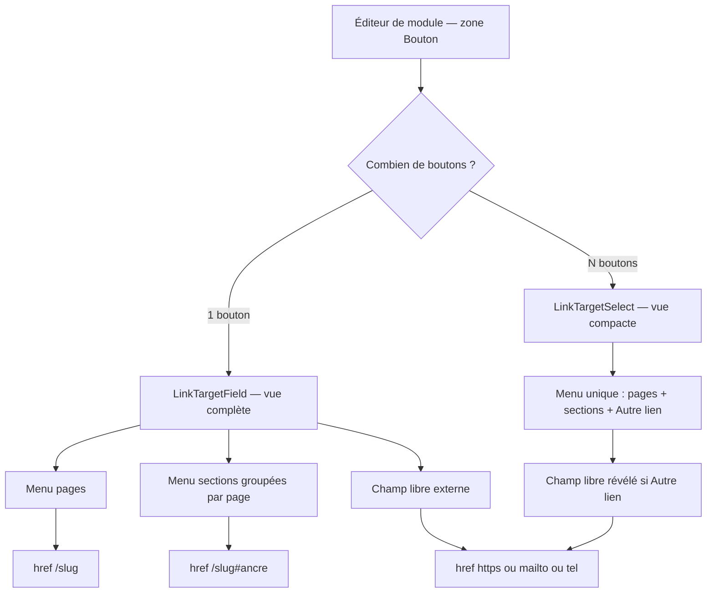
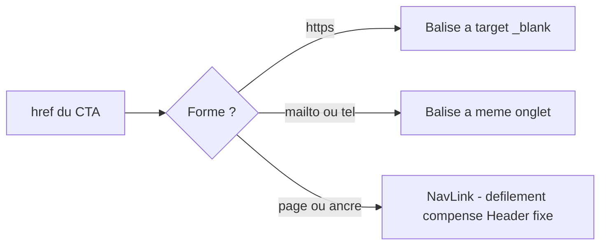

# Plan — ROADMAP Étape 11.21 : Sélecteur de lien généralisé à **tous** les CTA

## 0. Objectif

Rendre la saisie d'un **lien de bouton** identique et non technique **partout** dans
le back-office, en généralisant le sélecteur déjà éprouvé en 11.16 et en corrigeant
les deux défauts qu'une généralisation naïve introduirait (ergonomie des éditeurs à
répétition, cohérence du rendu public).

Aujourd'hui, un photographe non technique doit **taper à la main** un slug
(`/portfolio`) ou une adresse dans 5 éditeurs de modules, alors que le sélecteur
existe et qu'il est branché **sur un seul** (le CTA de galerie).

**Résultat visé** : partout où il y a un bouton, l'auteur choisit sa destination
parmi **des libellés lisibles** — jamais un identifiant technique.

---

## 1. État des lieux (audit du code existant)

### 1.1 Ce qui existe déjà et qu'il ne faut **pas** refaire

[`LinkTargetField`](../src/components/backoffice/pages/modules/LinkTargetField.tsx:85)
(Étape 11.16) implémente déjà les trois possibilités demandées, **plus un aperçu** :

| Besoin exprimé par l'utilisateur | Implémentation existante |
| --- | --- |
| Menu déroulant vers une page existante | [`« Aller vers une page du site »`](../src/components/backoffice/pages/modules/LinkTargetField.tsx:178) — tri alphabétique français, mention `(brouillon)` |
| Menu déroulant vers les liens d'une page choisie | [`« Aller vers une section de page »`](../src/components/backoffice/pages/modules/LinkTargetField.tsx:209) — `SelectGroup` **groupé par page hôte**, mention `(masqué)` |
| Champ pour une adresse externe | [`« Ou collez un lien »`](../src/components/backoffice/pages/modules/LinkTargetField.tsx:251) — `https://`, `mailto:`, `tel:` |
| *(bonus)* Aperçu compréhensible | [`describeLinkTarget`](../src/lib/link-targets.ts:204) : « Vous serez emmené vers : Portfolio › Galerie mariage » + alertes brouillon / section masquée |

**Propriétés fondatrices à préserver absolument** :

- **Le mode est DÉRIVÉ de `href`, jamais stocké** ([`detectCtaTargetMode`](../src/lib/link-targets.ts:180)) :
  l'exclusion mutuelle des menus est gratuite, aucun état `mode ≠ valeur` n'est possible,
  et un `href` devenu orphelin retombe en `custom` au lieu d'être perdu.
- **Aucune migration de données** : `href` reste une `string` dans tous les contenus.
- Les cibles sont **réelles** : les sections proviennent des `anchorId` déclarés par
  les modules ([`collectAnchorTargets`](../src/lib/link-targets.ts:123)), donc l'UI
  n'expose jamais `hero-1` ou `gallery-2`.

### 1.2 Ce qui n'est **pas** branché (le vrai chantier)

| Éditeur | Champ actuel | Nature |
| --- | --- | --- |
| [`ModuleCtaBannerEditor`](../src/components/backoffice/pages/modules/ModuleCtaBannerEditor.tsx:75) | `Lien du bouton` | texte brut, **1 bouton** |
| [`ModuleHeroEditor`](../src/components/backoffice/pages/modules/ModuleHeroEditor.tsx:254) | `Lien du bouton` | texte brut, **1 bouton** |
| [`ModuleHeroSliderEditor`](../src/components/backoffice/pages/modules/ModuleHeroSliderEditor.tsx:390) | `Lien` | texte brut, **1 bouton PAR diapositive** |
| [`ModuleHeroVideoEditor`](../src/components/backoffice/pages/modules/ModuleHeroVideoEditor.tsx:241) | `Lien` | texte brut, **1 bouton** |
| [`ModuleHeroParallaxEditor`](../src/components/backoffice/pages/modules/ModuleHeroParallaxEditor.tsx:202) | `Lien` | texte brut, **1 bouton** |

Déjà branché (référence de comportement) :
[`GalleryCtaPanel`](../src/components/backoffice/pages/modules/gallery/GalleryCtaPanel.tsx:85).

Le [`ModuleCtaBannerEditor`](../src/components/backoffice/pages/modules/ModuleCtaBannerEditor.tsx:21)
documente lui-même cette évolution comme « hors périmètre » de 11.17 : c'est
exactement le périmètre de la présente étape.

### 1.3 Deux défauts latents qu'il faut traiter **dans la même étape**

**Défaut A — divergence du rendu public sur les ancres.**
Le CTA de galerie route les cibles internes/ancres via
[`NavLink`](../src/components/modules/gallery/CTAButton.tsx:56) (défilement lissé
**avec compensation du Header fixe**). En revanche le Héro
([`HeroTextBlock`](../src/components/modules/hero/HeroTextBlock.tsx:135)) et le
Bandeau CTA ([`PublicModules`](../src/components/modules/PublicModules.tsx:146))
utilisent un simple `<a href>`.

→ Aujourd'hui c'est peu visible car l'utilisateur ne peut quasi jamais saisir une
ancre (champ libre). **Dès qu'on propose le menu « sections », le défaut devient
systématique** : une ancre sautera sous la barre de navigation fixe.

**Défaut B — recomposition de l'index N fois.**
[`LinkTargetField`](../src/components/backoffice/pages/modules/LinkTargetField.tsx:99)
recalcule **à chaque instance** l'index complet (parcours de toutes les pages et de
tous leurs modules). Sur le slider, qui rend un contrôle **par diapositive**, cela
signifie N parcours complets.

---

## 2. Décisions d'architecture (à valider)

### 11.21-D1 — Périmètre : **tous** les CTA, pas seulement le Héro

On généralise aux 5 éditeurs listés au §1.2. Justification : l'incohérence
d'ergonomie entre modules est précisément ce que 11.17 a combattu (« de quoi parle
cette rubrique ? ») ; laisser 5 champs « tapez un slug » à côté d'un sélecteur
moderne recréerait l'incohérence à l'échelle des boutons.

### 11.21-D2 — Conserver **le mode dérivé**, ne rien persister

Aucun champ `targetMode` n'est ajouté, ni en BDD ni dans les `content` JSONB.
Rétrocompatibilité totale, y compris pour les contenus existants (`#galerie`,
`/portfolio`, `https://…` sont déjà reconnus).

### 11.21-D3 — Découper en **un hook + deux vues**

Le composant actuel mêle trois responsabilités : collecte de l'index, dérivation du
mode, présentation. On extrait :

1. **`useLinkTargetIndex()`** (hook client) — construit l'index **une seule fois**
   par éditeur (`useMemo` sur `pages` / `getModules` / `currentPageId`).
   Il lit [`useCurrentPage()`](../src/components/backoffice/pages/CurrentPageContext.tsx:9).
2. **`LinkTargetField`** — vue **complète** (2 menus + champ libre + aperçu),
   signature `value` / `onChange` / `label` / `tip` / `hint` **inchangée** :
   `GalleryCtaPanel` continue de fonctionner sans modification.
3. **`LinkTargetSelect`** — vue **compacte** (1 seul menu + champ révélé à la
   demande), pour les éditeurs qui rendent **plusieurs boutons**.

Le hook accepte l'index en paramètre des vues, ce qui permet à un éditeur de slider
de calculer l'index **une fois** et de le passer aux N contrôles.

### 11.21-D4 — Variante compacte : un menu unique, « Autre lien… »

Contrainte : l'étape 11.17 a explicitement lutté contre l'empilement de contrôles
(≈ 35 contrôles à plat dans la galerie). Un `LinkTargetField` complet (5 lignes)
multiplié par N diapositives serait intenable.

Design de `LinkTargetSelect` :

```
[ Destination du bouton ▼ ]
   — Aucune —
   ── Pages ──────────────
   Accueil
   Portfolio (brouillon)
   ── Sections de cette page ──
   Galerie mariage
   ── Autres sections ─────
   Prestations › Tarifs
   ───────────────────────────
   Autre lien (externe)…
→ si « Autre lien » : révèle le champ texte + l'aperçu
```

- **Un seul `Select`** au lieu de deux : les pages et les sections cohabitent grâce
  aux `SelectLabel` de groupe (Radix), ce qui **supprime le choix exclusif à
  comprendre** et ne peut pas produire d'état incohérent.
- Les sections de la **page courante** sont remontées en premier (le cas le plus
  fréquent), les autres suivent par page.
- L'entrée **« Autre lien (externe)… »** (`value` sentinelle) révèle le `TextField`
  et l'aperçu — donc **zéro régression** : `https://`, `mailto:`, `tel:` et `href`
  orphelin restent saisissables.
- Aperçu **masqué** tant que le champ n'est pas révélé.

### 11.21-D5 — Rendu public : aligner Héro et Bandeau sur `NavLink`

Remplacer le `<a href>` par
[`NavLink`](../src/components/common/NavLink.tsx:96) dans
[`HeroTextBlock`](../src/components/modules/hero/HeroTextBlock.tsx:135) et
[`PublicModules`](../src/components/modules/PublicModules.tsx:146), en reprenant la
**discrimination déjà écrite** dans
[`CTAButton`](../src/components/modules/gallery/CTAButton.tsx:43) :

- `https?://` → `<a target="_blank" rel="noopener noreferrer">` ;
- `mailto:` / `tel:` → `<a>` simple (même onglet) ;
- tout le reste (`/page`, `#ancre`, `/page#ancre`) → `NavLink`.

→ Sans cette décision, l'option « section » du nouveau sélecteur produirait un
**mauvais résultat** sur 2 des 5 éditeurs migrés.

### 11.21-D6 — Point de conception : menu groupé **vs** cascade page → sections

La proposition initiale décrit **deux menus dépendants** (« choisir une page, puis
ses liens »). L'existant propose **un menu groupé** (§1.1). Analyse :

| Critère | Menu groupé (existant) | Cascade page → sections |
| --- | --- | --- |
| Nombre de clics | 1 | 2 |
| Risque d'impasse | nul | oui (page sans section) |
| Clarté pour un non-technique | bon (`SelectLabel` nomme la page) | meilleur (contexte explicite) |
| Encombrement | 1 contrôle | 2 contrôles |

**Recommandation** : conserver le **menu groupé** pour la vue complète (déjà éprouvée
et moins coûteuse), et tester la cascade uniquement si la recette montre une
confusion réelle. Ce point reste **à valider par l'utilisateur** : c'est le seul
écart entre la demande initiale et l'existant.

### 11.21-D7 — Hors périmètre

- Le module **Navigation** ([`NavEntryForm`](../src/components/backoffice/navigation/NavEntryForm.tsx:59))
  garde son fonctionnement actuel (cibles `page` / `custom`) : son modèle est
  structurel (`pageId`, `auto`), il n'est pas un « CTA ».
- Les liens de **contact / réseaux sociaux** du Profil (champs `mailto:` / URL) ne
  sont pas des CTA de contenu : hors périmètre.
- Aucune création automatique de section, aucune détection d'ancre manquante.
- **Aucune migration BDD**, aucun changement de schéma, aucun champ ajouté.

---

## 3. Modèle & helpers — aucun changement de contrat

`src/lib/link-targets.ts` est **conservé tel quel** (`collectPageTargets`,
`collectAnchorTargets`, `detectCtaTargetMode`, `describeLinkTarget`,
`isExternalHref`). Seuls ajouts envisagés, **purement présentatifs et sans risque** :

- un helper `groupAnchorTargets(index)` qui factorise le regroupement actuellement
  fait dans `LinkTargetField` (lignes 112-128) — utile aux **deux** vues ;
- un helper `buildLinkTargetOptions(index)` qui produit la liste plate
  (Aucune / Pages / Sections courantes / Autres sections / Autre lien) consommée par
  `LinkTargetSelect` — testable sans React.

Aucun `any`, TypeScript strict, helpers purs.

---

## 4. Composants

### 4.1 `LinkTargetField` (refactoré, signature publique inchangée)

- Reçoit `index?: LinkTargetIndex` (facultatif) : s'il est fourni, il n'en construit
  pas ; sinon il appelle `useLinkTargetIndex()` (rétrocompatibilité d'appel).
- Utilise `groupAnchorTargets()` au lieu du regroupement local.
- Comportement et apparence **identiques** (aucune régression sur `GalleryCtaPanel`).

### 4.2 `LinkTargetSelect` (nouveau, compact)

- Props : `value`, `onChange`, `label`, `tip`, `hint`, `index?`, `fieldId?`.
- Un `Select` unique + un `TextField` révélé sur « Autre lien (externe)… ».
- Réutilise `LabelWithTip`, `HelpTip`, `TextField` de
  [`form-fields.tsx`](../src/components/backoffice/pages/modules/form-fields.tsx:82).
- Aperçu compact : une seule ligne (`ArrowRight` + phrase), l'avertissement en
  orange **uniquement** s'il existe.

### 4.3 `useLinkTargetIndex` (nouveau hook)

```ts
export function useLinkTargetIndex(): LinkTargetIndex;
```

- `useMemo` sur `[pages, getModules, currentPageId]` ;
- aucune mutation, aucun effet de bord, aucun accès réseau.

---

## 5. Migration éditeur par éditeur

| Ordre | Éditeur | Variante | Remarque |
| --- | --- | --- | --- |
| 1 | [`ModuleCtaBannerEditor`](../src/components/backoffice/pages/modules/ModuleCtaBannerEditor.tsx:75) | complète | cas le plus simple, 1 bouton, et le commentaire du fichier annonce déjà l'évolution |
| 2 | [`ModuleHeroEditor`](../src/components/backoffice/pages/modules/ModuleHeroEditor.tsx:254) | complète | 1 bouton ; supprime le `tip` « Page du site (/slug) » devenu inutile |
| 3 | [`ModuleHeroSliderEditor`](../src/components/backoffice/pages/modules/ModuleHeroSliderEditor.tsx:390) | **compacte** | 1 index calculé pour toutes les diapositives |
| 4 | [`ModuleHeroVideoEditor`](../src/components/backoffice/pages/modules/ModuleHeroVideoEditor.tsx:241) | compacte | aligner la mise en page avec les autres héros |
| 5 | [`ModuleHeroParallaxEditor`](../src/components/backoffice/pages/modules/ModuleHeroParallaxEditor.tsx:202) | compacte | idem |

Règle de choix : **1 bouton → vue complète ; N boutons → vue compacte**.

---

## 6. Rendu public (défaut A)

Fichiers touchés :

- [`HeroTextBlock`](../src/components/modules/hero/HeroTextBlock.tsx:135) — rendu du
  CTA des héros statique / slider / parallaxe / vidéo (composant partagé).
- [`PublicModules`](../src/components/modules/PublicModules.tsx:146) — CTA du Bandeau.

Les deux adoptent la discrimination déjà en place dans
[`CTAButton`](../src/components/modules/gallery/CTAButton.tsx:43). Aucun changement
visuel pour les cibles actuelles ; **correction du défilement** pour les ancres.

---

## 7. Risques & mitigations

| Risque | Mitigation |
| --- | --- |
| Régression sur le CTA de galerie (déjà livré) | Signature de `LinkTargetField` **inchangée** ; `index` optionnel ; aucune modification de `link-targets.ts` dans son comportement |
| Formulaires surchargés (slider) | Variante **compacte** obligatoire dès que N > 1 (11.21-D4) ; index partagé (11.21-D3) |
| Ancre mal rendue sur le site public | Alignement `NavLink` traité **dans la même étape** (11.21-D5), avant la recette |
| Perte d'un `href` existant | Mode dérivé conservé (11.21-D2) ; « Autre lien » révèle toujours le champ libre ; cible orpheline retombe en `custom` |
| Écart entre la demande (cascade) et l'existant (groupé) | Décision 11.21-D6 explicitement soumise à validation |
| `useCurrentPage()` hors provider | `LinkTargetField`/`LinkTargetSelect` restent montés sous `CurrentPageContext` (déjà le cas dans l'éditeur de page) |

---

## 8. Tâches (ordre d'exécution — mode Code)

1. `src/lib/link-targets.ts` — ajouter `groupAnchorTargets()` et
   `buildLinkTargetOptions()` (purs, commentés, zéro `any`).
2. `src/components/backoffice/pages/modules/useLinkTargetIndex.ts` (nouveau) —
   hook d'index partagé.
3. `LinkTargetField.tsx` — accepter `index?`, utiliser `groupAnchorTargets()`,
   **signature publique inchangée**.
4. `LinkTargetSelect.tsx` (nouveau) — variante compacte (menu unique + « Autre
   lien… » + aperçu conditionnel).
5. `ModuleCtaBannerEditor.tsx` — remplacer le `TextField` « Lien du bouton » par
   `LinkTargetField` (zone « Bouton »).
6. `ModuleHeroEditor.tsx` — idem, retirer le `tip` obsolète.
7. `ModuleHeroSliderEditor.tsx` — `LinkTargetSelect` par diapositive + index unique.
8. `ModuleHeroVideoEditor.tsx` et `ModuleHeroParallaxEditor.tsx` — `LinkTargetSelect`.
9. `HeroTextBlock.tsx` + `PublicModules.tsx` — rendre les CTA via `NavLink`
   (discrimination absolue / protocole / interne).
10. Vérifications : `npx tsc --noEmit`, `npm run lint`, `npm run build`.
11. `ROADMAP.md` + `CHANGELOG.md`.

> **Contrainte d'environnement connue** : ne **jamais** lancer `npm run build`
> pendant que `npm run dev` tourne (cache Turbopack partagé). Voir l'incident
> documenté au CHANGELOG du 2026-09-11.

---

## 9. Critères d'acceptation (recette)

1. **Un seul comportement partout** : les 5 éditeurs (Bandeau, Héro, Slider, Vidéo,
   Parallaxe) + le CTA de galerie proposent la même logique de choix de destination.
2. **Aucun slug à connaître** : choisir une page puis une section se fait
   exclusivement par **libellés lisibles** ; les identifiants d'ancre bruts
   (`hero-1`) n'apparaissent **jamais**.
3. **Aucun contenu perdu** : un module dont `ctaHref` vaut `#galerie`, `/portfolio`
   ou `https://…` s'ouvre **déjà positionné** sur la bonne option (aucune action de
   l'utilisateur, aucune migration).
4. **Liens externes intacts** : `https://` s'ouvre dans un nouvel onglet ;
   `mailto:`/`tel:` restent possibles.
5. **Ancres correctes sur le site public** : un CTA de Héro ou de Bandeau pointant
   une section **scrolle avec compensation du Header fixe** (plus de saut sous la barre).
6. **Slider lisible** : le formulaire d'une diapositive n'ajoute **qu'un** contrôle
   de destination (vue compacte) ; l'index est calculé une seule fois.
7. **Avertissements présents** : page en brouillon / section masquée / cible
   introuvable sont signalés, jamais bloquants.
8. `npx tsc --noEmit` OK ; `npm run lint` OK ; `npm run build` OK ; `CHANGELOG.md` à jour.

---

## 10. Diagrammes

### 10.1 Flux de choix d'une destination



### 10.2 Rendu public après alignement



---

## 11. Références

- [`plans/ROADMAP-11.16-galleries-albums-cta-linkpicker.md`](ROADMAP-11.16-galleries-albums-cta-linkpicker.md) —
  création du sélecteur de cible et du helper `link-targets.ts`.
- [`plans/ROADMAP-11.17-editor-zones-ux.md`](ROADMAP-11.17-editor-zones-ux.md) —
  convention des zones d'éditeur et lutte contre l'empilement de contrôles.
- [`plans/ROADMAP-7.1-hero-static-basehero.md`](ROADMAP-7.1-hero-static-basehero.md) —
  vocabulaire « no-tech » des champs du Héro.
- [`SPECIFICATIONS-V8.md`](../SPECIFICATIONS-V8.md) §8 — navigation et en-tête.
- `.kilorules` §0.2 et §3 — étape par étape, zéro `any`, composants clients isolés.
