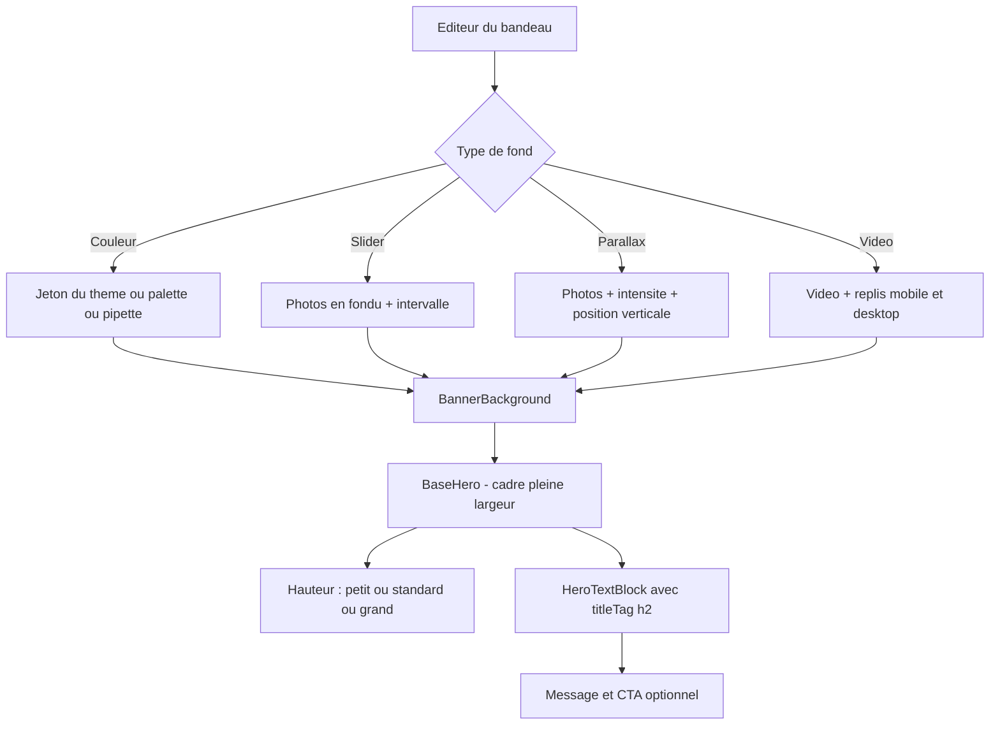
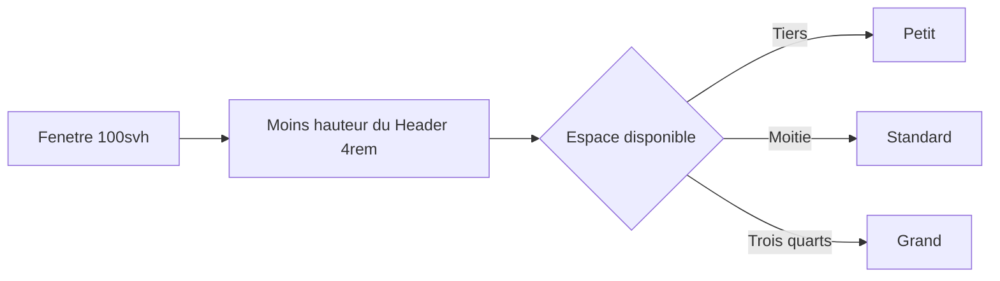

# Plan — ROADMAP Étape 11.27 : « Bandeau message ou d'appel à l'action »

## 0. Objectif

Transformer le module `cta-banner` — aujourd'hui un simple encart coloré (`bg-accent/30`, largeur limitée, `py-16`) — en **séparateur éditorial complet** :

- **renommage** : « Bandeau d'appel à l'action » → **« Bandeau message ou d'appel à l'action »** ;
- **4 types de fond** : couleur (thème ou palette/pipette), slider, parallax (avec **position verticale de la photo**), vidéo ;
- **3 hauteurs** : petit ≈ 33 %, standard ≈ 50 %, grand ≈ 75 % de l'espace entre le bas du Header et le bas de la fenêtre ;
- **pleine largeur d'écran** dans tous les cas ;
- **défauts sur l'accueil** : fond **parallax**, hauteur **standard**, **CTA activé** ;
- **aide intégrée** présentant les possibilités et les usages (message CTA, slogan, séparateur éditorial) ;
- **réutilisation des briques existantes** (Héro, CTA) — aucune nouvelle dépendance.

**Contraintes projet** : zéro `any`, TypeScript strict, **aucune migration BDD** (tout vit dans le JSONB `content`), avancement pas à pas avec validation.

---

## 1. État des lieux (audit du code existant)

### 1.1 Les briques Héro réutilisables telles quelles

| Brique | Rôle | Réutilisation dans le bandeau |
| --- | --- | --- |
| [`BaseHero`](../src/components/modules/hero/BaseHero.tsx:42) | section + overlay + animation + bloc texte/CTA centré | **Cadre du bandeau** (voir 1.3 : deux props à ajouter) |
| [`HeroTextBlock`](../src/components/modules/hero/HeroTextBlock.tsx:61) | H1 / H2 / paragraphe / CTA | **Bloc message** (voir 1.3 : niveau de titre) |
| [`RevealHero`](../src/components/modules/hero/RevealHero.tsx) | animation d'entrée (IntersectionObserver) | inclus dans `BaseHero` |
| [`HeroStaticBackground`](../src/components/modules/hero/HeroStaticBackground.tsx:26) | art-direction `<picture>` desktop / tablette / mobile | **slider** (une couche par image) + repli mobile du **parallax** |
| [`HeroParallaxBackground`](../src/components/modules/hero/HeroParallaxBackground.tsx:37) | parallaxe GPU + image fixe mobile | **fond parallax** (voir 1.3 : `focalY`) |
| [`HeroVideoBackground`](../src/components/modules/hero/HeroVideoBackground.tsx:88) | vidéo + replis mobile/desktop (révision 11.19) | **fond vidéo**, tel quel |
| [`ArtSourceField`](../src/components/backoffice/pages/modules/ArtSourceField.tsx) | éditeur d'un média art-direction (URL + alt + ratio) | éditeurs couleur des 3 médias |
| [`MediaUploadButton`](../src/components/backoffice/media/MediaUploadButton.tsx) | upload + WebP | fond vidéo |
| [`LinkTargetField`](../src/components/backoffice/pages/modules/LinkTargetField.tsx:85) | sélecteur de destination du CTA (Étape 11.26) | zone « Bouton » |
| [`SelectField` / `TextField` / `TextAreaField`](../src/components/backoffice/pages/modules/form-fields.tsx:205) | champs partagés + tooltip | tous les champs |
| [`EditorZone`](../src/components/backoffice/pages/modules/EditorZone.tsx) | zones titrées + portée + teintes | structure de l'éditeur |
| `parallaxSpeedOrder` / `parallaxSpeedLabels` | échelle d'intensité 7 niveaux | fond parallax |

### 1.2 L'existant à faire évoluer

- [`CtaBannerContent`](../src/lib/pages.ts:2187) : 4 champs seulement
  (`heading`, `subheading`, `ctaLabel`, `ctaHref`) — **aucun** champ de fond, de hauteur ou de ton.
- [`ModuleCtaBannerEditor`](../src/components/backoffice/pages/modules/ModuleCtaBannerEditor.tsx:37) : deux zones (message / bouton), aucun réglage visuel.
- [`CtaBannerModule`](../src/components/modules/PublicModules.tsx:136) : encart `mx-auto my-10 max-w-7xl rounded-2xl bg-accent/30 px-6 py-16` — ni pleine largeur, ni hauteur, ni fond média.
- Catalogue : [`label`](../src/lib/pages.ts:2329) et [`description`](../src/lib/pages.ts:2331) à réécrire (renommage + usages).
- Fabrique [`createModule("cta-banner")`](../src/lib/pages.ts:2403) : contenu statique, **`ctaShow` n'existe pas** dans le type.
- Accueil seedé : [`buildSeedModules("")`](../src/lib/pages.ts:2504) place un `cta-banner` en position 2.
- SEO : [`public-page.ts`](../src/lib/public-page.ts:105) lit `content.subheading` pour la description de partage.
- Démo : [`demo/page.tsx`](../src/app/(front-office)/demo/page.tsx:169) écrit un contenu `cta-banner` **à la main** → doit rester valide via le résolveur.

### 1.3 Deux limites réelles des briques réutilisées

**Limite A — `BaseHero` impose la hauteur plein écran et la remontée sous le Header.**
Sa `<section>` porte `min-h-[calc(100svh-4rem)]` (+ variante `100dvh`) et `-mt-4` (compensation du `pt-20` du `<main>` pour que le Héro affleure sous la barre fixe). Un séparateur, lui, doit accepter **trois hauteurs relatives** et **ne pas** remonter sous le Header.

→ **Décision proposée** : deux props **optionnelles** sur `BaseHero`, aux valeurs par défaut actuelles (aucun changement de rendu pour les Héro) :
`minHeightStyle?: React.CSSProperties` et `pullUp?: boolean` (défaut `true`).

**Limite B — `HeroTextBlock` rend un `<h1>`.**
Un bandeau est un **séparateur au milieu de la page** : un second `<h1>` casserait la hiérarchie (le projet en tient compte : [`page.tsx`](../src/app/(front-office)/page.tsx:74) ajoute un `<h1>` caché seulement quand le premier module n'est pas un Héro).

→ **Décision proposée** : prop `titleTag?: "h1" | "h2"` (défaut `"h1"`), le bandeau passant `"h2"`.

---

## 2. Décisions de conception (à valider)

### 11.27-D1 — Modèle de données : le bandeau **étend** la surface Héro

`CtaBannerContent extends HeroBaseShared` : le bandeau hérite donc gratuitement de l'overlay, du ton de texte, des trois graisses, du `ctaShow/ctaLabel/ctaHref/ctaStyle` — c'est-à-dire **exactement** ce que `BaseHero` consomme.

**Vocabulaire** : le bandeau exprime un **message** (titre / sous-titre / paragraphe), pas un H1 de page. On **conserve les clés stockées** `heading` / `subheading` (rétrocompatibilité stricte des contenus en BDD) et le résolveur les **projette** sur `titleH1` / `subtitleH2` du bloc partagé. Aucune donnée existante n'est perdue, aucune migration n'est nécessaire.

```ts
/** Type de fond du bandeau. */
export type BannerBackgroundKind = "color" | "slider" | "parallax" | "video";

/** Hauteur du bandeau, relative à l'espace sous le Header. */
export type BannerHeight = "small" | "standard" | "large";

/** Jeton produit du thème « Éclat Minéral & Nacre ». */
export type BannerThemeToken =
  | "accent-color"
  | "accent-color-strong"
  | "surface-color"
  | "surface-color-soft"
  | "bg-color"
  | "text-color"
  | "border-color";

/** Fond couleur : jeton du thème OU valeur libre (palette / pipette). */
export interface BannerColorSettings {
  source: "theme" | "custom";
  token: BannerThemeToken;
  value: string;
}

/** Une image du slider de fond (art-direction + cadrage vertical). */
export interface BannerSlide {
  id: string;
  media: HeroStaticMedia;
  focalY: number;
}

export interface CtaBannerContent extends HeroBaseShared {
  type: "cta-banner";
  variant: BannerBackgroundKind;
  height: BannerHeight;
  /** Message — clés historiques conservées. */
  heading: string;
  subheading: string;
  color: BannerColorSettings;
  /** Fond parallax (et couche par couche du slider). */
  media: HeroStaticMedia;
  /** Cadrage vertical de la photo, en % (0 = haut, 100 = bas). */
  focalY: number;
  parallaxSpeed: ParallaxSpeed;
  slides: BannerSlide[];
  /** Durée d'affichage d'une image du slider (ms). */
  intervalMs: number;
  video: HeroVideoMedia;
}
```

### 11.27-D2 — Hauteurs : ratios + variables CSS, jamais de magic number dans les composants

| Choix | Libellé | Ratio | `min-height` |
| --- | --- | --- | --- |
| `small` | Petit | 1/3 ≈ 33 % | `calc((100svh - var(--header-height)) / 3)` |
| `standard` | Standard (défaut) | 1/2 = 50 % | `calc((100svh - var(--header-height)) / 2)` |
| `large` | Grand | 3/4 = 75 % | `calc((100svh - var(--header-height)) * 0.75)` |

- **`--header-height: 4rem`** est déclarée dans [`globals.css`](../src/app/globals.css:23) : la valeur `4rem` (barre `h-16`) est aujourd'hui répétée dans `BaseHero`, `NavLink`, `Hero*` — elle devient nommée, sans changer les usages existants.
- Trois utilitaires `.banner-h-small` / `.banner-h-standard` / `.banner-h-large` vivent dans `globals.css` (même approche que les effets de galerie : la mécanique en CSS, l'éditeur ne transmet qu'une **valeur**), avec repli `100vh` puis surcharge `@supports (height: 100svh)`.
- `svh` (petit viewport) évite la hauteur instable des barres d'outils mobiles ; le repli `vh` couvre les navigateurs anciens.

### 11.27-D3 — Pleine largeur assumée

Le bandeau perd `max-w-7xl`, `mx-auto`, `my-10` et `rounded-2xl` : `<section className="relative w-full overflow-hidden">`. Les pages publiques rendent les modules **directement** dans `<main>` (aucun conteneur de largeur) — la pleine largeur est donc obtenue sans *escape hatch*.

**Conséquence assumée** : les bandeaux existants (Accueil, Prestations, À propos, Démo) changent d'aspect — c'est l'objet de la demande.

### 11.27-D4 — Parallax : position verticale de la photo (`focalY`)

`focalY` (0 → 100 %, défaut 50) est appliqué en **`object-position: 50% {focalY}%`** :

- sur l'image animée de [`HeroParallaxBackground`](../src/components/modules/hero/HeroParallaxBackground.tsx:139) ;
- sur son **repli mobile** ([`HeroStaticBackground`](../src/components/modules/hero/HeroStaticBackground.tsx:61)) — sans quoi le cadrage changerait d'un écran à l'autre.

Nouvelle prop **optionnelle** `focalY?: number` sur les deux composants : `undefined` ⇒ comportement actuel strictement inchangé (`50%`). L'éditeur l'expose en **5 crans** (Haut, Plutôt haut, Centre, Plutôt bas, Bas) — un select de pourcentages serait plus technique que le résultat qu'il produit.

### 11.27-D5 — Slider de fond : **carrousel complet** (décision révisée), moteur du `HeroSlider` **extrait et partagé**

*Arbitrage du propriétaire : « je veux un vrai carrousel de fond, flèches et puces, réutilisant le moteur du HeroSlider ».*

Le moteur existe déjà, complet et éprouvé, dans [`HeroSlider`](../src/components/modules/hero/HeroSlider.tsx:51) : piste glissante en **boucle transparente** (clone de la 1re slide, retour sans transition), fondu en opacité croisée, autoplay avec pause au **focus clavier** et pendant le geste, **flèches desktop**, **puces**, **swipe tactile** (`pointer events`), `prefers-reduced-motion` (transitions coupées + autoplay arrêté). Le dupliquer serait la faute que 11.17 puis 11.26 ont précisément combattue.

→ **Extraction en primitives neutres**, dans un dossier **`src/components/modules/shared/`** (et non dans `hero/` ni `banner/`), pour que la règle « pas d'importations croisées entre modules » du `.kilorules` reste respectée :

| Primitive | Contenu | Consommée par |
| --- | --- | --- |
| `useSliderEngine(options)` | **déplacement à l'identique** de la machine à états de `HeroSlider` : `pos` / `smooth` / `paused` / `trackMode` / `active`, boucle transparente, autoplay, gestes pointeur, `goNext` / `goPrev` / `goToDot` | `HeroSlider` **et** `BannerSliderBackground` |
| `SliderControls` | flèches (desktop) + puces (`role="tablist"`), apparence paramétrable par une teinte (`light` / `dark`) et une échelle (`md` / `sm`) | `HeroSlider` **et** `BannerSliderBackground` |

`HeroSlider` est donc **refactoré pour consommer ces primitives** : le code est **déplacé** (aucune règle modifiée), le rendu restant piloté par ses propres diapositives (fond + overlay + `HeroTextBlock`). Le bandeau, lui, n'a **pas** de texte par image : `BannerSliderBackground` rend **uniquement** les calques `HeroStaticBackground` (art-direction `<picture>`) et laisse le message unique du bandeau par-dessus.

Réglages exposés au photographe (repris du Héro, vocabulaire identique) : liste des photos (ajout / suppression / ↑↓), **transition** (glissement / fondu), **vitesse** (3 / 5 / 7 / 10 s), **flèches** on/off, **puces** on/off, `focalY` (cadrage vertical) par image.
`prefers-reduced-motion` : transitions coupées, autoplay arrêté, première image affichée.

### 11.27-D6 — Fond couleur : thème **ou** palette **ou** pipette

| Source | Stockage | Rendu | Effet |
| --- | --- | --- | --- |
| **Thème** | `{ source: "theme", token: "accent-color" }` | `var(--accent-color)` | suit le thème clair/sombre et les futurs presets |
| **Palette / pipette** | `{ source: "custom", value: "#RRGGBB" }` | valeur littérale | choix figé, indépendant du thème |

- La **palette** réutilise les constantes existantes [`VISUAL_IDENTITY_NEUTRALS` / `VISUAL_IDENTITY_ACCENTS`](../src/lib/visual-identity.ts:130) (24 pastilles).
- La **pipette** réutilise l'**API `EyeDropper`** déjà implémentée — mais **en ligne** dans [`VisualIdentityScreen`](../src/components/backoffice/visual-identity/VisualIdentityScreen.tsx:96).

→ **Proposition** : extraire ce bloc en composant partagé **`ColorField`** (pastilles + pipette + champ hexadécimal + aperçu) et faire consommer ce composant par **les deux** écrans (identité visuelle **et** bandeau). Bénéfice : une seule implémentation de la pipette et du repli « navigateur non supporté ».
*Variante prudente, si l'on préfère ne pas toucher un écran livré : créer `ColorField` et ne migrer `VisualIdentityScreen` que dans un second temps (duplication temporaire de ~40 lignes).*

### 11.27-D7 — Aide intégrée : destinée au **photographe**, pas au visiteur

L'aide est affichée **dans l'éditeur** (et non sur le site public) :

1. **Zone d'aide toujours visible en tête** de l'éditeur (`EditorZone tone="detail"`, titre « À quoi sert ce bandeau ? ») — une phrase de définition + les **trois usages** (message d'appel à l'action, slogan, simple séparateur éditorial) + l'annonce des **quatre fonds** et des **trois hauteurs**.
2. **Carte du catalogue** « + Ajouter une section » : `ModuleMeta.description` réécrite en une phrase qui dit l'usage, pas la technique.
3. Pas de texte d'aide ajouté sur le **site public** (un séparateur ne s'explique pas à ses visiteurs).

---

## 3. Modèle, résolveur et défauts (aucune migration)

```ts
/** Ratios de hauteur (fraction de l'espace sous le Header). */
export const BANNER_HEIGHT_RATIO: Record<BannerHeight, number> = {
  small: 1 / 3,
  standard: 1 / 2,
  large: 3 / 4,
};

/** Classe CSS de hauteur correspondante (mécanique déclarée dans globals.css). */
export const BANNER_HEIGHT_CLASS: Record<BannerHeight, string> = {
  small: "banner-h-small",
  standard: "banner-h-standard",
  large: "banner-h-large",
};

export function createCtaBannerContent(): CtaBannerContent;
export function resolveCtaBannerContent(raw: unknown): CtaBannerContent;
```

**Stratégie de repli, champ par champ (aucun `throw`, aucun `any`)** :

| Champ | Contenu ancien absent | Défaut retenu | Pourquoi |
| --- | --- | --- | --- |
| `variant` | — | **`parallax`** dans la **fabrique** / **`color`** dans le **résolveur** | la fabrique sert le catalogue et le seed (défaut demandé : parallax) ; un contenu **déjà enregistré** garde l'esprit de l'ancien encart coloré et n'invente **aucune** image |
| `height` | — | `standard` | valeur médiane demandée |
| `ctaShow` | absentes | `true` si `ctaLabel` et `ctaHref` sont renseignés | reproduit exactement l'affichage actuel du bouton |
| `color` | — | `{ source: "theme", token: "accent-color" }` | proche du `bg-accent/30` actuel |
| `media` | — | médias de démonstration (picsum) | cohérent avec `createHeroStaticContent()` |
| `focalY` | — | `50` | centrage actuel |
| `parallaxSpeed` | — | `"medium"` | ressenti de référence (11.4) |
| `slides` | — | `[]` | un slider **vide** retombe sur le fond couleur (jamais un cadre noir) |
| `intervalMs` | — | `6000` | rythme de lecture confortable |
| `video` | — | défauts `HeroVideoMedia` | cohérent avec `createHeroVideoContent()` |

**Accueil** : [`buildSeedModules("")`](../src/lib/pages.ts:2504) conserve son `cta-banner` en position 2 ; son contenu par défaut devient `createCtaBannerContent()` ⇒ **parallax + standard + CTA activé**, exactement la demande.

**SEO** : [`publicDescription`](../src/lib/public-page.ts:105) continue de lire le sous-titre du bandeau — la clé `subheading` étant conservée, **aucune modification n'est nécessaire**.

---

## 4. Rendu public

### 4.1 Aiguillage

`CtaBannerModule` conserve son rôle d'aiguilleur (Server Component) :

| `variant` | Calque de fond | `hasImage` (overlay) |
| --- | --- | --- |
| `color` | `<div>` plein cadre (`var(--token)` ou hex) | `false` (un aplat n'a pas besoin d'assombrissement) |
| `parallax` | `HeroParallaxBackground` + `focalY` | `true` si un média existe |
| `slider` | `BannerSliderBackground` (carrousel : glissement ou fondu, flèches, puces, autoplay — moteur partagé) | `true` si les images existent |
| `video` | `HeroVideoBackground` | `true` si un média existe |

Puis `<BaseHero content={shared} hasImage={…} minHeightStyle={…} pullUp={false}>{fond}</BaseHero>` et `HeroTextBlock` appelé avec `titleTag="h2"`.

### 4.2 Dégradations propres

- **Slider sans image** ou **parallax sans média** → repli sur le fond **couleur** (jamais un cadre vide) ; l'éditeur le signale.
- **Vidéo injouable** → mécanisme 11.19 inchangé (image de repli desktop, jamais pendant le chargement).
- **`prefers-reduced-motion`** → parallaxe désactivée et slider figé sur sa première image.

---

## 5. Éditeur (`ModuleCtaBannerEditor`)

Cinq `EditorZone`, dans l'ordre de lecture du photographe :

| # | Zone | Teinte | Contenu |
| --- | --- | --- | --- |
| 0 | **À quoi sert ce bandeau ?** | `detail` | aide toujours visible (D7) |
| 1 | **Message du bandeau** | `content` | Titre, Sous-titre, Paragraphe (optionnel), Couleur du texte, Assombrissement |
| 2 | **Fond du bandeau** | `style` | `SelectField` 4 types + sous-formulaire conditionnel (couleur / parallax / slider / vidéo) |
| 3 | **Hauteur du bandeau** | `style` | 3 choix avec le pourcentage affiché (« ≈ 1/3 de l'espace sous la barre ») |
| 4 | **Bouton d'appel à l'action** | `action` | Interrupteur + Libellé + `LinkTargetField` + Style |

- **Aucun contrôle nouveau sur les Héro** : les trois calques sont **déjà** éditables par leurs composants (art-direction, vitesse, vidéo).
- Les nombres sont **nommés** : le photographe choisit « Grand », pas `0.75`.
- L'éditeur de photos du slider (ajout / suppression / ↑↓) reprend la mécanique du slider Héro **sans** ses textes par diapositive.

---

## 6. Fichiers touchés

| Fichier | Nature |
| --- | --- |
| [`src/lib/pages.ts`](../src/lib/pages.ts) | types `Banner*`, `CtaBannerContent`, ratios, classes, `createCtaBannerContent`, `resolveCtaBannerContent`, label/description du catalogue, seed accueil |
| [`src/app/globals.css`](../src/app/globals.css) | `--header-height`, `.banner-h-small/standard/large` |
| [`src/components/modules/PublicModules.tsx`](../src/components/modules/PublicModules.tsx) | `CtaBannerModule` réécrit (aiguillage + pleine largeur) |
| [`src/components/modules/banner/`](../src/components/modules) *(nouveau)* | `BannerBackground`, `BannerSliderBackground` (carrousel), `BannerColorBackground` |
| [`src/components/modules/shared/`](../src/components/modules) *(nouveau)* | `useSliderEngine` + `SliderControls` — moteur de carrousel **extrait** du Héro (D5 révisé) |
| [`src/components/modules/hero/HeroSlider.tsx`](../src/components/modules/hero/HeroSlider.tsx) | consomme les primitives partagées (code **déplacé**, rendu inchangé) |
| [`src/components/modules/hero/BaseHero.tsx`](../src/components/modules/hero/BaseHero.tsx) | props optionnelles `minHeightStyle`, `pullUp` |
| [`src/components/modules/hero/HeroTextBlock.tsx`](../src/components/modules/hero/HeroTextBlock.tsx) | prop optionnelle `titleTag` |
| [`src/components/modules/hero/HeroStaticBackground.tsx`](../src/components/modules/hero/HeroStaticBackground.tsx) | prop optionnelle `focalY` |
| [`src/components/modules/hero/HeroParallaxBackground.tsx`](../src/components/modules/hero/HeroParallaxBackground.tsx) | prop optionnelle `focalY` |
| [`src/components/backoffice/pages/modules/ModuleCtaBannerEditor.tsx`](../src/components/backoffice/pages/modules/ModuleCtaBannerEditor.tsx) | refonte en 5 zones |
| [`src/components/backoffice/shared/ColorField.tsx`](../src/components/backoffice) *(nouveau)* | pastilles + pipette + hex + aperçu |
| [`src/components/backoffice/visual-identity/VisualIdentityScreen.tsx`](../src/components/backoffice/visual-identity/VisualIdentityScreen.tsx) | consomme `ColorField` (selon D6) |
| `ROADMAP.md` / `CHANGELOG.md` | suivi |
| [`src/lib/public-page.ts`](../src/lib/public-page.ts) | **écart assumé au plan** : les images du bandeau (`bannerImageSources`) rejoignent la collecte d'images de page **et** l'image OpenGraph — un bandeau photo/vidéo peut être le seul visuel d'une page |

**Non modifiés** : `db/schema.ts`, `lib/schemas/persistence.ts` (les contenus JSONB restent validés finement côté domaine), migrations SQL.

---

## 7. Risques et parades

| Risque | Parade |
| --- | --- |
| Régression sur les 4 variantes Héro | `BaseHero`, `HeroTextBlock`, `HeroStaticBackground`, `HeroParallaxBackground` ne reçoivent que des props **optionnelles** aux défauts identiques au rendu actuel |
| Deux `<h1>` sur une page | `titleTag="h2"` pour le bandeau (D-1.3-B) |
| Contenus existants cassés | résolveur tolérant champ par champ ; clés `heading` / `subheading` **conservées** |
| Encart existant devenu noir | un fond média sans média retombe sur le fond **couleur** |
| Pipette indisponible (Firefox) | message explicite déjà écrit dans `VisualIdentityScreen`, repris tel quel dans `ColorField` |
| Bandeau trop haut sur mobile | hauteurs exprimées en `svh` ; le message reste centré et l'overlay garantit la lisibilité |
| **Refactor du `HeroSlider`** (extraction du moteur) | le code est **déplacé**, pas réécrit ; contrôle de non-régression sur `/demo` : boucle transparente sans saut, autoplay, flèches, puces, swipe, `prefers-reduced-motion` |
| Nouveaux dossiers `banner/` et `shared/` | cohérents avec `hero/` et `gallery/` ; `shared/` évite toute importation **croisée** entre modules (`.kilorules` §4) |

---

## 8. Tâches (ordre d'exécution — mode Code)

1. `lib/pages.ts` — types `Banner*`, `CtaBannerContent`, `BANNER_HEIGHT_RATIO`, `BANNER_HEIGHT_CLASS`, labels, `createCtaBannerContent()`, `resolveCtaBannerContent()`.
2. `globals.css` — `--header-height` + utilitaires de hauteur.
3. `BaseHero` — `minHeightStyle`, `pullUp` ; `HeroTextBlock` — `titleTag`.
4. `HeroStaticBackground` + `HeroParallaxBackground` — `focalY`.
5. `components/modules/shared/` — extraire `useSliderEngine` + `SliderControls` du `HeroSlider`, puis refactorer `HeroSlider` pour les consommer (code déplacé, comportement identique).
6. `components/modules/banner/` — `BannerColorBackground`, `BannerSliderBackground` (carrousel), `BannerBackground` (aiguillage).
7. `PublicModules.CtaBannerModule` — pleine largeur, cadre `BaseHero`, `titleTag="h2"`.
8. `ColorField` partagé (pastilles + pipette + hex + aperçu) + `VisualIdentityScreen` branché dessus.
9. `ModuleCtaBannerEditor` — 5 zones (aide, message, fond, hauteur, bouton).
10. Catalogue : `label` / `description` ; vérifier `buildSeedModules("")` (parallax / standard / CTA activé).
11. Vérifications : `npx tsc --noEmit`, `npm run lint`, `npm run build` (jamais pendant `npm run dev`).
12. `ROADMAP.md` (Étape 11.27) + `CHANGELOG.md`.

---

## 9. Critères d'acceptation (recette)

1. Le module s'appelle **« Bandeau message ou d'appel à l'action »** dans le catalogue et dans la liste des modules.
2. Les **quatre fonds** sont sélectionnables et rendus : couleur (jeton du thème **ou** couleur choisie à la pipette), slider (**carrousel** : glissement ou fondu, flèches, puces, autoplay, swipe tactile), parallax (avec position verticale), vidéo.
3. Le carrousel de fond se comporte **comme** celui du Héro (boucle transparente sans saut, pause au focus clavier, gestes tactiles) et le Héro lui-même **n'a pas changé** de comportement.
3. Les **trois hauteurs** produisent bien ≈ 33 %, 50 % et 75 % de l'espace sous le Header, et le bandeau occupe **toute la largeur**.
4. Sur l'**Accueil**, un bandeau nouvellement ajouté arrive en **parallax + standard + CTA activé**.
5. L'**aide** décrit les paramétrages et les usages (message CTA, slogan, séparateur éditorial).
6. Aucune régression : Héro (static / slider / video / parallax) et CTA de galerie **inchangés** ; un bandeau enregistré **avant** cette étape s'ouvre sans erreur et reste lisible.
7. `npx tsc --noEmit` OK ; `npm run lint` OK ; `npm run build` OK ; `CHANGELOG.md` à jour.

---

## 10. Diagrammes

### 10.1 Choix du fond et du cadre



### 10.2 Hauteur relative



---

## 11. Références

- [`plans/ROADMAP-7.1-hero-static-basehero.md`](ROADMAP-7.1-hero-static-basehero.md) — `BaseHero`, art-direction `<picture>`, vocabulaire no-tech.
- [`plans/ROADMAP-7.2-hero-slider.md`](ROADMAP-7.2-hero-slider.md) — moteur de transition, édition multi-visuels.
- [`plans/ROADMAP-7.3-hero-video.md`](ROADMAP-7.3-hero-video.md) et CHANGELOG 11.18 / 11.19 — rôles des médias vidéo.
- [`plans/ROADMAP-7.4-hero-parallax.md`](ROADMAP-7.4-hero-parallax.md) — parallaxe GPU, échelle d'intensité.
- [`plans/ROADMAP-9.1-visual-identity-logo.md`](ROADMAP-9.1-visual-identity-logo.md) — pipette `EyeDropper` et palettes.
- [`plans/ROADMAP-11.17-editor-zones-ux.md`](ROADMAP-11.17-editor-zones-ux.md) — convention des zones d'éditeur.
- [`plans/ROADMAP-11.21-cta-link-picker-generalise.md`](ROADMAP-11.21-cta-link-picker-generalise.md) — sélecteur de destination du CTA.
- [`PROJECT_CONTEXT.md`](../PROJECT_CONTEXT.md) §2 — direction artistique « Éclat Minéral & Nacre ».
- `.kilorules` §0.2 et §3 — étape par étape, zéro `any`, composants isolés.
