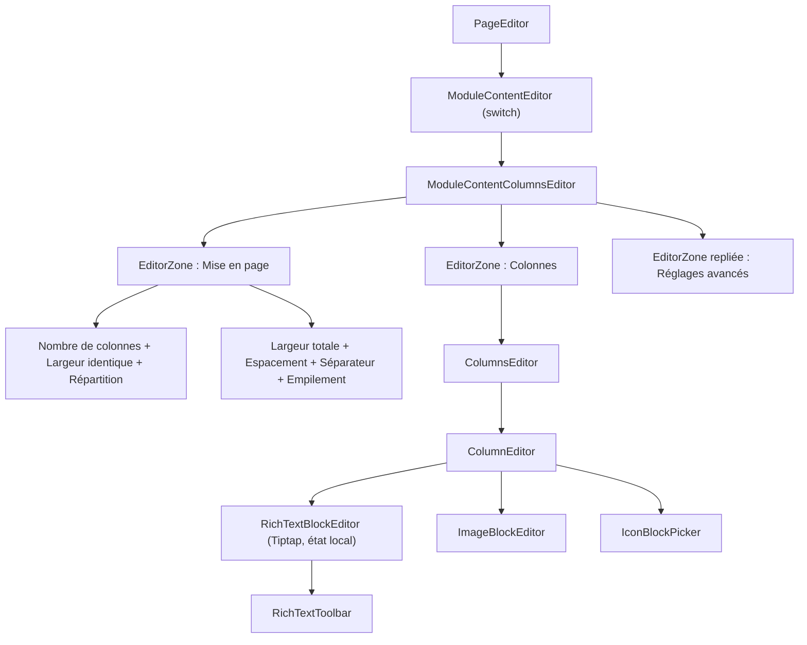
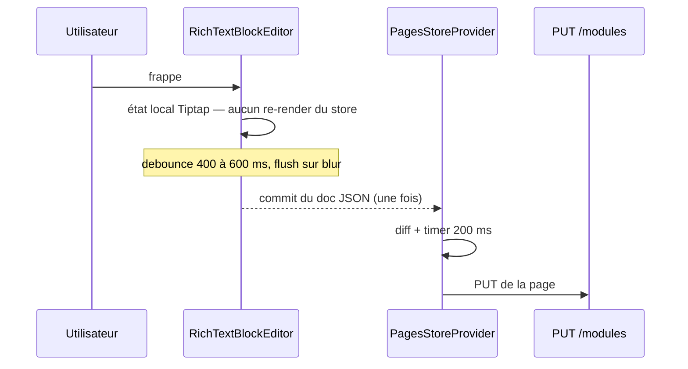
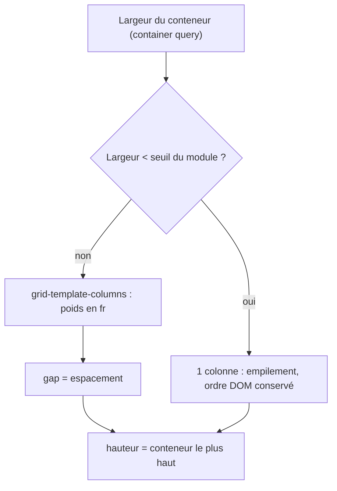

# Plan — ROADMAP Étape 12.1 : « Section de contenu en colonnes »

## 0. Objectif

Créer une **nouvelle famille de module** du Page Builder permettant à un utilisateur **non technique** d'écrire et de mettre en forme du contenu directement **dans la section**, avec une expérience proche d'un traitement de texte, et de répartir ce contenu en **1 à 4 colonnes** (« conteneurs ») réglables.

Le module doit permettre :

- **Texte riche** : titres et sous-titres, texte courant, **gras**, *italique*, alignement (gauche / centre / droite / justifié) ;
- **Listes** à puces et numérotées ;
- **Liens hypertextes** (page du site, section de page, lien externe — via le sélecteur existant) ;
- **Images** insérées dans le flux ;
- **Icônes** depuis une bibliothèque gratuite (**SVG en priorité**) ;
- **Mise en page** : 1 colonne à largeur réglable, 2 colonnes à largeurs individuelles + largeur totale, 3 ou 4 colonnes ;
- **Hauteur de section = colonne la plus haute** (comportement automatique) ;
- **Responsive** : les colonnes s'empilent verticalement (exigence prioritaire) ;
- **Accessibilité** complète.

**Contraintes projet** : zéro `any`, TypeScript strict, avancement lot par lot avec validation.

**Une migration est nécessaire — correction issue du Lot C.** Le **contenu** vit entièrement dans le JSONB `content` et n'exige aucun changement de schéma ; mais `module_type` est un **enum Postgres** ([`moduleTypeEnum`](../src/db/schema.ts:53)), et ajouter une **nouvelle famille** demande `ALTER TYPE … ADD VALUE`. Une simple **variante** d'une famille existante (galerie 11.1, bandeau 11.27) n'en demandait pas : c'est la différence entre les deux situations. Migration générée : `drizzle/0006_whole_puff_adder.sql`.

---

## 1. État des lieux (audit du code existant)

### 1.1 Briques réutilisables telles quelles

| Brique | Rôle | Réutilisation |
| --- | --- | --- |
| [`EditorZone`](../src/components/backoffice/pages/modules/EditorZone.tsx:77) / `EditorSubZone` | zones titrées + portée + teintes | structure de l'éditeur |
| [`EDITOR_TYPE`](../src/components/backoffice/pages/modules/editor-type.ts:48) | échelle typographique des éditeurs | tous les libellés |
| [`TextField` / `TextAreaField` / `SelectField`](../src/components/backoffice/pages/modules/form-fields.tsx:205) | champs partagés + tooltip « i » | tous les champs |
| [`LinkTargetSelect` / `LinkTargetField`](../src/components/backoffice/pages/modules/LinkTargetSelect.tsx) | sélecteur de destination (11.16 / 11.26) | insertion et édition d'un lien |
| [`MediaPicker`](../src/components/backoffice/media/MediaPicker.tsx) / [`MediaUploadButton`](../src/components/backoffice/media/MediaUploadButton.tsx) | choix et upload média | insertion d'image |
| [`MediaImage`](../src/components/common/MediaImage.tsx) | `next/image`, lazy, blur | rendu des images |
| [`NavLink`](../src/components/common/NavLink.tsx) | liens internes avec compensation du Header | rendu des liens internes |
| `lucide-react` | bibliothèque d'icônes **déjà installée** | icônes insérables |

### 1.2 L'existant à faire évoluer

| Point d'intégration | Fichier | Nature du changement |
| --- | --- | --- |
| Famille de modules | [`src/lib/pages.ts:184`](../src/lib/pages.ts:184) | ajouter la valeur à `PageModuleType` |
| Union de contenus | [`src/lib/pages.ts:2173`](../src/lib/pages.ts:2173) | ajouter la branche discriminée |
| Catalogue | [`src/lib/pages.ts:2695`](../src/lib/pages.ts:2695) | nouvelle entrée (`moduleCatalog`) |
| Fabriques | [`src/lib/pages.ts:2806`](../src/lib/pages.ts:2806) | `createModuleContent` (switch exhaustif) |
| Icône | [`src/components/backoffice/pages/ModuleIcon.tsx:22`](../src/components/backoffice/pages/ModuleIcon.tsx:22) | mapping `type → LucideIcon` |
| Routage éditeur | [`src/components/backoffice/pages/modules/ModuleContentEditor.tsx:54`](../src/components/backoffice/pages/modules/ModuleContentEditor.tsx:54) | nouvelle branche |
| Routage public | [`src/components/modules/PublicModules.tsx:241`](../src/components/modules/PublicModules.tsx:241) | nouvelle branche |
| Validation | [`src/lib/schemas/persistence.ts:331`](../src/lib/schemas/persistence.ts:331) | schéma Zod dédié (le champ reste `z.unknown()`) |

**Deux constats corrigés en cours d'implémentation (Lot C).**

1. **Le contenu n'exige aucune migration, mais la famille, si.** [`moduleSchema`](../src/lib/schemas/persistence.ts:331) déclare `content: z.unknown()` ⇒ le JSONB absorbe la nouvelle forme sans rien changer. En revanche `module_type` est un **enum Postgres** ([`moduleTypeEnum`](../src/db/schema.ts:53)) : ajouter une **nouvelle famille** exige `ALTER TYPE … ADD VALUE`, là où une simple **variante** d'une famille existante (galerie 11.1, bandeau 11.27) vivait uniquement dans le JSONB. C'est la **première migration** de ce type pour un module.

2. **Le filet de sécurité `tsc` est partiel.** Seuls deux points d'intégration signalent l'oubli : [`ModuleIcon`](../src/components/backoffice/pages/ModuleIcon.tsx:22) (type `Record<PageModuleType, …>`) et [`createModuleContent`](../src/lib/pages.ts:2806) (type de retour `ModuleContent`). Les `switch` de [`ModuleContentEditor`](../src/components/backoffice/pages/modules/ModuleContentEditor.tsx:54) et [`PageModuleRenderer`](../src/components/modules/PublicModules.tsx:241) **n'ont pas de branche par défaut** : un cas manquant ne fait pas échouer `tsc`, il rend `undefined` — donc une section simplement **invisible**. Leçon à retenir pour les prochaines familles : vérifier ces deux `switch` à la main.

3. **Un quatrième point d'intégration, lui aussi parfaitement muet.** [`moduleTypeSchema`](../src/lib/schemas/persistence.ts:20) énumère les familles pour la validation d'écriture côté serveur. Comme Zod **infère** son type de cette liste, l'oublier ne casse ni `tsc`, ni `lint`, ni `build` : l'ajout du module échoue seulement **à l'enregistrement**, en **HTTP 400** (`Requête invalide`). C'est ce défaut qui a réellement bloqué la première recette du module.

**Checklist d'une nouvelle famille de module** — neuf points, dont **cinq ne se signalent pas à la compilation** :

| # | Point | Muet à la compilation ? |
| --- | --- | --- |
| 1 | `PageModuleType` ([`src/lib/pages.ts`](../src/lib/pages.ts:184)) | non (cascade) |
| 2 | `ModuleContent` ([`src/lib/pages.ts`](../src/lib/pages.ts:2173)) | non (cascade) |
| 3 | `moduleCatalog` | **oui** |
| 4 | `createModuleContent` | non (type de retour) |
| 5 | `ModuleIcon` | non (`Record<…>`) |
| 6 | `ModuleContentEditor` | **oui** (aucune branche par défaut) |
| 7 | `PageModuleRenderer` | **oui** (aucune branche par défaut) |
| 8 | `moduleTypeEnum` (Postgres) + migration | **oui** (erreur à l'exécution) |
| 9 | **`moduleTypeSchema` (Zod)** | **oui** (erreur à l'exécution) |

### 1.3 Contrainte technique majeure : la frappe contre le store

[`PagesStoreProvider`](../src/components/backoffice/PagesStoreProvider.tsx:144) réagit à **chaque** changement d'état :

1. comparaison `JSON.stringify(oldModules) !== JSON.stringify(newModules)` sur **toute** la page ([ligne 204](../src/components/backoffice/PagesStoreProvider.tsx:204)) ;
2. recréation du `useMemo` du contexte ⇒ **re-render de tout l'arbre** ([ligne 231](../src/components/backoffice/PagesStoreProvider.tsx:231)) ;
3. `PUT` de **toute la page** après 200 ms ([ligne 216](../src/components/backoffice/PagesStoreProvider.tsx:216)) via [`persistUpdateModules`](../src/lib/persistence-client.ts:97).

Le modèle « chaque frappe persiste », adapté à un champ de 40 caractères, **ne l'est pas** à un éditeur riche. **Décision : l'éditeur de texte riche est non contrôlé vis-à-vis du store** (état local + commit débouncé + flush sur `blur`). Aucune refonte du store n'est requise.

---

## 2. Décisions structurantes (à confirmer en Lot 0)

| # | Décision | Choix proposé | Justification |
| --- | --- | --- | --- |
| D-1 | Famille | `type: "content"` + `variant: "columns"` | Aligne le pattern existant `hero` / `cta-banner` |
| D-2 | Vocabulaire UI | **« Colonne »** (jamais « conteneur », « grille », « breakpoint ») | Mot de l'utilisateur, hérité de Word ; principe P4 |
| D-3 | Vocabulaire code | **`container`** | Lève l'ambiguïté avec les colonnes CSS et documente l'indépendance des blocs |
| D-4 | Modèle de colonnes | **Conteneurs indépendants** (pas de flux type « colonnes de presse » de Word) | Seul modèle permettant image/icône **par** colonne |
| D-5 | Largeurs | **Poids relatifs** (`weight`), normalisés au rendu — **jamais de pixels** | Invariant responsive garanti par le type |
| D-6 | Réglage individuel | Case **« Largeur identique » cochée par défaut** (miroir de Word) | Simple par défaut, précis au besoin |
| D-7 | Largeur totale | **Jeton** `maxWidth` (Étroite / Standard / Large / Pleine largeur) | Aucune valeur magique |
| D-8 | Hauteur | **Auto** (`align-items: stretch` par défaut), option « aligner en haut » | Comportement natif de Grid, coût nul |
| D-9 | Mobile | **Empilement strict à 1 colonne** | Prévisible et accessible ; pas de 2×2 |
| D-10 | Ordre | Réordonnancement **dans les données**, jamais par `order:` CSS | Ordre DOM = ordre de lecture |
| D-11 | Changement du nombre de colonnes | **Non destructif** (les conteneurs retirés gardent leurs blocs) | Fiabilité perçue |
| D-12 | Titres | **H2 / H3 / H4 uniquement** (jamais H1 : il appartient au Héro) | Hiérarchie sémantique de la page |
| D-13 | Éditeur | **Tiptap v3** (ProseMirror), configuration **fermée** | Headless, JSON stable, React 19 |
| D-14 | Rendu public | **Static renderer côté serveur** → React, **sans** `dangerouslySetInnerHTML` | Compatible RSC / ISR |
| D-15 | Icônes | Stocker le **nom** de l'icône, jamais le SVG brut | Poids, XSS, `currentColor` |
| D-16 | Styles | **Une seule portée** `.rich-content` partagée éditeur / public | WYSIWYG crédible |

---

## 3. Modèle de données

Ajouté à [`src/lib/pages.ts`](../src/lib/pages.ts) (esquisse, sans les commentaires d'en-tête qui suivent la convention du fichier) :

```ts
export type TextAlign = "left" | "center" | "right" | "justify";
export type ContentHeadingLevel = 2 | 3 | 4;
export type ContentMaxWidth = "narrow" | "standard" | "wide" | "full";
export type ContentGap = "sm" | "md" | "lg";
export type ContentStackAt = "sm" | "md" | "lg";
export type ContentIconSize = "sm" | "md" | "lg";

/** Document ProseMirror (JSON) — le HTML n'est jamais stocké. */
export interface RichTextDoc {
  type: "doc";
  content?: RichTextNode[];
}
export type RichTextNode = Record<string, unknown>;

export type ContentBlock =
  | { id: string; kind: "rich-text"; doc: RichTextDoc }
  | { id: string; kind: "image"; media: MediaField; width: "auto" | "full"; align: TextAlign }
  | { id: string; kind: "icon"; name: string; size: ContentIconSize; align: TextAlign }
  | { id: string; kind: "spacer"; size: ContentGap };

export interface ContentContainer {
  id: string;
  /** Poids relatif de répartition (ignoré si layout.sameWidth). */
  weight: number;
  blocks: ContentBlock[];
}

export interface ContentColumnsContent {
  type: "content";
  variant: "columns";
  /** Titre de section optionnel (h2). */
  heading: string;
  containers: ContentContainer[]; // 1..4
  layout: {
    maxWidth: ContentMaxWidth;
    gap: ContentGap;
    sameWidth: boolean;   // = « Largeur identique » de Word (true par défaut)
    separator: boolean;   // = « Ligne entre les colonnes »
    stackAt: ContentStackAt;
    verticalAlign: "stretch" | "start" | "center";
  };
}
```

**Règles d'or**

1. **Aucune dimension en pixels** ni dans les types, ni dans le rendu.
2. **`id` stable** sur chaque conteneur et chaque bloc (clés React, réordonnancement, stabilité du re-render).
3. **Invariant `1 ≤ containers.length ≤ 4`** garanti par l'éditeur **et** par le schéma Zod.
4. **Rétro-compatibilité** par un résolveur `resolveContentColumnsContent()` (même patron que [`resolveGalleryContent`](../src/lib/pages.ts) et `resolveCtaBannerContent`) : tolère les formes partielles et applique les défauts.

---

## 4. Rendu public et styles partagés

### 4.1 Composants (Server Components)

```
src/components/modules/content/
├── ContentColumnsModule.tsx    # section + grille responsive + séparateur
├── ContentBlockRenderer.tsx    # aiguillage bloc par bloc
└── RichTextRenderer.tsx        # doc ProseMirror -> React (static renderer)
```

`ContentColumnsModule` est branché dans [`PageModuleRenderer`](../src/components/modules/PublicModules.tsx:234). Aucun état client : le module reste **statique / ISR**.

### 4.2 Portée de styles unique

Nouvelle portée `.rich-content` dans [`src/app/globals.css`](../src/app/globals.css), pilotée par les **variables CSS existantes** (`--text-color`, `--text-muted`, `--font-heading`, `--border-color`). Elle est appliquée **à l'identique** :

- dans `RichTextRenderer` (site public) ;
- dans `RichTextBlockEditor` (back-office).

C'est cette **source unique** qui garantit que « ce que je vois est ce qui sera publié ». Le CSS de `.ProseMirror` est neutralisé par cette portée, jamais l'inverse.

---

## 5. Éditeur back-office



```
src/components/backoffice/pages/modules/content/
├── ModuleContentColumnsEditor.tsx
├── LayoutControls.tsx
├── ColumnsEditor.tsx
├── ColumnEditor.tsx
├── RichTextToolbar.tsx
├── blocks/
│   ├── RichTextBlockEditor.tsx
│   ├── ImageBlockEditor.tsx
│   ├── IconBlockPicker.tsx
│   └── rich-text-config.ts   # SOURCE UNIQUE : extensions autorisées + barre d'outils
```

**`rich-text-config.ts` est la clé de la maintenabilité** : la liste des fonctionnalités autorisées est déclarée **une fois**, consommée par l'éditeur **et** par le rendu public. Impossible de désynchroniser l'édition et le rendu.

### 5.1 Contrat de l'éditeur riche (état local)



- `onUpdate` → **pas** de commit immédiat, seulement un report de minuterie ;
- `onBlur` → **commit immédiat** (rien n'est perdu à la fermeture de l'accordéon) ;
- démontage → commit de sécurité si une modification est en attente.

---

## 6. Responsive (exigence prioritaire)



**Cinq principes opposables**

1. **Mobile-first** : sous `stackAt`, une seule colonne, dans l'**ordre du DOM**.
2. **`minmax(0, <poids>fr)` obligatoire** : sans le `0`, une longue URL ou un mot insécable fait exploser la colonne (bug classique).
3. **Container queries** plutôt que media queries de fenêtre : c'est la largeur **du module** qui décide, ce qui rend le module réellement réutilisable.
4. **Aucune hauteur fixe** : `align-items: stretch` (défaut) donne déjà « hauteur = la plus haute ».
5. **La gouttière change de sens** : `column-gap` en large, `row-gap` à l'empilement — un seul réglage « Espacement » pilote les deux.

---

## 7. Accessibilité

| Point | Règle |
| --- | --- |
| Ordre de lecture | Ordre **DOM = ordre visuel** ; réordonnancement dans les données, **jamais** `order:` CSS |
| Titres | H2 / H3 / H4 uniquement (H1 = Héro) |
| Barre d'outils | `role="toolbar"` + `aria-label` français ; `aria-pressed` sur les bascules |
| Raccourcis | Ctrl/Cmd + B, I, K (lien) — socle du ressenti « traitement de texte » |
| Liens | Réutilisation du sélecteur existant ; externe = nouvel onglet + `rel="noopener noreferrer"` ; `mailto:` / `tel:` même onglet |
| Images | `alt` **obligatoire** dans l'éditeur ([`MediaField`](../src/lib/pages.ts:224)) |
| Listes | Vraies balises `<ul>` / `<ol>` |
| Focus | Le retour texte ⇄ barre d'outils ne doit pas perdre le focus |
| Mouvement | Suppression — et non accélération — sous `prefers-reduced-motion` |
| Contraste | Fond de section limité aux **jetons du thème** (jamais de couleur libre) |

---

## 8. Lots d'exécution

| Lot | Contenu | Livrable |
| --- | --- | --- |
| **0** | Geler les décisions D-1 à D-16 | décisions consignées |
| **A** | Types, constantes et libellés FR dans [`src/lib/pages.ts`](../src/lib/pages.ts) | `ContentColumnsContent` et jetons |
| **A2** | `createContentColumnsContent()` + `resolveContentColumnsContent()` | fabrique et résolveur testables |
| **B** | `contentColumnsContentSchema` dans [`persistence.ts`](../src/lib/schemas/persistence.ts:331) | validation d'écriture, tolérance de lecture |
| **C** | Branchement aux points d'intégration (8 fichiers, cf. §1.2) | famille reconnue, icône, catalogue |
| **D** | Portée `.rich-content` dans [`globals.css`](../src/app/globals.css) | source unique de styles |
| **E** | `ContentColumnsModule` + `ContentBlockRenderer` | rendu public de la grille |
| **F** | `RichTextRenderer` (static renderer) | texte riche sans HTML brut |
| **G** | `rich-text-config.ts` (extensions + barre d'outils) | configuration unique |
| **H** | `RichTextBlockEditor` (état local, débounce, flush `blur`) | édition fluide |
| **I** | `RichTextToolbar` (rôles, raccourcis, lien) | barre accessible |
| **J** | `LayoutControls` (nombre, largeur identique, répartition, espacement, séparateur, largeur totale, empilement) | mise en page réglable |
| **K** | `ColumnsEditor` / `ColumnEditor` (ajout/retrait non destructif, réordonnancement clavier) | gestion des colonnes |
| **L** | Blocs Image / Icône / Espacement + réordonnancement | contenu hétérogène |
| **M** | `IconBlockPicker` (nom seul stocké) | icônes insérables |
| **N** | Responsive : `minmax(0, …)`, container queries, empilement, gouttière | conformité §6 |
| **O** | Accessibilité : ordre, titres, focus, contrastes, mouvement | conformité §7 |
| **P** | Consommateurs transverses (SEO [`public-page.ts`](../src/lib/public-page.ts), aperçus, switches) | aucun régression |
| **Q** | Démo et recette utilisateur non technique | validation terrain |
| **R** | `npx tsc --noEmit`, `npm run lint`, `npm run build` | qualité |
| **S** | `ROADMAP.md`, `CHANGELOG.md`, ce plan | traçabilité |

### 8.1 Dépendances à installer (Lot G)

`@tiptap/react`, `@tiptap/pm`, `@tiptap/starter-kit`, `@tiptap/extension-link`, `@tiptap/extension-image`, `@tiptap/extension-text-align`, `@tiptap/extension-underline`, `@tiptap/static-renderer`.

**À vérifier à l'installation** : compatibilité React 19 / Next 16.4 (Tiptap **v3** — la v2 posait des conflits de *peer dependencies* avec React 19).

> **Rappe**l : conformément à [`AGENTS.md`](../AGENTS.md:1), lire la documentation versionnée dans `node_modules/next/dist/docs/` **avant** d'écrire du code (règles `next dev`, APIs et conventions susceptibles d'avoir changé).

---

## 9. Critères d'acceptation

1. Un utilisateur sans culture web crée une section, écrit un titre, du gras, une liste, un lien, une image et une icône **sans explication**.
2. Le réglage « Nombre de colonnes » propose 1 à 4 ; « Largeur identique » est cochée par défaut.
3. La répartition individuelle ne s'affiche qu'après décochage de « Largeur identique ».
4. Passer de 4 à 2 colonnes **ne supprime aucun contenu** ; le retour à 4 les restitue.
5. Sur mobile, les colonnes **s'empilent** dans l'ordre de lecture ; l'ordre de tabulation est correct.
6. La hauteur de section égale celle du conteneur le plus haut, sans hauteur codée en dur.
7. Aucune valeur en pixels n'est présente dans le JSONB enregistré.
8. Le rendu public est **identique** à l'aperçu de l'éditeur (portée `.rich-content` partagée).
9. Le site public reste **statique / ISR** : aucun `contentEditable` n'est monté côté visiteur.
10. Frapper 200 caractères ne déclenche **aucun** `PUT` intermédiaire (commit groupé uniquement).
11. `tsc`, `lint` et `build` passent ; aucun `any`.

---

## 10. Risques et points de vigilance

| Risque | Parade |
| --- | --- |
| Re-render global à chaque frappe | Éditeur non contrôlé + débounce + flush `blur` (§1.3, §5.1) |
| Explosion d'une colonne (URL longue) | `minmax(0, …fr)` obligatoire (Lot N) |
| Contenu perdu au changement du nombre de colonnes | D-11 non destructif (Lot K) |
| Divergence aperçu / site public | Portée `.rich-content` unique (Lot D) |
| HTML brut injecté | Rendu par static renderer, jamais `dangerouslySetInnerHTML` (Lot F) |
| Ambiguïté du mot « colonne » (flux Word) | Vocabulaire D-2/D-3 + aperçu live + invitation « Écrivez ici… » |
| Justifié illisible en colonne étroite | Proposer le justifié seulement en 1 colonne large ; `hyphens: auto` |
| Dépendance Tiptap incompatible | Vérification à l'installation (Lot G), repli sur Lexical sinon |

---

## 11. Hors périmètre (évolutions futures)

- **Variante « flux »** (`variant: "flow"`, CSS `columns`) pour un texte pur qui coule de colonne en colonne, à l'image exacte de Word — **module distinct**, jamais un mode de l'éditeur à conteneurs.
- Glisser-déposer des blocs et des conteneurs (le réordonnancement clavier ↑/↓ est le prérequis, jamais remplacé).
- Import d'un fichier `.docx`.
- Modèles de sections pré-remplies (« deux colonnes texte + photo », « trois atouts avec icônes »).
- Bibliothèque d'icônes élargie (Iconify) au-delà de `lucide-react`.
