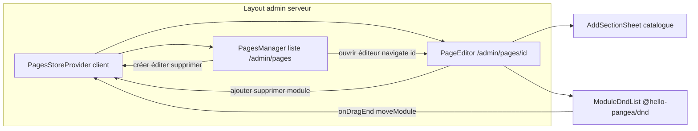

# Plan — ROADMAP Étape 3.2 : Conteneur Drag & Drop des Modules + Menu « + Ajouter une section » (Page Builder)

## Objectif

Poursuivre la **Phase 3 – Back-Office « Créateur de Pages » (Page Builder)** en créant
l'**éditeur de page** : une route dédiée `/admin/pages/[id]` où le photographe compose
la page par **empilement de modules réordonnables par Drag & Drop** (`@hello-pangea/dnd`),
via un **menu « + Ajouter une section »** ouvrant le catalogue de modules préformatés.

À l'issue de cette étape, le photographe doit pouvoir **ajouter, supprimer et réordonner
les modules d'une page** (persistance simulée dans un **store React Context global au
Back-Office**, en attendant l'intégration Supabase/Drizzle). Les *bandeaux accordéon
compacts* (poignée, libellé, Toggle Eye, suppression intégrés) et le *CRUD déplié* des
champs font l'objet des **Étapes 3.3 et 3.4** — l'Étape 3.2 livre l'**ossature** : types de
modules, état partagé, ordre, ajout/suppression, et le **conteneur DnD** réutilisable.

## Références projet

- `ROADMAP.md` — Phase 3, Étape 3.2 `[IN_PROGRESS]`.
- `SPECIFICATIONS-V8.md` §7.2-B « Constructeur de Pages à Blocs Modulaires » (Canvas
  vierge, menu « + Ajouter une section », gestionnaire Accordéon Compact & Drag & Drop)
  et §8 « Catalogue des Templates de Sections Préformatées » (familles de modules).
- `PROJECT_CONTEXT.md` §3 « Back-Office Page Builder » + §1.2 (Dashboard « épurée et
  hautement contrastée », **Desktop-first**).
- `.kilorules` §2 (structure des fichiers, `/components/modules/` à terme), §3
  (Client Components isolés, étape par étape, zéro `any`, vérification build), §4
  (pas de bibliothèque UI fermée ; Drag & Drop via `@hello-pangea/dnd` ou `@dnd-kit`).
- `ARCHITECTURE.md` §1 (Back-Office = SSR + Client Components isolés ; `useState` /
  `useContext` pour états locaux) et §2 (structure `(back-office)/admin`).
- `plans/ROADMAP-3.1-pagemetadata.md` — Étape précédente : `PagesManager`,
  `PageMetadataForm`, `src/lib/pages.ts`, chrome `/admin`, portée `.admin`.
- Composants déjà injectés : `src/components/ui/{button,input,label,select,switch,badge,
  textarea,separator,dialog}.tsx` + alias `@/*` et tokens `.admin` (`globals.css`).

## 0. Décisions d'architecture (préalables à valider)

1. **Route éditeur dédiée** : `/admin/pages/[id]` (choix validé). Le `[id]` correspond à
   l'`id` stable d'une `SitePage` (seed `seed-*` ou `crypto.randomUUID()` pour les
   nouvelles). Aucune page publique ne change d'URL.
2. **Store React Context global au Back-Office** : l'état des `pages` (créé à l'Étape 3.1
   dans un `useState` *local* à `PagesManager`) **remonte** dans un **Provider client
   englobant tout `/admin`** (posé dans le Layout Dashboard serveur). Il porte aussi les
   **modules de chaque page** (`modulesByPage`). La liste `/admin/pages` et l'éditeur
   `/admin/pages/[id]` consomment la même source → créer/supprimer une page ou manipuler
   ses modules reste cohérent entre navigations (persistance de session simulée, aucune BDD).
3. **Persistance simulée inchangée** : aucun SDK Supabase/Drizzle. Le Provider initialise
   avec `seedPages` + un jeu de **modules par défaut** par page (seed). Le schéma BDD
   n'est **pas modifié** (règle `.kilorules` §4). Le contrat de données `SitePage` /
   nouveau `PageModule` est documenté pour le futur mapping table `pages` + table
   `page_modules` (ordre = colonne `position`).
4. **Drag & Drop isolé** : la bibliothèque `@hello-pangea/dnd` n'est **pas compatible
   SSR/hydratation** (accès au DOM). Elle est encapsulée dans un sous-arbre client chargé
   via `next/dynamic(..., { ssr: false })` pour éviter tout `mismatch` d'hydratation.
   Compatibilité **React 19 à vérifier à l'installation** (dernière version stable) ;
   repli documenté : `@dnd-kit` (également autorisé par la spec §9 et `.kilorules`).
5. **Catalogue « + Ajouter une section »** : panneau latéral droit **`Sheet`** (shadcn/ui,
   wrapper du `@radix-ui/react-dialog` **déjà installé** → aucune dépendance Radix
   supplémentaire). Le catalogue expose un **sous-ensemble représentatif** des 8 familles
   de la spec §8 (Hero, À-propos, Services/Tarifs, Bandeau CTA, Galerie, FAQ, Contact).
6. **Périmètre de l'Étape 3.2 vs 3.3/3.4** : l'Étape 3.2 livre les types, l'état partagé,
   l'ordre (DnD), l'ajout et la suppression de modules, avec un **rendu « bandeau » simple**
   par module (libellé + icône + poignée + suppression). Le *bandeau accordéon compact*
   finalisé (Toggle Eye, glisser intégré, masquage, animations) et le *CRUD déplié*
   (champs textuels, médias, CTA, ancres) sont respectivement **3.3** et **3.4**.

## 1. Fichiers concernés

### 1.1 Dépendance & composant UI — installation / injection

- **Installer** `@hello-pangea/dnd` (vérifier à l'installation que la version retenue
  déclare le support de **React 19** en `peerDependencies` ; sinon choisir `@dnd-kit` et
  documenter l'écart dans le CHANGELOG).
- **Injecter** `src/components/ui/sheet.tsx` (variante shadcn/ui moderne `data-slot`, comme
  `dialog.tsx`) — pas de dépendance Radix nouvelle (`@radix-ui/react-dialog` présent).

### 1.2 Modèle étendu — `src/lib/pages.ts` (modifié)

Ajouter les types **module** et le **catalogue** (logique pure, **zéro JSX / zéro icône** ;
les icônes sont mappées côté composant dans `ModuleIcon.tsx`, cf. §1.6) :

```ts
/** Identifiants stables des familles de modules (spec §8, sous-ensemble Étape 3.2). */
export type PageModuleType =
  | "hero" | "about" | "services" | "cta-banner" | "gallery" | "faq" | "contact";

/** Animation d'entrée d'un module (spec §7.2-B ; pleinement exploitée en 3.4). */
export type ModuleAnimation = "default" | "fade-up" | "fade-in" | "scale-in" | "none";

/** Module de page — mappe 1:1 vers la future table `page_modules` (position = ordre). */
export interface PageModule {
  id: string;               // stable (mock : crypto.randomUUID())
  type: PageModuleType;
  title: string;            // libellé court (par défaut : label du type)
  hidden: boolean;          // Toggle Eye (visibilité, exploité pleinement en 3.3)
  animation: ModuleAnimation;
  anchorId: string;         // ancre générée, ex. "hero-1" (modifiable en 3.4)
}

/** Entrée du catalogue : méta statique d'un type de module. */
export interface ModuleMeta {
  type: PageModuleType;
  label: string;            // ex. "Héro plein écran"
  category: string;         // ex. "Héro & accroche" (groupe catalogue)
  description: string;      // une phrase d'aide
}

/** Catalogue ordonné des modules proposés dans « + Ajouter une section ». */
export const moduleCatalog: ModuleMeta[];

/** Crée un module par défaut pour un type donné (title = label, anchorId indexé). */
export function createModule(type: PageModuleType, sequence: number): PageModule;

/** Modules de départ d'une page seed (fonction déterministe par slug). */
export function buildSeedModules(slug: string): PageModule[];

/** Réordonne un tableau de modules : de `from` vers `to` (helper pur, réutilisé par le DnD). */
export function reorderModules<T>(list: T[], from: number, to: number): T[];
```

> `buildSeedModules` : ex. page `Accueil` → `[hero, gallery, cta-banner]`,
> `Portfolio` → `[hero, gallery, contact]`, autres → `[hero, about]` ; nouvelles pages
> créées via le formulaire (3.1) → **aucun module** (canvas vide + CTA d'ajout).

### 1.3 Store global — `src/components/backoffice/PagesStoreProvider.tsx` (nouveau)

**Client Component** (`"use client"`) qui **encadre tout `/admin`** (posé dans le Layout
Dashboard §1.4) et porte l'état mock partagé + ses actions :

```tsx
export type PagesStoreValue = {
  pages: SitePage[];
  getPage: (id: string) => SitePage | undefined;
  createPage: (draft: PageMetadataDraft) => SitePage;
  updatePage: (id: string, draft: PageMetadataDraft) => void;
  deletePage: (id: string) => void;
  // Modules
  getModules: (pageId: string) => PageModule[];
  addModule: (pageId: string, type: PageModuleType) => void;
  removeModule: (pageId: string, moduleId: string) => void;
  moveModule: (pageId: string, from: number, to: number) => void;
};

export function PagesStoreProvider({ children }: { children: ReactNode });
export function usePagesStore(): PagesStoreValue; // throws hors Provider
```

- **État** : `useState` d'un objet unique `{ pages: SitePage[]; modulesByPage: Record<string, PageModule[]> }`
  initialisé une fois avec `seedPages` + `buildSeedModules(slug)` pour chaque page seed.
- **Actions** : chaque mutation clône proprement l'état (zéro mutation directe) et met à
  jour `updatedAt` (ISO) ; `deletePage` retire aussi `modulesByPage[pageId]` ;
  `createPage` initialise `modulesByPage[newId] = []` ; `moveModule`/`addModule`/
  `removeModule` recalculent l'ordre (cf. `reorderModules`).
- **Garde-fou** : consommer **strictement** les actions du Provider (aucun `setState`
  parallèle ailleurs). Le hook exporté est la seule porte d'accès.

### 1.4 Intégration — `src/app/(back-office)/admin/layout.tsx` (modifié)

Le Layout Dashboard (Server Component) enveloppe sa zone de contenu d'un **Provider
client** : `<PagesStoreProvider>{children}</PagesStoreProvider>` autour du `<main>`.
Le chrome (sidebar/topbar) reste serveur ; seul le sous-arbre de contenu est client.

> Garde-fou : les composants de liste/éditeur deviennent consommateurs du hook
> `usePagesStore` ; le Layout reste **Server Component** (aucun `"use client"`).

### 1.5 Refactor — `src/components/backoffice/pages/PagesManager.tsx` (modifié)

- **Supprimer** le `useState<SitePage[]>(initialPages ?? seedPages)` local et les mutations
  directes ; consommer le store : `const { pages, createPage, updatePage, deletePage } = usePagesStore()`.
- **Action « Ouvrir l'éditeur »** : nouveau bouton/icône par ligne (ou lien sur le titre)
  → `router.push(`/admin/pages/${page.id}`)` (`useRouter` de `next/navigation`).
- **Création/édition/suppression** : remplacer les appels internes par les actions du store
  (comportement 3.1 conservé : Dialog `PageMetadataForm`, confirmation de suppression).
- La page serveur `src/app/(back-office)/admin/pages/page.tsx` **cesse de passer**
  `initialPages` (le seed vit dans le Provider) : `<PagesManager />` sans props.

### 1.6 Composants de l'éditeur — `src/components/backoffice/pages/`

#### 1.6.1 Écran — `PageEditor.tsx` (nouveau, `"use client"`)
Écran plein de l'éditeur d'une page :
- **En-tête** : bouton retour liste (`← Pages`), titre de la page + slug (`/{slug}`),
  `Badge` statut (Publié/Brouillon), lien « Aperçu » (`/slug`, `target=_blank`).
- **Canvas** : liste des modules (§1.6.3) ; **état vide** (page sans module) = encart
  « Cette page est vide » + CTA « + Ajouter une section ».
- **Bouton « + Ajouter une section »** (sticky bas ou barre d'outils) → ouvre la `Sheet`
  catalogue (§1.6.2).
- **Garde-fou « page introuvable »** : si `getPage(id)` renvoie `undefined` (id inconnu ou
  page supprimée), afficher un état dédié + lien retour (aucune erreur runtime).

#### 1.6.2 Catalogue — `AddSectionSheet.tsx` (nouveau, `"use client"`)
- `Sheet` latérale droite (`side="right"`) : titre « Ajouter une section », sous-titre.
- Grille du catalogue `moduleCatalog` groupée par `category` : chaque entrée = carte
  cliquable (icône `ModuleIcon`, `label`, `description`).
- Clic → `addModule(pageId, type)` → fermeture de la `Sheet` → le nouveau module apparaît
  **en fin de canvas** (scroll/feedback visuel optionnel).

#### 1.6.3 Canvas DnD — `ModuleDndList.tsx` (nouveau, `"use client"`, cœur de l'Étape)
Encapsule `@hello-pangea/dnd` (import direct ici — le chargement SSR est neutralisé au
§1.6.5 par `next/dynamic`) :

```tsx
import { DragDropContext, Droppable, Draggable } from "@hello-pangea/dnd";

export function ModuleDndList({ modules }: { modules: PageModule[] }) {
  return (
    <DragDropContext onDragEnd={handleDragEnd}>
      <Droppable droppableId="page-modules">
        {(provided) => (
          <div ref={provided.innerRef} {...provided.droppableProps} className="space-y-3">
            {modules.map((module, index) => (
              <Draggable key={module.id} draggableId={module.id} index={index}>
                {(dragProvided, snapshot) => <ModuleRow ... />}
              </Draggable>
            ))}
            {provided.placeholder}
          </div>
        )}
      </Droppable>
    </DragDropContext>
  );
}
```

- **`onDragEnd`** : si `destination` existe et diffère de `source.index` →
  `moveModule(pageId, source.index, destination.index)` (utilise `reorderModules`).
- **Clé stable** : `module.id` comme `draggableId` + `key` React (jamais l'index).
- **Accessibilité** : `dragHandleId` sur la poignée uniquement (le reste du bandeau reste
  cliquable/sélectionnable) ; supports clavier natifs de la lib.

#### 1.6.4 Bandeau — `ModuleRow.tsx` (nouveau, `"use client"`)
Représentation **compacte provisoire** (l'accordéon complet viendra en 3.3) :
- Poignée de glissement `GripVertical` (attribuée en `dragHandleId`),
- `ModuleIcon` + `title` (libellé du module) + libellé du type en secondaire,
- Bouton suppression `Trash2` → `removeModule(pageId, module.id)` (suppression directe,
  l'UX de confirmation/undo sera peaufinée en 3.3),
- Style : carte `border`, `bg-card`, hover `bg-muted/40`, état `isDragging` (ombre).

#### 1.6.5 Point de montage — `PageEditorScreen.tsx` (nouveau, `"use client"`)
Wrapper minimal qui **charge l'éditeur sans SSR** pour isoler `@hello-pangea/dnd` :

```tsx
const PageEditor = dynamic(() => import("./PageEditor").then((m) => m.PageEditor), {
  ssr: false,
  loading: () => <p className="text-sm text-muted-foreground">Chargement de l'éditeur…</p>,
});

export function PageEditorScreen({ pageId }: { pageId: string }) {
  return <PageEditor pageId={pageId} />;
}
```

### 1.7 Route serveur — `src/app/(back-office)/admin/pages/[id]/page.tsx` (nouveau)

```tsx
import type { Metadata } from "next";
import { PageEditorScreen } from "@/components/backoffice/pages/PageEditorScreen";

export const metadata: Metadata = { title: "Éditeur de page — Administration" };

export default async function AdminPageBuilderPage({ params }: { params: Promise<{ id: string }> }) {
  const { id } = await params;
  return <PageEditorScreen pageId={id} />;
}
```

> Route **dynamique** : pas de pré-rendu statique à la compilation (le `[id]` est inconnu
> au build). Next génère la route à la demande (`force-dynamic` implicite par les données
> client) ; la validation d'existence est faite **côté client** dans `PageEditor`
> (§1.6.1) puisque les données vivent dans le store mock.

### 1.8 Icônes — `src/components/backoffice/pages/ModuleIcon.tsx` (nouveau)
Petit composant pur `{ type: PageModuleType }` → icône `lucide-react` (ex. `Sparkles`/`LayoutTemplate`
pour hero, `User`/`Images` pour about, `BadgeDollarSign`/`ShoppingBag` services,
`Megaphone` CTA, `LayoutGrid`/`Images` gallery, `CircleHelp` FAQ, `Mail`/`MapPin` contact).
Centralise le mapping type→icône (évite d'importer `lucide` dans `lib/pages.ts`).

## 2. Ordre d'exécution (Code mode) — avec validation à chaque sous-tâche

1. **ROADMAP** : Étape 3.2 déjà `[IN_PROGRESS]` (fait).
2. **Dépendance & UI** : installer `@hello-pangea/dnd` (vérifier peer React 19 ; repli
   `@dnd-kit` documenté) + injecter `src/components/ui/sheet.tsx`. → validation build.
3. **Modèle** `src/lib/pages.ts` : types module, `moduleCatalog`, `createModule`,
   `buildSeedModules`, `reorderModules` (logique pure, valeurs seed déterministes).
4. **Store** `PagesStoreProvider.tsx` (Provider + hooks) puis **intégration** dans
   `admin/layout.tsx`. → `tsc`.
5. **Refactor `PagesManager`** pour consommer le store (CRUD 3.1 préservé) + suppression de
   la prop `initialPages` de la page `/admin/pages`. → validation visuelle liste `/admin/pages`
   (créer/éditer/supprimer une page reflète l'éditeur et réciproquement).
6. **Route** `[id]/page.tsx` + `PageEditorScreen` (dynamic ssr:false) + `PageEditor`
   (en-tête, états vide/introuvable). → validation `/admin/pages/seed-home`.
7. **Canvas DnD** `ModuleDndList` + `ModuleRow` + `handleDragEnd`→`moveModule`.
   → validation : réordonner les modules au drag.
8. **Catalogue** `AddSectionSheet` + `ModuleIcon` + action d'ajout ; bouton suppression.
   → validation : ajouter/supprimer des modules.
9. **Contrôles finaux** : `npx tsc --noEmit`, `npm run build`, `npm run lint` (zéro erreur).
10. **Validation utilisateur** (`npm run dev` : `/admin/pages` → éditeur d'une page → DnD +
    ajout/suppression) puis mise à jour `CHANGELOG.md` + coche `3.2 [x]` et `3.3 [IN_PROGRESS]`
    dans `ROADMAP.md`.

## 3. Garde-fous / non-régression

- **Front-Office et layout racine inchangés** ; aucune URL publique modifiée.
- **CRUD Pages 3.1 préservé** : le refactor vers le store ne change pas le comportement
  (Dialog `PageMetadataForm`, unicité du slug, confirmation de suppression) ; seul l'état
  remonte d'un `useState` local vers le Provider.
- **Dashboard sans chrome public** conservé ; la portée `.admin` reste la seule source de
  style Back-Office (aucun code couleur en dur dans les nouveaux composants).
- **Isolation DnD** : `@hello-pangea/dnd` uniquement dans `ModuleDndList`, monté via
  `next/dynamic ssr:false` → zéro erreur d'hydratation ; en cas d'incompatibilité React 19
  constatée à l'installation, basculer sur `@dnd-kit` (même contrat de props/actions).
- **TypeScript strict, zéro `any`** ; `Record` typé, fonctions typées ; clés `draggableId`
  = `module.id` (stables, jamais l'index).
- **Pas de dépendance UI fermée** : `Sheet` = wrapper local shadcn/ui sur Radix déjà présent.
- **Pas de modification du schéma BDD** : `PageModule` documenté pour un futur mapping vers
  la table `page_modules` (colonne `position` = ordre du tableau).
- **Vérification finale obligatoire** : `npx tsc --noEmit`, `npm run build` et
  `npm run lint` sans erreur avant toute déclaration de fin d'étape.


