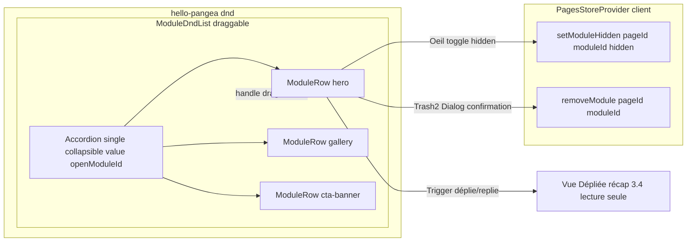

# Plan — ROADMAP Étape 3.3 : Composant Accordéon Compact (Drag handle, nom du module, Toggle Eye de masquage, suppression)

## Objectif

Poursuivre la **Phase 3 – Back-Office « Créateur de Pages » (Page Builder)** en
transformant le **bandeau provisoire** de l'Étape 3.2 (une simple rangée par module)
en un **gestionnaire Accordéon Compact** conforme à la spec §7.2-B :

- **Vue Compacte (accordéon fermé)** : une carte horizontale par module, avec
  **poignée de glissement** (réordonnancement DnD), **libellé du module** cliquable
  pour déplier/replier, **Toggle Eye** d'affichage/masquage et bouton de **suppression**.
- **Vue Dépliée (accordéon ouvert)** : une zone de contenu qui accueillera, à
  l'**Étape 3.4**, le formulaire CRUD complet (champs textuels, médias, CTA, ancres).
  À l'Étape 3.3, cette zone présente un **récapitulatif en lecture seule** du module
  (type, catégorie, ancre, animation, visibilité) + un encart signalant le CRUD 3.4 —
  ce qui permet de **valider visuellement l'ouverture/fermeture** sans anticiper 3.4.

À l'issue de cette étape, le photographe doit pouvoir **masquer/afficher un module sur
le site public** (Toggle Eye → champ `hidden` du modèle, déjà présent mais inexploité),
**supprimer un module avec confirmation**, et **déplier/replier chaque module** — le tout
**sans casser** le Drag & Drop livré en 3.2. Persistance simulée inchangée (store
`PagesStoreProvider`), en attendant l'intégration Supabase/Drizzle.

## Références projet

- `ROADMAP.md` — Phase 3, Étape 3.3 `[IN_PROGRESS]`.
- `SPECIFICATIONS-V8.md` §7.2-B « Gestionnaire Accordéon Compact & Drag & Drop »
  (Vue Compacte : poignée, libellé, switch masquage Toggle Eye, suppression ; Vue
  Dépliée CRUD = Étape 3.4) + §7.2-D (Toggle Eye « masque sans supprimer »).
- `PROJECT_CONTEXT.md` §3 « Gestionnaire en Accordéons Compacts & Drag & Drop » +
  §1.2 (Dashboard « épuré et haut contraste », **Desktop-first**, shadcn/ui).
- `.kilorules` §2, §3 (étape par étape, validation explicite, zéro `any`,
  vérification build) et §4 (pas de bibliothèque UI fermée, pas de schéma BDD modifié).
- `plans/ROADMAP-3.2-pagebuilder-dnd.md` — Étape précédente : `ModuleRow` bandeau
  provisoire, `ModuleDndList`, store modules, modèle `PageModule` avec `hidden`.
- Composants UI déjà injectés : `src/components/ui/{button,input,label,select,switch,
  badge,textarea,separator,dialog,accordion,sheet}.tsx` + alias `@/*` + tokens `.admin`.

## 0. Décisions d'architecture (préalables à valider)

1. **Accordéon « single » repliable.** La liste des modules s'ouvre **un module à la
   fois** (`Accordion type="single" collapsible`, valeur = `module.id`). Un seul CRUD
   ouvert à la fois est le comportement attendu d'un Page Builder (spec §7.2-B « Vue
   Dépliée = édition d'un module ») et garde le canvas compact. L'utilisateur peut
   fermer l'item ouvert en re-cliquant son déclencheur (`collapsible`).
2. **Réutilisation des primitives `@radix-ui/react-accordion`** via le wrapper
   `src/components/ui/accordion.tsx` (déjà injecté en Étape 1.3). Le bandeau compact
   impose **3 zones interactives par rangée** (déclencheur d'ouverture, Toggle Eye,
   suppression) en plus de la poignée DnD → la mise en page utilise les **primitives
   Radix directement** dans `ModuleRow` (pas le `AccordionTrigger` shadcn pleine
   largeur qui ajoute le chevron en bout de rangée et interdit les boutons voisins).
   Garde-fou HTML : **aucun bouton imbriqué** (handle / trigger / eye / delete sont des
   éléments *frères* dans la même rangée, jamais un `<button>` dans un `<button>`).
3. **Toggle Eye = action store.** Le champ `hidden: boolean` existe déjà sur
   `PageModule` (Étape 3.2) mais aucune action ne le pilote. L'Étape 3.3 ajoute
   **une unique action** `setModuleHidden(pageId, moduleId, hidden)` au Provider
   (mutation clonante, `updatedAt` page rafraîchi en cohérence avec le reste).
   Sémantique : `hidden = true` → le module **n'est pas rendu** sur le site public
   (le rendu public arrive à une phase ultérieure ; l'état est déjà modélisé).
4. **Rendu visuel « masqué » dans l'éditeur.** Un module `hidden` reste **visible et
   éditable** dans le canvas mais porte une signature visuelle explicite : badge
   « Masquée », icône `EyeOff`, texte/libellé estompé (`opacity`/`text-muted`),
   état `aria-pressed` sur le bouton œil. Le titre courant du bandeau reflète l'état.
5. **Suppression avec confirmation.** Remplacer la suppression « à chaud » de 3.2 par
   une **`Dialog` de confirmation** (pattern déjà utilisé par `PagesManager` Étape 3.1,
   composant `dialog.tsx` présent). Texte adapté : avertissement si le module est
   **publié/visible** (impact public). Ferme aussi l'accordéon si l'item supprimé
   était ouvert.
6. **Placement de l'Accordéon vs Drag & Drop.** `DragDropContext`/`Droppable` restent
   dans `ModuleDndList` ; le conteneur `Droppable` englobe l'`Accordion` Radix ; chaque
   module devient un `AccordionItem` rendu par `ModuleRow` (la ref `innerRef` et
   `draggableProps` sont posées sur l'`AccordionItem` lui-même, élément racine de la
   carte). Les `draggableId` restent stables (`module.id`) ; seul le **handle** lance
   le drag → aucun conflit entre « cliquer pour déplier » et « glisser pour réordonner ».
7. **Comportement après Drag.** L'item ouvert conserve son état ouvert après
   réordonnancement (la valeur `module.id` ne change pas). Le content animé
   (`animate-accordion-up/down` fourni par `tw-animate-css`, importé dans
   `globals.css`) est respecté ; le drag d'un item ouvert est mesuré correctement
   (hauteur fixe au drag, `@hello-pangea/dnd` clone l'élément).
8. **Périmètre 3.3 vs 3.4.** 3.3 livre le **conteneur accordéon**, le **bandeau
   compact enrichi** (handle, libellé cliquable + chevron, œil, suppression) et la
   **logique store `hidden`**. La zone dépliée n'embarque **aucun champ éditable**
   (ceux-ci arrivent en 3.4) : elle affiche un récapitulatif **lecture seule** et un
   encart « Édition du contenu — Étape 3.4 ».

## 1. Fichiers concernés

### 1.1 Store — `src/components/backoffice/PagesStoreProvider.tsx` (modifié)

Ajouter **une action** au type `PagesStoreValue` et son implémentation :

```ts
/** Masque (hidden=true) ou affiche (hidden=false) un module sur le site public. */
setModuleHidden: (pageId: string, moduleId: string, hidden: boolean) => void;
```

Implémentation (mutation clonante, même style que `removeModule`) :

```ts
const setModuleHidden = (pageId, moduleId, hidden) => {
  setState((previous) => ({
    ...previous,
    modulesByPage: {
      ...previous.modulesByPage,
      [pageId]: (previous.modulesByPage[pageId] ?? []).map((module) =>
        module.id === moduleId ? { ...module, hidden } : module
      ),
    },
  }));
};
```

> Garde-fou : uniquement cette action pilote `hidden` ; aucune écriture parallèle.

### 1.2 Canvas DnD + Accordéon — `src/components/backoffice/pages/ModuleDndList.tsx` (modifié)

- Import des primitives accordéon (`Accordion`, `AccordionItem` de
  `@/components/ui/accordion`) et de `usePagesStore`.
- L'`Accordion` (contrôlé : `value`/`onValueChange`, `type="single"`, `collapsible`)
  est placé **à l'intérieur du conteneur `Droppable`** ; chaque `Draggable` rend un
  `ModuleRow` (= un `AccordionItem`), **dans l'ordre du tableau**.
- État local d'ouverture : `const [openModuleId, setOpenModuleId] = useState<string>()`.
- `handleRemove(moduleId)` : si `openModuleId === moduleId` → refermer, puis
  `removeModule(pageId, moduleId)`.
- `handleToggleHidden(moduleId, current)` : `setModuleHidden(pageId, moduleId,
  !current)`.
- Structure cible :

```tsx
<DragDropContext onDragEnd={handleDragEnd}>
  <Droppable droppableId={`modules-${pageId}`}>
    {(dropProvided) => (
      <div ref={dropProvided.innerRef} {...dropProvided.droppableProps} className="space-y-3">
        <Accordion type="single" collapsible value={openModuleId} onValueChange={setOpenModuleId}>
          {modules.map((module, index) => (
            <Draggable key={module.id} draggableId={module.id} index={index}>
              {(dragProvided, snapshot) => (
                <ModuleRow
                  module={module}
                  index={index}
                  provided={dragProvided}
                  snapshot={snapshot}
                  onToggleHidden={handleToggleHidden}
                  onRemove={handleRemove}
                />
              )}
            </Draggable>
          ))}
        </Accordion>
        {dropProvided.placeholder}
      </div>
    )}
  </Droppable>
</DragDropContext>
```

### 1.3 Item accordéon compact — `src/components/backoffice/pages/ModuleRow.tsx` (réécrit)

**Client Component**, devient l'`AccordionItem` de la carte. Racine =
`AccordionItem` (ref `innerRef` + `draggableProps` + classes carte / état drag /
état masqué). Props :

```tsx
type ModuleRowProps = {
  module: PageModule;
  index: number;
  provided: DraggableProvided;
  snapshot: DraggableStateSnapshot;
  onToggleHidden: (moduleId: string, hidden: boolean) => void;
  onRemove: (moduleId: string) => void;
};
```

Structure interne (garde-fou HTML : **boutons frères, jamais imbriqués**) :

```
AccordionItem (value = module.id, ref + draggableProps, classes carte)
├── Bandeau compact (flex items-center gap) — toujours visible
│   ├── Poignée GripVertical (dragHandleProps, seule zone draggable)
│   ├── AccordionTrigger personnalisé (flex-1) : ModuleIcon + titre/numéro
│   │   + meta (catégorie · ancre) + ChevronDown (rotation data-state=open)
│   │   + Badge « Masquée » si module.hidden
│   └── Actions (frères, hors du Trigger)
│       ├── Toggle Eye (Eye / EyeOff, aria-pressed, tooltip title)
│       └── Suppression Trash2 → ouvre la Dialog de confirmation
└── AccordionContent — Vue Dépliée (lecture seule, CRUD 3.4)
    └── Récapitulatif : Type/Catégorie, Ancre (#anchorId), Animation,
        Visibilité (Affiché/Masqué) + encart « Édition du contenu — Étape 3.4 »
```

Détails d'implémentation :

- **Trigger** : composé depuis `AccordionPrimitive` (Header + Trigger) pour contrôler
  la mise en page (le wrapper shadcn `AccordionTrigger` pleine largeur imposerait le
  chevron en fin de rangée et empêcherait les boutons d'action voisins). Le chevron
  pivote via `[&[data-state=open]>svg]:rotate-180` (utilitaires déjà dans
  `accordion.tsx`). Label cliquable = zone d'ouverture/fermeture.
- **État masqué** : `bg` légèrement atténué, libellé en `text-muted-foreground`,
  badge « Masquée » (`variant="outline"` ou secondaire), icône `EyeOff`.
- **Toggle Eye** : `<Button variant="ghost" size="icon">` avec `Eye` (visible) /
  `EyeOff` (masqué), `aria-pressed={module.hidden}`, `title` explicite
  (« Afficher sur le site » / « Masquer sur le site ») → `onToggleHidden`.
- **Suppression** : état local `confirmDelete` + `Dialog` embarquée
  (titre « Supprimer ce module ? », message adapté si le module est **visible**
  → avertissement « Il sera retiré du site public », boutons Annuler / Supprimer
  `variant="destructive"`) → confirme → `onRemove(module.id)`.
- Commentaire JSDoc : référence au plan 3.3 + note d'adaptateur DnD conservée
  (`eslint-disable react-hooks/refs` existant, à étendre aux refs Radix si besoin).

### 1.4 Point de montage / autres composants (inchangés)

- `ModuleDndList` reste monté via `PageEditor` (déjà chargé sans SSR par
  `PageEditorScreen` → aucun changement de la chaîne `dynamic ssr:false`).
- `ModuleIcon`, `AddSectionSheet`, `PageEditor`, la route `[id]/page.tsx` et le
  `PagesStoreProvider` sont **inchangés** (seul le store gagne l'action §1.1).
- Le composant `src/components/ui/accordion.tsx` est **réutilisé tel quel** (aucune
  modification nécessaire ; les primitives y sont exportées).

## 2. Ordre d'exécution (Code mode) — avec validation à chaque sous-tâche

1. **ROADMAP** : Étape 3.3 déjà `[IN_PROGRESS]` (fait).
2. **Store** : ajouter `setModuleHidden` dans `PagesStoreProvider.tsx` (type +
   implémentation). → `npx tsc --noEmit`.
3. **`ModuleDndList.tsx`** : intégrer l'`Accordion` contrôlé + état d'ouverture +
   handlers (`handleRemove`, `handleToggleHidden`). → validation visuelle : le DnD
   fonctionne toujours (réordonner), chaque module est désormais dans un accordéon.
4. **`ModuleRow.tsx`** (réécriture) : item accordéon — poignée, trigger personnalisé
   (libellé + chevron), Toggle Eye branché sur `setModuleHidden`, suppression avec
   Dialog de confirmation, rendu visuel « masqué », vue dépliée récapitulative 3.4.
   → validation visuelle : déplier/replier, masquer/afficher (badge + état), supprimer
   avec confirmation (fermeture si l'item était ouvert).
5. **Contrôles finaux** : `npx tsc --noEmit`, `npm run build`, `npm run lint`
   (zéro erreur).
6. **Validation utilisateur** via `npm run dev` (`/admin/pages` → « Ouvrir l'éditeur »
   d'une page seed → déplier/replier un module, masquer/afficher via l'œil,
   réordonner au drag, supprimer avec confirmation) puis mise à jour `CHANGELOG.md`
   (résumé + fichiers + prochaine étape 3.4) et coche `3.3 [x]` + `3.4 [IN_PROGRESS]`
   dans `ROADMAP.md`.

## 3. Garde-fous / non-régression

- **Drag & Drop 3.2 préservé** : `DragDropContext`/`Droppable`/`Draggable` inchangés ;
  seul le contenu de chaque item devient un accordéon. `draggableId` = `module.id`
  (stable), poignée = unique zone de drag (le clic sur le trigger déplie, ne drag pas).
- **HTML valide** : handle / trigger / œil / suppression sont des **frères** ; aucun
  `<button>` imbriqué. L'`AccordionItem` porte la ref `innerRef` + `draggableProps`
  (pattern d'adaptateur DnD, `eslint-disable react-hooks/refs` documenté).
- **Front-Office, layout racine, routes et schéma BDD inchangés** ; aucune URL publique
  modifiée ; aucune nouvelle dépendance (primitives accordéon et Dialog déjà injectées).
- **TypeScript strict, zéro `any`** ; les primitives Radix sont typées ; valeurs
  d'accordéon = `module.id`.
- **Style uniquement via tokens `.admin` / shadcn** (`bg-card`, `border-border`,
  `text-muted-foreground`, badges…) — aucun code couleur en dur.
- **Non-régression des actions existantes** : `addModule`, `removeModule`,
  `moveModule`, CRUD pages conservés à l'identique ; `setModuleHidden` est additif.
- **Animation** : `tw-animate-css` (déjà importé dans `globals.css`) fournit
  `animate-accordion-up/down` ; `prefers-reduced-motion` déjà couvert globalement.
- **Vérification finale obligatoire** : `npx tsc --noEmit`, `npm run build` et
  `npm run lint` sans erreur avant déclaration de fin d'étape.



## 4. Fichiers créés / modifiés (résumé pour le CHANGELOG)

- Modifiés : `src/components/backoffice/PagesStoreProvider.tsx` (action
  `setModuleHidden`), `src/components/backoffice/pages/ModuleDndList.tsx` (Accordéon
  contrôlé + handlers), `src/components/backoffice/pages/ModuleRow.tsx` (réécriture :
  AccordionItem compact), `ROADMAP.md` (fin d'étape), `CHANGELOG.md`.
- Créés : `plans/ROADMAP-3.3-accordion-compact.md` (ce plan).
- Aucune dépendance nouvelle, aucun composant UI nouveau, aucune route nouvelle.
