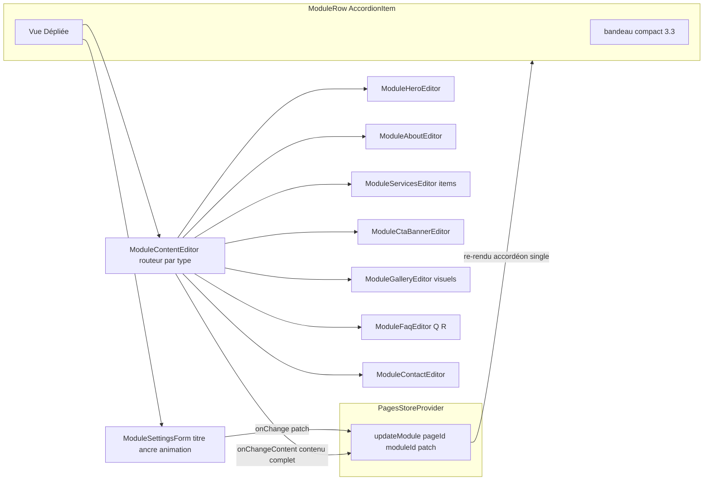

# Plan — ROADMAP Étape 3.4 : Formulaire CRUD en vue dépliée (Édition des contenus & réglages des modules)

## Objectif

Poursuivre la **Phase 3 – Back-Office « Créateur de Pages » (Page Builder)** en
remplaçant la **Vue Dépliée « lecture seule »** livrée en Étape 3.3 par un
**formulaire d'édition complet** (spec §7.2-B « Vue Dépliée - CRUD »). Le
photographe doit pouvoir, depuis chaque `AccordionItem` déplié de l'éditeur
`/admin/pages/[id]` :

- **modifier les réglages généraux** du module : Titre d'affichage, ancre `#id`,
  animation d'entrée (`ModuleAnimation`) ;
- **éditer le contenu contextuel de chaque famille de module** (spec §8) : Hero /
  CTA (H1, sous-titre, bouton CTA), À-propos (bio/texte + média), Services / Tarifs
  et FAQ (listes d'items), Galerie (liste de visuels URL), Contact (coordonnées) ;
- voir chaque frappe/saisie **persister instantanément dans le store React Context**
  (`PagesStoreProvider`) — **sans rechargement de page** ni bouton « Enregistrer ».

L'édition reste **simulée en mémoire** (mock) : le contenu vit dans l'objet
`PageModule` et est conçu pour mapper vers la future table `page_modules` (colonne
`content` JSONB + colonnes scalaires `title` / `anchor_id` / `animation` /
`layout_variant`). Aucune BDD ni route API.

## Références projet

- `ROADMAP.md` — Phase 3, Étape 3.4 `[IN_PROGRESS]`.
- `SPECIFICATIONS-V8.md` §7.2-B « Vue Dépliée (Accordéon Ouvert - CRUD) :
  formulaire d'édition complet (champs textuels, médias, CTA) » ; §7.2-C (ancres,
  boutons CTA, liens) ; §8 « Catalogue des Templates de Sections Préformatées »
  (contenus par famille) ; §9.1 (Client Components isolés, Desktop-first).
- `PROJECT_CONTEXT.md` §3 (Gestionnaire en Accordéons Compacts : CRUD, médias avec
  Alt SEO, CTA) + §1.2 (Dashboard épuré haut contraste, shadcn/ui).
- `.kilorules` §2, §3 (étape par étape, **interdiction absolue du `any`**, composants
  clients isolés, vérification build), §4 (pas de bibliothèque UI fermée, schéma BDD
  inchangé à ce stade).
- `plans/ROADMAP-3.3-accordion-compact.md` — Étape précédente : `ModuleRow` en
  `AccordionItem`, vue dépliée lecture seule (à remplacer), `setModuleHidden`,
  accordéon contrôlé dans `ModuleDndList`.
- Composants UI injectés : `src/components/ui/{button,input,label,select,switch,
  badge,textarea,separator,dialog,accordion,sheet}.tsx` + alias `@/*` + tokens
  `.admin` (globals.css).

## 0. Décisions d'architecture (préalables à valider)

1. **Modèle `content` typé par famille — PAS `Record<string, any>`.** La consigne
   initiale propose `Record<string, any>` mais `.kilorules` §3 l'interdit
   strictement (« interdiction absolue du type `any` »). Le plan adopte un
   **union discriminé typé** `ModuleContent` (discriminant = `type`, mêmes valeurs
   que `PageModuleType`). Chaque famille expose des interfaces dédiées
   (`MediaField`, `ServiceItem`, `FaqItem`, `GalleryImage`…) → **zéro `any`**, autocomplétion
   et narrowing complets dans les formulaires et le futur rendu public.
2. **`content` emporte son discriminant `type`.** `PageModule` gagne
   `content: ModuleContent` (union dont chaque branche contient `type`). Invariant
   maintenu par les fabriques : `module.type === module.content.type` (cohérent avec
   un futur JSONB `content` autonome). Les champs scalaires restent en colonnes sur
   `PageModule` : `title`, `hidden`, `animation`, `anchorId` (+ `layoutVariant?`).
3. **`layoutVariant?: string` réservé (facultatif, non édité en 3.4).** Le Layout
   Switcher (spec §7.2-B « Sélecteur de Variantes ») n'est pas au périmètre de
   l'Étape 3.4 : le champ est **modélisé** (`layoutVariant?: string`, défaut absent)
   pour préparer le futur mapping, mais **aucun champ de formulaire** n'est ajouté.
   Ne pas l'afficher en 3.4 pour éviter un contrôle inopérant.
4. **Persistance temps réel via une unique action `updateModule`.** Ajout au store :
   `updateModule(pageId, moduleId, patch: Partial<PageModule>)` — mutation clonante
   qui fusionne le `patch` dans le module ciblé (et met à jour `updatedAt` de la
   page pour rester cohérent). Les formulaires **committent le contenu en bloc**
   (`{ content: nextContent }`, jamais un contenu partiel) — indispensable pour
   rester typé sainement avec un union discriminé ; les réglages scalaires committent
   `{ title }`, `{ anchorId }`, `{ animation }` individuellement.
5. **Formulaires contrôlés par le store (pas de brouillon local à sauvegarder).**
   Chaque champ lit sa valeur depuis `module.content` / `module.title`… et son
   `onChange` reconstruit l'objet (immutable) puis appelle `updateModule`. Aucun
   état « en attente de sauvegarde », aucune Dialog d'enregistrement → réactivité
   immédiate sans rechargement (exigence UX de l'étape). La liste des modules reste
   la source unique de vérité (l'accordéon `single` garantit un seul formulaire
   ouvert à la fois → coût de re-rendu négligeable).
6. **Arborescence de formulaires** : création d'un dossier
   `src/components/backoffice/pages/modules/` avec un **routeur par type**
   (`ModuleContentEditor`) et un **formulaire par famille** (hero, about, services,
   cta-banner, gallery, faq, contact) + un formulaire de **réglages généraux**
   partagé (`ModuleSettingsForm`). `ModuleRow` cesse d'afficher le récapitulatif
   lecture seule et monte ces formulaires dans `AccordionContent`.
7. **Compatibilité Drag & Drop / saisie.** La poignée reste la **seule** zone
   draggable (`dragHandleProps` sur le bouton poignée) : cliquer ou taper dans un
   `input`/`textarea` du corps déplié **ne déclenche jamais** le drag (pattern déjà
   établi en 3.3). Le `Trigger` d'accordéon n'englobe que le bandeau (aucun champ
   dans le trigger) → la saisie dans le corps ne replie pas l'item. Les saisies
   (flèches, Tab) dans les champs ne sont pas interceptées par le capteur clavier
   de `@hello-pangea/dnd` (clavier actif uniquement via le handle).
8. **Ancre `#id`.** Champ texte libre préfixé `#` ; validation légère : caractères
   autorisés = identifiants HTML (a-z0-9-_), indication en temps réel si l'ancre est
   vide. **Avertissement non bloquant** d'ancre dupliquée au sein de la page
   (comparaison avec les `anchorId` des autres modules) — la cohérence finale est
   vérifiée au rendu public (hors périmètre).
9. **Défauts de contenu riches.** `createModule(type, sequence)` et
   `buildSeedModules(slug)` fournissent un contenu par défaut **réaliste et riche**
   par famille (ex. Hero : heading accroche + CTA ; Services : 2 items ; FAQ :
   2 questions ; Galerie : 2 visuels URL placeholder) pour démontrer l'édition.
   `buildSeedModules` reste déterministe ; on peut y **surcharger** le contenu de
   certains modules seed (ex. Hero de l'Accueil aligné sur la marque) sans changer
   le contrat.

## 1. Fichiers concernés

### 1.1 Modèle & contenus — `src/lib/pages.ts` (modifié)

**Nouveaux types de contenu** (logique pure, zéro JSX / zéro import UI) :

```ts
/** Média simple (URL + texte alternatif SEO). */
export interface MediaField {
  url: string;
  alt: string;
}

/** Item de prestation (Services / Tarifs). */
export interface ServiceItem {
  id: string;          // stable (mock : crypto.randomUUID())
  title: string;
  description: string;
  price: string;       // ex. "à partir de 190 €"
}

/** Item de question / réponse (FAQ). */
export interface FaqItem {
  id: string;
  question: string;
  answer: string;
}

/** Visuel de galerie (URL + alt). */
export interface GalleryImage {
  id: string;
  url: string;
  alt: string;
}

/** Contenu éditable d'un module, discriminé par `type` (spec §8). */
export type ModuleContent =
  | { type: "hero"; heading: string; subheading: string; ctaLabel: string; ctaHref: string; media: MediaField }
  | { type: "about"; heading: string; text: string; media: MediaField }
  | { type: "services"; heading: string; intro: string; items: ServiceItem[] }
  | { type: "cta-banner"; heading: string; subheading: string; ctaLabel: string; ctaHref: string }
  | { type: "gallery"; heading: string; images: GalleryImage[] }
  | { type: "faq"; heading: string; items: FaqItem[] }
  | { type: "contact"; heading: string; intro: string; email: string; phone: string; address: string };
```

**Extension de `PageModule`** :

```ts
export interface PageModule {
  id: string;
  type: PageModuleType;
  title: string;            // libellé court (bandeau) — éditable en 3.4
  hidden: boolean;
  animation: ModuleAnimation;
  anchorId: string;         // ancre HTML — éditable en 3.4
  layoutVariant?: string;   // RÉSERVÉ (Layout Switcher ultérieur) — non édité en 3.4
  content: ModuleContent;   // union discriminé (module.type === content.type)
}
```

**Fabriques de contenu par défaut** (switch typé par famille) :

```ts
export function createModuleContent(type: PageModuleType): ModuleContent;
```

- `hero` : heading « Bienvenue dans mon univers » / subheading / CTA « Découvrir mon
  portfolio » → `/portfolio` ; `media` = `{ url: "", alt: "" }`.
- `about` : heading « À propos de moi » / text (2-3 phrases) / média vide.
- `services` : heading « Mes prestations » / intro / `items: [2 items seed]`.
- `cta-banner` : heading + CTA « Me contacter » → `/contact`.
- `gallery` : heading / `images: [2 GalleryImage]` (URL placeholder explicite).
- `faq` : heading / `items: [2 FaqItem]`.
- `contact` : heading / intro / email / phone / address vides à compléter.

**Intégration dans les fabriques existantes** :

```ts
export function createModule(type: PageModuleType, sequence: number): PageModule {
  // … champs actuels … + layoutVariant: undefined + content: createModuleContent(type)
}
```

`buildSeedModules(slug)` conserve sa signature ; il appelle `createModule` puis
**surcharge le contenu** d'une sélection de modules seed (ex. l'`hero` de l'Accueil
avec un heading aligné « Photographe professionnel ») pour une démo parlante.
Un helper `createModuleContent(type)` retourne **une nouvelle instance** à chaque
appel (aucune référence partagée → zéro mutation croisée dans le store).

**Constante de libellés d'animation** (pure, réutilisée par le formulaire réglages) :

```ts
export const moduleAnimationLabels: Record<ModuleAnimation, string>;
export const moduleAnimationOrder: ModuleAnimation[]; // ordre du Select
```

> Les fabriques utilisent `crypto.randomUUID()` (client) — cohérent avec l'existant.

### 1.2 Store — `src/components/backoffice/PagesStoreProvider.tsx` (modifié)

Ajouter **une action** au type `PagesStoreValue` et son implémentation :

```ts
/** Fusionne un patch dans un module (réglages scalaires OU content complet). */
updateModule: (pageId: string, moduleId: string, patch: Partial<PageModule>) => void;
```

Implémentation (mutation clonante, cohérente avec `setModuleHidden`) :

```ts
const updateModule = (pageId, moduleId, patch) => {
  const now = new Date().toISOString();
  setState((previous) => ({
    ...previous,
    pages: previous.pages.map((page) =>
      page.id === pageId ? { ...page, updatedAt: now } : page
    ),
    modulesByPage: {
      ...previous.modulesByPage,
      [pageId]: (previous.modulesByPage[pageId] ?? []).map((module) =>
        module.id === moduleId ? { ...module, ...patch } : module
      ),
    },
  }));
};
```

> Garde-fou : seule action d'édition de contenu ; `addModule`/`removeModule`/
> `moveModule`/`setModuleHidden` inchangés. Le `content` est toujours committé **en
> bloc** (jamais partiel) pour préserver le typage de l'union.

### 1.3 Formulaires de modules — `src/components/backoffice/pages/modules/` (nouveau dossier)

Tous **Client Components** (`"use client"`). Convention d'édition **contrôlée par le
store** (décision §0.5).

#### 1.3.1 Réglages généraux — `ModuleSettingsForm.tsx`

Props :

```tsx
type ModuleSettingsFormProps = {
  module: PageModule;
  duplicateAnchor: boolean;                       // ancre déjà prise dans la page
  onChange: (patch: Partial<PageModule>) => void; // → updateModule
};
```

Champs (grille 3 colonnes `sm`) :
1. **Titre d'affichage** — `Input` requis → `onChange({ title })` (le bandeau se met
   à jour en direct, pattern 3.3 déjà réactif).
2. **Ancre `#id`** — `Input` préfixé `#`, placeholder `ex. prestations-mariage` ;
   validation légère (regex `^[a-z0-9][a-z0-9-]*$` en minuscules ou vide) + message
   `duplicateAnchor` (« Cette ancre est déjà utilisée dans la page ») non bloquant.
3. **Animation d'entrée** — `Select` (`moduleAnimationOrder`/`moduleAnimationLabels`)
   → `onChange({ animation })`.

#### 1.3.2 Routeur — `ModuleContentEditor.tsx`

`switch (module.type)` → rend le formulaire de la famille correspondante. Contrat
commun à tous les éditeurs :

```tsx
type ModuleEditorProps = {
  content: Extract<ModuleContent, { type: "hero" }>; // (type adapté par famille)
  onChangeContent: (content: Extract<ModuleContent, { type: "hero" }>) => void;
};
```

> Le routeur centralise la correspondance `PageModuleType` ↔ éditeur (comme
> `ModuleIcon` pour les icônes) et évite d'importer `lucide` dans `lib/pages.ts`.

#### 1.3.3 Éditeurs par famille — `modules/*.tsx`

- **`ModuleHeroEditor.tsx`** : Titre H1 (Input), Sous-titre (Textarea ou Input),
  Libellé CTA (Input), Lien CTA (Input, préfixe `/` ou URL), Média (URL + alt).
- **`ModuleAboutEditor.tsx`** : Heading, Bio/texte (Textarea), Média (URL + alt).
- **`ModuleServicesEditor.tsx`** : Heading, Intro (Textarea) + **liste d'items**
  (titre, description, prix) avec boutons **+ Ajouter / suppression** par item.
- **`ModuleCtaBannerEditor.tsx`** : Heading, Sous-titre, Libellé CTA, Lien CTA.
- **`ModuleGalleryEditor.tsx`** : Heading + **liste de visuels** (URL + alt) avec
  ajout / suppression (ordre fixe en 3.4 — réordonnancement d'images hors périmètre).
- **`ModuleFaqEditor.tsx`** : Heading + **liste Q/R** (question, réponse Textarea).
- **`ModuleContactEditor.tsx`** : Heading, Intro (Textarea), Email, Téléphone,
  Adresse.

**Gestion des listes (services / gallery / faq)** — pattern commun recommandé :
chaque éditeur gère ses items en **état local** (`useState` initialisé depuis
`content.items`) pour des ajouts/suppressions fluides, puis **commit le tableau
complet** vers le store à chaque mutation (`onChangeContent({ ...content, items })`).
Chaque `input` d'un item est contrôlé et commit via le même chemin (reconstruit le
tableau, immuable). Aucun `any` : tableaux fortement typés (`ServiceItem[]`,
`FaqItem[]`, `GalleryImage[]`), clés `key={item.id}` stables (jamais l'index).

#### 1.3.4 Composition — champ d'entrée partagé (optionnel, anti-duplication)

Petit composant `FieldLabel`/`SectionLabel` réutilisable (label + description +
children) pour homogénéiser les formulaires — ou simple usage des primitives
`Label` + `Input` existantes directement. Choix laissé à l'implémentation (privilégier
les primitives existantes si le rendu reste homogène).

### 1.4 Intégration — `src/components/backoffice/pages/ModuleRow.tsx` (modifié)

- **Props** : ajouter `onUpdateModule: (patch: Partial<PageModule>) => void` et
  `duplicateAnchor: boolean` (calculé par le parent, cf. §1.5).
- **Vue Dépliée (`AccordionContent`)** : **remplacer** le récapitulatif lecture
  seule + encart « Étape 3.4 » par :
  - `ModuleSettingsForm` (réglages généraux, séparateur),
  - `ModuleContentEditor` (formulaire de la famille),
  - avec des libellés de section clairs (« Réglages », « Contenu »).
- Le bandeau compact, la poignée, l'œil et la suppression de la Vue Compacte sont
  **inchangés** (3.3 préservé). Le `Wrench` et le récap deviennent inutiles →
  suppression.
- Garde-fou HTML conservé : aucun `input` dans le `Trigger` ; poignée seule draggable.

### 1.5 Câblage — `src/components/backoffice/pages/ModuleDndList.tsx` (modifié)

- Sortir `updateModule` du store ; exposer `handleUpdateModule(moduleId, patch)` =
  `updateModule(pageId, moduleId, patch)`.
- Calculer `duplicateAnchor` pour chaque module : `modules.filter(m => m.id !== id
  && m.anchorId === module.anchorId).length > 0` (dérivation pure, aucun `useMemo`
  obligatoire — liste courte) ; passer `onUpdateModule` + `duplicateAnchor` à
  chaque `ModuleRow`.

### 1.6 Composants non modifiés

`PageEditor`, `PageEditorScreen`, `AddSectionSheet`, `ModuleIcon`, la route
`[id]/page.tsx`, `PagesStoreProvider` (hors action §1.2) restent inchangés. Aucun
composant UI nouveau n'est requis (`Select`, `Textarea`, `Input`, `Label`, `Switch`,
`Separator`, `Badge` déjà injectés).

## 2. Ordre d'exécution (Code mode) — avec validation à chaque sous-tâche

1. **ROADMAP** : Étape 3.4 déjà `[IN_PROGRESS]` (fait).
2. **Modèle `src/lib/pages.ts`** : types de contenu (`MediaField`, `ServiceItem`,
   `FaqItem`, `GalleryImage`, `ModuleContent`), `layoutVariant?`, `content` sur
   `PageModule`, `createModuleContent(type)`, surcharge seed dans `buildSeedModules`,
   `moduleAnimationLabels`/`moduleAnimationOrder`. → `tsc` (les anciens `createModule`
   sans `content` casseront le typage → c'est le signal attendu).
3. **Store** : `updateModule` (type + implémentation). → `tsc`.
4. **Dossier `modules/`** : `ModuleSettingsForm` puis le routeur `ModuleContentEditor`
   et les 7 éditeurs de famille (commencer par Hero + CTA simples, puis About/
   Contact, puis les listes Services/Gallery/FAQ). → `tsc` à chaque lot.
5. **Intégration `ModuleRow`** : brancher les formulaires dans la Vue Dépliée et
   supprimer le récap/encart 3.4. → validation visuelle : le titre saisi met à jour
   le bandeau en direct.
6. **Câblage `ModuleDndList`** : `updateModule` + `duplicateAnchor`. → validation :
   saisir dans un item déplié, le contenu persiste au repli/rouvreture ; le drag
   fonctionne toujours ; les flèches dans les champs ne déplacent pas l'item.
7. **Contrôles finaux** : `npx tsc --noEmit`, `npm run build`, `npm run lint`
   (zéro erreur).
8. **Validation utilisateur** via `npm run dev` puis mise à jour `CHANGELOG.md` et
   coche `3.4 [x]` + passage à la Phase 4 (ou étape suivante) dans `ROADMAP.md`.

## 3. Garde-fous / non-régression

- **Zéro `any`** : `ModuleContent` est un union discriminé typé ; les tableaux
  d'items sont typés ; `createModuleContent` est un `switch` exhaustif (le TS exige
  de couvrir les 7 familles — jamais de `default` silencieux ou de cast).
- **`module.type === module.content.type`** : invariant garanti par les fabriques ;
  le routeur `ModuleContentEditor` switch sur `module.type` (jamais de mapping
  relâché par cast).
- **Drag & Drop 3.2 / Accordéon 3.3 préservés** : poignée seule draggable ;
  `draggableId` = `module.id` ; accordéon `single` contrôlé inchangé ; saisie dans
  le corps sans déclencher drag/repli.
- **Réactivité sans rechargement** : tous les champs commitent via `updateModule`
  (store) — pas de brouillon local à enregistrer, pas de Dialog de sauvegarde.
- **`content` committé en bloc** dans les formulaires (jamais partiel) — préserve le
  typage de l'union et la cohérence d'état.
- **Front-Office, layout racine, routes, chrome `.admin`, schéma BDD inchangés** ;
  aucune nouvelle dépendance ; `layoutVariant` non édité (réservé).
- **Vérification finale obligatoire** : `npx tsc --noEmit`, `npm run build`,
  `npm run lint` sans erreur avant déclaration de fin d'étape.



## 4. Fichiers créés / modifiés (résumé pour le CHANGELOG)

- Modifiés : `src/lib/pages.ts` (types de contenu + fabriques), `src/components/
  backoffice/PagesStoreProvider.tsx` (action `updateModule`), `src/components/
  backoffice/pages/ModuleRow.tsx` (formulaires dans la Vue Dépliée),
  `src/components/backoffice/pages/ModuleDndList.tsx` (câblage update + ancre
  dupliquée), `ROADMAP.md`, `CHANGELOG.md`.
- Créés : `plans/ROADMAP-3.4-crud-expanded.md` (ce plan) + dossier
  `src/components/backoffice/pages/modules/` (`ModuleSettingsForm`,
  `ModuleContentEditor`, éditeurs hero/about/services/cta-banner/gallery/faq/contact).
- Aucune dépendance nouvelle, aucun composant UI nouveau, aucune route nouvelle.
