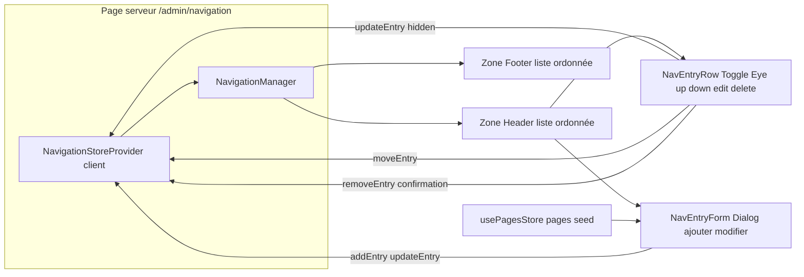

# Plan — ROADMAP Étape 4.1 : Écran « Navigation & Menus » (arborescence Header / Footer)

## Objectif

Amorcer la **Phase 4 – Back-Office « Gestionnaire de Menu & Navigation »** en créant
l'**écran d'administration de la navigation** (`/admin/navigation`) : une interface
qui organise l'**arborescence du Header** (menu horizontal principal) et du
**Footer** (colonne Navigation), conformément à la spec §7.2-D.

À l'issue de cette étape, le photographe doit pouvoir, depuis le Back-Office :
- **visualiser** les menus du Header et du Footer sous forme de listes ordonnées ;
- **ajouter, éditer, supprimer** un élément de menu (libellé + cible) ;
- **masquer/afficher** un élément via le **Toggle Eye** (sans le supprimer, spec
  §7.2-D « Option Afficher/Masquer ») ;
- **réordonner** les éléments (montée/descente) — le Drag & Drop complet et la
  hiérarchie de Niveau 2 étant réservés à l'Étape 4.3.

Persistance **simulée en mémoire** (mock, store React Context local), en attendant
l'intégration Supabase/Drizzle. Le **Front-Office reste inchangé** : le Header/Footer
publics continuent d'être alimentés par la config statique `src/lib/site.ts` ; le
branchage des menus édités sur le site public interviendra avec l'intégration BDD
(le rendu mock du Back-Office ne peut pas alimenter des Server Components hors du
Provider `/admin`).

## Références projet

- `ROADMAP.md` — Phase 4, Étape 4.1 `[IN_PROGRESS]`.
- `SPECIFICATIONS-V8.md` §7.2-D « Gestionnaire de Navigation & Presets Onboarding » :
  arborescence des liens du menu principal (Niveau 1) et sous-menus (Niveau 2) ;
  option Afficher/Masquer (Toggle Eye) ; §3.1 (Header / Footer) ; §7.2-B (Canvas).
- `PROJECT_CONTEXT.md` §3 « Arborescence & Navigation » (menu Niveau 1 + sous-menus
  Niveau 2, Toggle Eye, presets) + §1.2 (Dashboard épuré, Desktop-first, shadcn/ui).
- `.kilorules` §2, §3 (étape par étape, validation, zéro `any`, composants clients
  isolés), §4 (pas de bibliothèque UI fermée, schéma BDD inchangé à ce stade).
- `plans/ROADMAP-3.1-pagemetadata.md` — Pattern écran CRUD Back-Office (`PagesManager`,
  portée `.admin`) ; `plans/ROADMAP-3.2-pagebuilder-dnd.md` — pattern Provider global
  `/admin` (`PagesStoreProvider`) ; `plans/ROADMAP-3.3/3.4` — pattern Accordéon, Toggle
  Eye et `updateModule`.
- `src/lib/site.ts` (`mainNav`, `NavItem`, `socialLinks`, `legalLinks`), `src/lib/pages.ts`
  (`seedPages`), `src/components/layout/Header.tsx` & `Footer.tsx`, `src/app/(back-office)/
  admin/layout.tsx` (sidebar « Navigation » actuellement désactivée).
- Composants UI injectés : `{button,input,label,select,switch,badge,dialog,separator,
  accordion,sheet}.tsx` + alias `@/*` + tokens `.admin` (globals.css).

## 0. Décisions d'architecture (préalables à valider)

1. **Périmètre de l'Étape 4.1 (délimitation nette avec 4.2 / 4.3 / 4.4)** :
   - **4.1 (cette étape)** : l'**écran** « Navigation & Menus » + **modèle** +
   **store** + **CRUD d'items** (ajout/édition/suppression) + **Toggle Eye** +
   **réordonnancement de base** (montée/descente) — arborescence **plate** par zone
   (Header, Footer), items de type **lien interne (page)** ou **libellé libre**.
   - **4.2** : rattachement **automatique** du `MenuTitle` des pages créées (3.1).
   - **4.3** : Drag & Drop, **sous-menus de Niveau 2**, ancres `#id` et liens externes.
   - **4.4** : Presets Onboarding (Artiste / Commercial / Passionné).
   → Ne **pas** implémenter 4.2/4.3/4.4 ici (aucun champ hiérarchique, aucun sélecteur
   d'ancre/externe, aucun preset). Le modèle reste toutefois **extensible**.
2. **Modèle de données navigation** : nouveau module `src/lib/navigation.ts`
   (logique pure, typé, **zéro `any`**). Zones gérées : `header` et `footer`.
   Un item = `{ id, label, kind, href, hidden }` (4.1) :
   - `kind: "page"` (lien interne — cible un `slug` de page) ou `"link"` (lien à
     saisie libre, URL/slug). L'ancre/externe dédié arrive en 4.3.
   - `hidden` : Toggle Eye (masquer sans supprimer, spec §7.2-D).
   - pas de `children` en 4.1 (Niveau 2 = 4.3) — le modèle futur `nav_items`
     (colonne `parent_id`) reste documenté mais non implémenté.
   - Mappage futur : table `nav_items` (zone, libellé, cible, ordre = position,
     `hidden`, `parent_id` nullable). Le schéma BDD **n'est pas modifié**.
3. **Seed cohérent avec les pages** : le store initialise les menus Header/Footer
   **depuis `seedPages`** (page d'accueil + pages vitrines) pour montrer la
   correspondance entre la navigation et les pages existantes (prépare 4.2).
   Header = les 5 pages seed ; Footer = colonne Navigation reprenant le menu (sans
   l'Accueil) — config statique `site.ts` inchangée pour le rendu public.
4. **Store React Context local à la route** : créer un **Provider navigation**
   (`NavigationStoreProvider`) posé **dans la page serveur `/admin/navigation`**
   (pas dans le Layout global `/admin`, contrairement à `PagesStoreProvider` : seule
   cette route consomme la navigation). Il porte l'état `{ header, footer }` + les
   actions CRUD. Le Layout `/admin` reste **Server Component** ; le `PagesStoreProvider`
   global reste inchangé et englobe déjà la page (l'écran pourra lister les pages pour
   aider à choisir la cible).
5. **Activation de l'entrée sidebar « Navigation »** : dans `admin/layout.tsx` (Server
   Component), l'entrée `Navigation` passe de `disabled` à fonctionnelle. L'état
   **actif selon la route** est aujourd'hui codé en dur (`item.active` sur « Pages ») ;
   pour ne pas rendre tout le layout client, on introduit un **petit composant client
   `SidebarNav`** (reçoit les items en props, utilise `usePathname()` pour calculer
   l'item actif) — le layout reste serveur, seul le composant de navigation est client.
6. **CRUD items — UX** : réutiliser le pattern Back-Office existant (Dialog + formulaire,
   comme `PagesManager`/`PageMetadataForm` en 3.1). Un **Dialog « Ajouter / Modifier un
   lien »** embarque un formulaire (libellé + type de cible + cible) ; le **Toggle Eye**
   est un bouton inline (pattern 3.3) ; la suppression passe par une **Dialog de
   confirmation** (pattern 3.1/3.3) ; le réordonnancement utilise des **boutons
   ↑/↓** (provisoires — le DnD complet est 4.3).
7. **Non-régression Front-Office** : Header/Footer publics et `site.ts` **inchangés**.
   Aucune URL publique modifiée. L'écran `/admin/navigation` est une **nouvelle URL**
   Back-Office uniquement. Pas de dépendance nouvelle (tous les composants UI sont déjà
   injectés).

## 1. Fichiers concernés

### 1.1 Modèle — `src/lib/navigation.ts` (nouveau)

Logique pure (aucun JSX, aucune dépendance UI) :

```ts
/** Zone de menu administrée (spec §7.2-D : Header / Footer). */
export type NavArea = "header" | "footer";

/** Type de cible d'un item de menu (4.1 : page ou lien libre ; ancre/ext = 4.3). */
export type NavItemKind = "page" | "link";

/** Item de menu — mappe vers la future table `nav_items` (sans parent en 4.1). */
export interface NavMenuEntry {
  id: string;        // stable (mock : crypto.randomUUID())
  label: string;     // libellé affiché
  kind: NavItemKind;
  href: string;      // cible : "/portfolio" (page) ou URL/slug libre (link)
  hidden: boolean;   // Toggle Eye (masquer sans supprimer)
}

/** Navigation complète du site par zone. */
export interface SiteNavigation {
  header: NavMenuEntry[];
  footer: NavMenuEntry[];
}

/** Crée un item de menu par défaut pour un type donné. */
export function createNavEntry(kind: NavItemKind, label: string, href: string): NavMenuEntry;

/** Menu de départ : construit header/footer depuis `seedPages` (src/lib/pages.ts). */
export function buildSeedNavigation(): SiteNavigation;

/** Insère un item à la position `to` (helper pur, non-mutant). */
export function moveNavEntry<T>(list: T[], from: number, to: number): T[];
```

> `buildSeedNavigation()` : Header = Accueil (`/`, slug vide) + Portfolio +
> Prestations + À propos + Contact (libellé = `menuTitle` de chaque page) ; Footer =
> même liste **sans Accueil**. Chaque entrée `kind: "page"`, `hidden: false`.

### 1.2 Store — `src/components/backoffice/navigation/NavigationStoreProvider.tsx` (nouveau)

**Client Component** (`"use client"`), provider local à la route `/admin/navigation` :

```ts
export type NavigationStoreValue = {
  navigation: SiteNavigation;
  getEntries: (area: NavArea) => NavMenuEntry[];
  addEntry: (area: NavArea, entry: NavMenuEntry) => void;
  updateEntry: (area: NavArea, id: string, patch: Partial<NavMenuEntry>) => void;
  removeEntry: (area: NavArea, id: string) => void;
  moveEntry: (area: NavArea, from: number, to: number) => void;
};
```

- État : `useState<SiteNavigation>(buildSeedNavigation)` (une seule initialisation).
- Actions clonantes (pattern `PagesStoreProvider`) : `addEntry` (ajout en fin),
  `updateEntry` (fusion patch : libellé/href/kind/hidden), `removeEntry` (filtre),
  `moveEntry` (via `moveNavEntry` — montée/descente).
- Hook `useNavigationStore()` = seule porte d'accès ; throw hors Provider.
- TypeScript strict, zéro `any`.

### 1.3 Écran — `src/components/backoffice/navigation/NavigationManager.tsx` (nouveau, `"use client"`)

Point d'entrée de l'écran `/admin/navigation` :
- **En-tête** : titre « Navigation & Menus », sous-titre, compteur par zone.
- **Deux zones** (sections visuellement distinctes, style `.admin`) :
  « Menu principal — Header » puis « Navigation du pied de page — Footer ».
- Par zone : liste ordonnée d'items ; **état vide** = encart « Aucun lien » + CTA.
- Barre d'actions par zone : bouton « + Ajouter un lien ».
- Bouton « Aperçu du site » (lien `/` target blank, déjà présent dans le layout).

### 1.4 Liste d'items — `src/components/backoffice/navigation/NavEntryRow.tsx` (nouveau, `"use client"`)

Rangée compacte par item (pattern bandeau 3.3, **sans** accordéon ni DnD en 4.1) :
- libellé + badge du type (`Badge` : « Page » / « Lien ») + cible `href` (mono),
- **Toggle Eye** (`Eye`/`EyeOff`, `aria-pressed`, tooltip) → `updateEntry({hidden})`,
- boutons **↑ / ↓** (chevrons `ChevronUp`/`ChevronDown`, désactivés aux extrémités)
  → `moveEntry`,
- bouton **éditer** (`Pencil`) → ouvre la Dialog du formulaire,
- bouton **supprimer** (`Trash2`) → ouvre la Dialog de confirmation.

### 1.5 Formulaire — `src/components/backoffice/navigation/NavEntryForm.tsx` (nouveau, `"use client"`)

Formulaire contrôlé (réutilisation des composants `Input`, `Select`, `Label`) pour
**créer/éditer** un item :

```tsx
type NavEntryFormProps = {
  initial?: NavMenuEntry;        // absent → mode création
  pages: { menuTitle: string; slug: string }[]; // listes des pages (choix cible)
  onSubmit: (data: { label: string; kind: NavItemKind; href: string }) => void;
  onCancel: () => void;
};
```

Champs :
1. **Libellé** (`Input` requis, hint « Nom affiché dans le menu »).
2. **Type de cible** (`Select` : « Page du site » / « Lien libre »).
   - Page → `Select` des pages disponibles (libellé = `menuTitle`, valeur = `pageHref(slug)`)
     pré-rempli depuis `seedPages` du store Pages ;
   - Lien libre → `Input` (URL ou slug, préfixé `/`).
3. Boutons Annuler / Enregistrer (`submitLabel`).
Validation légère (champs requis) sans bibliothèque externe.

> En 4.1, la liste des pages est fournie par `usePagesStore()` (Provider global déjà
> présent autour de `/admin`) — prépare le rattachement auto de 4.2 sans le faire.

### 1.6 Intégration routes & sidebar

- **Nouvelle page serveur** `src/app/(back-office)/admin/navigation/page.tsx` :
  `metadata` + `<NavigationStoreProvider><NavigationManager /></NavigationStoreProvider>`.
- **Sidebar** `admin/layout.tsx` : l'entrée `{ label: "Navigation", href:
  "/admin/navigation", icon: Menu }` passe à **fonctionnelle** ; la gestion de l'item
  **actif** est extraite dans un **composant client `SidebarNav`** (usePathname) pour
  conserver le Layout en Server Component. Vérifier que « Pages » reste actif sur
  `/admin/pages` et que « Navigation » le devient sur `/admin/navigation`.

### 1.7 Composants non modifiés

`PagesStoreProvider`, `PagesManager`, l'éditeur de page (3.x) restent inchangés.
`Header`/`Footer`/`site.ts` inchangés (le Front-Office n'est pas branché sur le store
mock — décision §0.7). Aucun composant UI nouveau requis.

## 2. Ordre d'exécution (Code mode) — avec validation à chaque sous-tâche

1. **ROADMAP** : Étape 4.1 déjà `[IN_PROGRESS]` (fait en fin d'étape 3.4).
2. **Modèle** `src/lib/navigation.ts` (types, `createNavEntry`, `buildSeedNavigation`,
   `moveNavEntry`). → `npx tsc --noEmit`.
3. **Store** `NavigationStoreProvider.tsx` (Provider + hook, seed `buildSeedNavigation`).
   → `tsc`.
4. **Sidebar** : extraire `SidebarNav` (client, usePathname) dans `admin/layout.tsx` et
   activer « Navigation ». → validation visuelle : `/admin/navigation` accessible, les
   entrées Pages/Navigation deviennent actives selon la route.
5. **Écran + liste** : `NavigationManager` + `NavEntryRow` (zones Header/Footer, listes,
   Toggle Eye, ↑/↓, états vides). → validation : lister/réordonner/masquer.
6. **Formulaire CRUD** : `NavEntryForm` (Dialog ajout/édition + confirmation
   suppression). → validation : créer/éditer/supprimer des liens, cible page ou libre.
7. **Contrôles finaux** : `npx tsc --noEmit`, `npm run build`, `npm run lint`
   (zéro erreur).
8. **Validation utilisateur** via `npm run dev` puis mise à jour `CHANGELOG.md` et
   coche `4.1 [x]` + `4.2 [IN_PROGRESS]` dans `ROADMAP.md`.

## 3. Garde-fous / non-régression

- **Front-Office inchangé** : `Header`, `Footer`, `site.ts` et le layout
  `(front-office)` ne sont **pas** modifiés — aucune URL publique, aucun rendu impacté.
- **Périmètre 4.1 strict** : pas de hiérarchie Niveau 2, pas de DnD complet, pas de
  liens ancre/externe, pas de presets — le tout est **4.2/4.3/4.4** (documenté dans le
  plan, pas implémenté).
- **Dashboard sans chrome public** conservé ; style via tokens `.admin` uniquement
  (aucun code couleur en dur) ; Desktop-first.
- **Layout `/admin` reste Server Component** : l'état actif de la sidebar est isolé
  dans le composant client `SidebarNav` ; `PagesStoreProvider` et le nouveau provider
  navigation restent encapsulés côté client.
- **TypeScript strict, zéro `any`** ; `Record`/tableaux typés ; clés d'items `id`
  stables (jamais l'index).
- **Pas de dépendance UI nouvelle** (Dialog/Select/Badge/Switch déjà injectés) ;
  **schéma BDD non modifié** (`NavMenuEntry` documenté pour un futur `nav_items`).
- **Vérification finale obligatoire** : `npx tsc --noEmit`, `npm run build`,
  `npm run lint` sans erreur avant déclaration de fin d'étape.



## 4. Fichiers créés / modifiés (résumé pour le CHANGELOG)

- Modifiés : `src/app/(back-office)/admin/layout.tsx` (sidebar `Navigation` active +
  extraction `SidebarNav`), `ROADMAP.md`, `CHANGELOG.md`.
- Créés : `plans/ROADMAP-4.1-navigation.md` (ce plan), `src/lib/navigation.ts`,
  `src/components/backoffice/navigation/NavigationStoreProvider.tsx`,
  `NavigationManager.tsx`, `NavEntryRow.tsx`, `NavEntryForm.tsx` (+ éventuel
  `SidebarNav.tsx` sous `src/components/backoffice/`), route
  `src/app/(back-office)/admin/navigation/page.tsx`.
- Aucune dépendance nouvelle, aucun composant UI nouveau, aucune route publique
  nouvelle, aucun changement Front-Office ni de schéma BDD.
