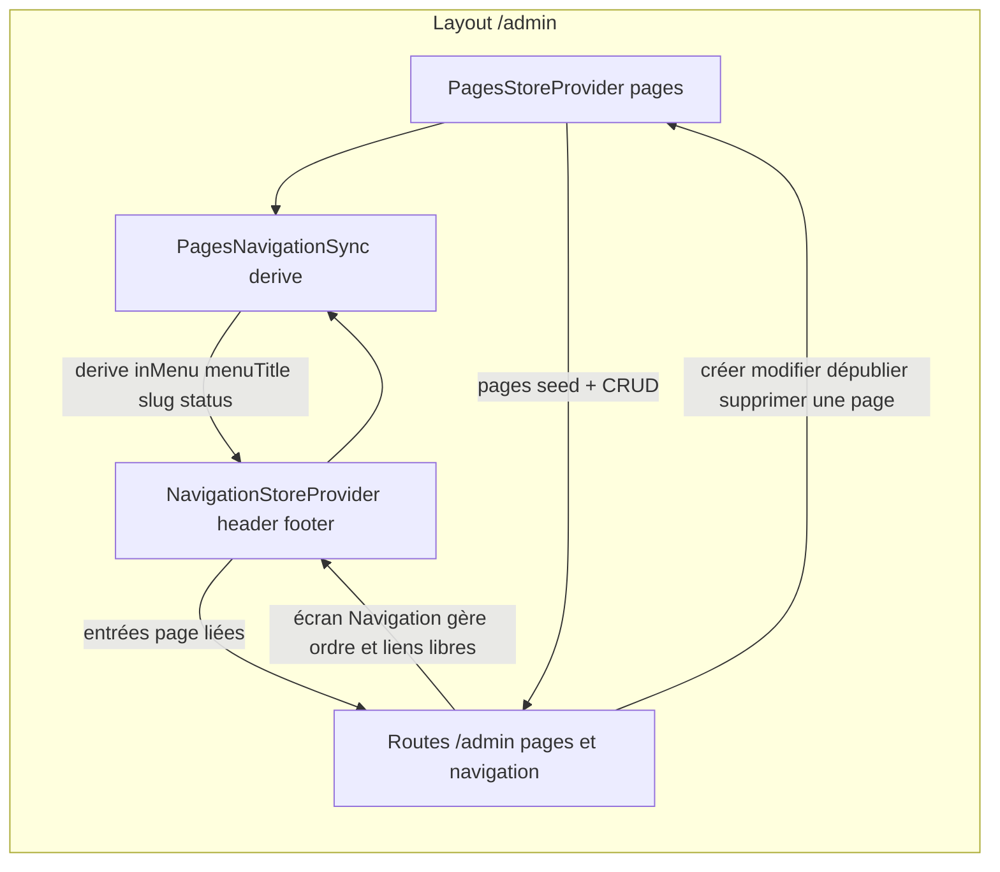

# Plan — ROADMAP Étape 4.2 : Rattachement dynamique des pages (Navigation ↔ Pages)

## Objectif

Assurer l'**interconnexion automatique et cohérente** entre la gestion des Pages
(`PagesStoreProvider`) et l'arborescence de la Navigation
(`NavigationStoreProvider`), afin que les entrées de menu de type `page` reflètent
en permanence l'état réel des pages : **MenuTitle → label**, **slug → href**,
**création (option « Ajouter au menu »)**, **dépubliage (statut)**, et **suppression
(cascade / anti-liens orphelins)**.

À l'issue de cette étape, depuis l'écran `Pages` :
- créer une page **avec l'option « Ajouter au menu principal »** → une entrée de
  menu apparaît automatiquement dans le Header (`/admin/navigation`) ;
- modifier le **MenuTitle** ou le **slug** d'une page → l'entrée de menu liée se met
  à jour automatiquement (label / href) ;
- **dépublier** une page (statut Brouillon) → l'entrée liée est **masquée
  automatiquement** (Toggle Eye) sans être supprimée ;
- **supprimer** une page → les entrées de navigation liées (Header ET Footer) sont
  **purgées** (aucun lien orphelin).

Persistance **simulée en mémoire** (mock). Le Front-Office reste **inchangé**
(Header/Footer publics alimentés par `site.ts` — décision récurrente : le branchage
public viendra avec l'intégration BDD).

## Références projet

- `ROADMAP.md` — Phase 4, Étape 4.2 `[IN_PROGRESS]`.
- `SPECIFICATIONS-V8.md` §7.2-D « Champs Création de Page : Titre SEO/H1, MenuTitle
  (nom abrégé pour le menu) et emplacement » + « Option Afficher/Masquer (Toggle Eye)
  : masque une page du menu sans la supprimer ».
- `plans/ROADMAP-4.1-navigation.md` — Étape précédente : `NavMenuEntry` (kind
  page/link, href, hidden), `NavigationStoreProvider`, écran `/admin/navigation`.
- `plans/ROADMAP-3.1-pagemetadata.md` & `3.2` — `SitePage`, `PagesStoreProvider`
  (global au layout `/admin`), `PagesManager` (CRUD), `PageMetadataForm`.
- `.kilorules` §0.2, §1 (étape par étape, validation explicite, CHANGELOG), §3
  (zéro `any`, composants clients isolés), §4 (schéma BDD inchangé).

## 0. Corrections / décisions d'architecture (préalables à valider)

> ⚠️ **Prérequis bloquant (écart vs plan proposé)** : le plan proposé place un hook
> `useNavigationSync` « au niveau du layout d'administration /admin ». Or en 4.1, le
> `NavigationStoreProvider` est **local à la route `/admin/navigation`** (décision
> §0.4 du plan 4.1). Il n'est **pas monté** sur `/admin/pages` ni `/admin/pages/[id]` :
> la synchro déclenchée par la création/suppression d'une page ne pourrait pas
> atteindre le store navigation. **Correction obligatoire** : globaliser le
> `NavigationStoreProvider` **dans le Layout `/admin`** (au même niveau que
> `PagesStoreProvider`), et retirer le Provider de la page `/admin/navigation`
> (elle n'embarque plus que `<NavigationManager />`). Ce refactor est **sans impact
> visuel** sur l'écran Navigation (mêmes données seed, mêmes actions) mais change le
> point de montage.

1. **Lien stable page ↔ entrée de menu via `pageId`.** Le `NavMenuEntry` actuel
   (4.1) n'a **pas** de `pageId` : il faut l'ajouter (`pageId: string | null`) pour
   relier une entrée à sa page de façon stable — indépendamment du slug. Les entrées
   créées par l'utilisateur comme « Lien libre » ont `pageId: null` (aucune synchro).
   Les entrées « Page du site » (via `NavEntryForm`) doivent dorénavant **retenir le
   `pageId`** de la page choisie (pas seulement `href`).
2. **Marqueur `inMenu` sur la page.** `SitePage` gagne `inMenu: boolean`
   (colonnes futures `pages.show_in_menu`). C'est **la** source de vérité du
   rattachement automatique : une page avec `inMenu: true` doit avoir une entrée
   `page` dans le Header ; `inMenu: false` → aucune entrée automatique. Les pages
   **seed** ont `inMenu: true` (cohérent avec la navigation actuelle). Le formulaire
   `PageMetadataForm` gagne une **option « Ajouter automatiquement au menu
   principal »** (case à cocher / `Switch`), visible **à la création** (et en édition
   d'une page déjà rattachée — cf. §4).
   - Noms d'actions réels du store Pages (le plan proposé cite `addPage`/`removePage`,
     inexistants) : **`createPage`**, `updatePage`, `deletePage`.
3. **Réconciliation automatique = « NavigationStore = dérivé des pages pour les
   liens `page` ».** Plutôt qu'un couplage manuel dispersé (fragile), on introduit un
   composant **`PagesNavigationSync`** (rend `null`) monté **sous les deux
   Providers** dans le Layout `/admin`. Il observe `pages` (store Pages) et
   réconcilie le Header de la navigation par **dérivation idempotente** :
   - pour chaque page `inMenu === true` : s'assurer qu'une entrée Header `page` avec
     ce `pageId` existe (sinon `addEntry`) et mettre à jour `label = menuTitle` et
     `href = pageHref(slug)` ;
   - pour chaque page dont l'état veut `hidden = (status === "draft")` sur l'entrée
     liée : synchroniser `hidden` (masqué si brouillon, affiché si publié) **sans
     supprimer** l'entrée (Toggle Eye auto, spec §7.2-D) ;
   - pour chaque entrée Header/Footer `pageId` dont la page **n'existe plus** (ou
     `inMenu === false` après édition) : **retirer** l'entrée (cascade, anti-lien
     orphelin).
   - Les entrées `pageId: null` (liens libres/manuels) et l'**ordre** des entrées
     ne sont **jamais** touchés par la réconciliation (respect de l'organisation
     manuelle de l'écran Navigation).
   > Garde-fou de stabilité : `PagesNavigationSync` ne dépend que de `pages`
   > (source de vérité) pour ses effets et **ne met à jour la navigation que si une
   > différence réelle existe** (comparaison avant `setState`) → aucune boucle
   > infinie entre les deux stores.
4. **Portée de l'automatisme : Header uniquement.** La synchro automatique
   (création/`inMenu`) vise le **menu principal du Header** (spec « menu horizontal
   principal »). Le **Footer** reste un menu géré manuellement dans l'écran
   Navigation — seule la **cascade de suppression** y purge les entrées `pageId`
   orphelines (protection anti-lien mort). Ce choix est documenté et ajustable.
5. **Statut Brouillon → `hidden` (masquage auto), pas de suppression.** Conforme à
   la spec (« masque une page du menu sans la supprimer ») : dépublication → entrée
   masquée (elle réapparaît au re-publication). L'utilisateur garde la main : un
   `hidden` posé **manuellement** sur une entrée publiée peut être écrasé par la
   réconciliation (décision : l'automatisme l'emporte pour les entrées `page`;
   documenter). À ajuster si l'utilisateur préfère préserver le masquage manuel.
6. **`NavEntryForm` (écran Navigation)** : le type « Page du site » doit désormais
   sélectionner par **`pageId`** et enregistrer `{ kind: 'page', pageId, label =
   menuTitle, href = pageHref }`. La liste des pages proposée exclut celles déjà
   rattachées au Header (optionnel) ou, plus simple, propose toutes les pages et
   marque celles déjà liées. (Choix minimal : proposer toutes les pages ; la
   réconciliation évite les doublons.)
7. **Pas de dépendance nouvelle, pas de schéma BDD, Front-Office inchangé.**
   Tous les composants UI (`Switch`, `Dialog`, `Badge`) sont déjà injectés.
   `SitePage.inMenu` et `NavMenuEntry.pageId` sont documentés pour un futur mapping
   (`pages.show_in_menu`, `nav_items.page_id`).

## 1. Fichiers concernés

### 1.1 Modèle Pages — `src/lib/pages.ts` (modifié)

- `SitePage` : + `inMenu: boolean`.
- `PageMetadataDraft` : + `inMenu: boolean`.
- `seedPages` : chaque page seed passe à `inMenu: true`.
- `createPage` (store) : construit `SitePage` avec `inMenu` fourni.

### 1.2 Modèle Navigation — `src/lib/navigation.ts` (modifié)

```ts
export interface NavMenuEntry {
  id: string;
  label: string;
  kind: NavItemKind;         // "page" | "link"
  href: string;
  hidden: boolean;
  pageId: string | null;     // lien stable vers SitePage (null = lien libre)
}
```

- `createNavEntry(...)` : accepte `pageId: string | null`.
- `buildSeedNavigation()` : les entrées issues des pages seed portent
  `pageId = page.id`.
- Nouveau helper pur (optionnel) `navEntryHref(page)` = `pageHref(page.slug)`.

### 1.3 Stores — globalisation + actions de navigation

- **`NavigationStoreProvider.tsx`** : inchangé sur les actions mais commentaire mis
  à jour (« Provider global au Layout `/admin`, comme PagesStoreProvider »). Les
  actions existantes (`getEntries`, `addEntry`, `updateEntry`, `removeEntry`,
  `moveEntry`) suffisent pour la réconciliation (addEntry gère un `pageId`).
- **`PagesStoreProvider.tsx`** : `createPage` enregistre `inMenu` sur la page.

### 1.4 Pont de synchronisation — `src/components/backoffice/navigation/PagesNavigationSync.tsx` (nouveau, `"use client"`, rend `null`)

Monté sous les deux Providers dans le Layout `/admin`. Logique (dérivation
idempotente, zéro `any`) :

```ts
// Références : usePagesStore().pages + useNavigationStore().
// Dans un useEffect [pages] :
//  1. header = getEntries("header") ; footer = getEntries("footer")
//  2. Pour chaque page inMenu :
//       trouver entry pageId = page.id dans header
//       absent → addEntry("header", { kind:'page', pageId: page.id,
//                  label: page.menuTitle, href: pageHref(page.slug) })
//       présent et (label/href/hidden ≠ attendu) → updateEntry
//     (hidden attendu = page.status === "draft")
//  3. Pour chaque entrée pageId != null de header+footer :
//       page absente OU !page.inMenu (entrée header auto) → removeEntry
//  4. Aucun changement de l'ordre ; aucune action sur pageId === null
```

> Implémentation via des helpers purs de comparaison (pas de `setState` inutile) pour
> garantir l'absence de boucle. `PagesNavigationSync` n'a aucun rendu visible.

### 1.5 Layout — `src/app/(back-office)/admin/layout.tsx` (modifié)

Emboîter les deux Providers + le sync dans la zone de contenu :

```tsx
<main className="flex-1 px-4 py-6 sm:px-6 lg:px-8">
  <PagesStoreProvider>
    <NavigationStoreProvider>
      <PagesNavigationSync />
      {children}
    </NavigationStoreProvider>
  </PagesStoreProvider>
</main>
```

Le Layout reste **Server Component** (les trois sous-composants sont clients).

### 1.6 Page route — `src/app/(back-office)/admin/navigation/page.tsx` (modifié)

Retirer le `NavigationStoreProvider` local (désormais global) :

```tsx
export default function AdminNavigationPage() {
  return <NavigationManager />;
}
```

### 1.7 Formulaire de page — `PageMetadataForm.tsx` (modifié) & `PagesManager.tsx` (modifié)

- `PageMetadataForm` : champ **« Ajouter automatiquement au menu principal »**
  (`Switch` ou case à cocher, état `inMenu`) — pré-rempli `initial?.inMenu` en
  édition (défaut `false` à la création). Hint : « Ajoute une entrée au menu
  principal (Header) avec le nom du menu ».
- `PagesManager` : transmet `inMenu` dans le `PageMetadataDraft` à
  `createPage`/`updatePage`. (La réconciliation du §1.4 applique l'effet.)

### 1.8 Écran Navigation — `NavEntryForm.tsx` (modifié)

- Les « pages cibles » sont typées `{ id, menuTitle, slug }` ; la sélection d'une
  page remplit `pageId` + `label` (`menuTitle`) + `href` (`pageHref(slug)`).
- `NavEntryRow` : affichage d'un badge/icône indiquant si l'entrée est **liée à une
  page** (et « auto ») — distinction visuelle avec les liens libres (optionnel mais
  recommandé).

## 2. Ordre d'exécution (Code mode) — avec validation à chaque sous-tâche

1. **ROADMAP** : Étape 4.2 déjà `[IN_PROGRESS]` (fait en fin de 4.1).
2. **Modèles** : `SitePage.inMenu`, `PageMetadataDraft.inMenu`, seedPages ;
   `NavMenuEntry.pageId`, `createNavEntry(pageId)`, `buildSeedNavigation` avec
   `pageId`. → `npx tsc --noEmit` (les usages existants cassent → signal attendu).
3. **Store** : `createPage` enregistre `inMenu`. → `tsc`.
4. **Globalisation** : `admin/layout.tsx` emboîte `PagesStoreProvider` >
   `NavigationStoreProvider` > `PagesNavigationSync` ; retrait du provider de la page
   `/admin/navigation`. → validation : `/admin/navigation` fonctionne à l'identique.
5. **Réconciliation** : créer `PagesNavigationSync` (création/update/statut/cascade
   idempotente). → validation : créer une page avec « Ajouter au menu » → elle
   apparaît dans `/admin/navigation` ; dépublier → masquée ; supprimer → purgée
   (Header & Footer) ; modifier menuTitle/slug → mise à jour en direct.
6. **Formulaire** : option « Ajouter au menu » dans `PageMetadataForm` +
   transmission `inMenu` dans `PagesManager`. → validation visuelle création/édition.
7. **NavEntryForm** : sélection « Page du site » par `pageId`. → `tsc`.
8. **Contrôles finaux** : `npx tsc --noEmit`, `npm run build`, `npm run lint`
   (zéro erreur).
9. **Validation utilisateur** via `npm run dev` puis mise à jour `CHANGELOG.md` et
   coche `4.2 [x]` + `4.3 [IN_PROGRESS]` dans `ROADMAP.md`.

## 3. Garde-fous / non-régression

- **Globalisation sans régression** : le Provider navigation est déplacé (même
  arbre, même seed) ; l'écran `/admin/navigation` conserve son comportement.
- **Zéro boucle inter-stores** : `PagesNavigationSync` compare avant toute mise à
  jour et ne dépend que de `pages` → aucune réaction en chaîne Pages ↔ Navigation.
- **Ordre & liens libres préservés** : la réconciliation ne réordonne jamais et ne
  touche pas aux `pageId: null` (respect de l'organisation manuelle).
- **Cascade uniquement sur les entrées liées** : suppression d'une page → purge des
  entrées Header ET Footer possédant ce `pageId` ; les liens libres restants ne sont
  jamais purgés (ils sont gérés par l'utilisateur).
- **Front-Office, `site.ts`, routes publiques, schéma BDD inchangés** ; aucune
  dépendance nouvelle.
- **TypeScript strict, zéro `any`** ; types explicites (`pageId: string | null`,
  `inMenu: boolean`).
- **Vérification finale obligatoire** : `npx tsc --noEmit`, `npm run build`,
  `npm run lint` sans erreur.



## 4. Fichiers créés / modifiés (résumé pour le CHANGELOG)

- Modifiés : `src/lib/pages.ts` (`inMenu`), `src/lib/navigation.ts` (`pageId`),
  `src/components/backoffice/PagesStoreProvider.tsx` (`createPage` + inMenu),
  `src/components/backoffice/pages/PageMetadataForm.tsx` (option « Ajouter au menu »),
  `src/components/backoffice/pages/PagesManager.tsx` (transmission inMenu),
  `src/app/(back-office)/admin/layout.tsx` (Providers + sync globalisés),
  `src/app/(back-office)/admin/navigation/page.tsx` (provider retiré),
  `src/components/backoffice/navigation/NavEntryForm.tsx` (sélection par pageId),
  `ROADMAP.md`, `CHANGELOG.md`.
- Créés : `plans/ROADMAP-4.2-pages-nav-sync.md` (ce plan),
  `src/components/backoffice/navigation/PagesNavigationSync.tsx`.
- Aucune dépendance nouvelle, aucun composant UI nouveau, aucune route publique
  nouvelle, aucun changement Front-Office ni de schéma BDD.
