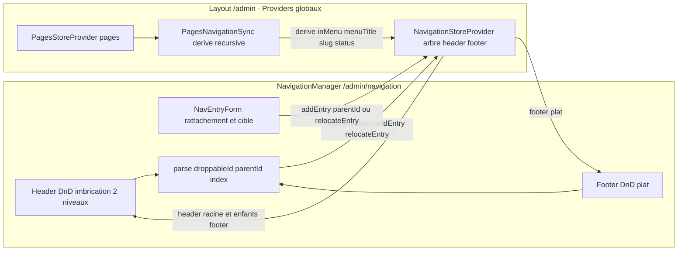

# Plan — ROADMAP Étape 4.3 : Sous-menus Niveau 2, Drag & Drop et Liens Ancres/Externes

## Objectif

Enrichir l'écran Navigation & Menus (`/admin/navigation`) pour passer d'une
arborescence **plate** (Étapes 4.1/4.2) à une arborescence **hiérarchique
restructurable** :

- **Sous-menus de Niveau 2** : imbriquer des liens sous un item parent du menu
  principal — **Header uniquement** (le Footer reste un menu plat à 1 niveau) ;
- **Re-structuration par Drag & Drop** (`@hello-pangea/dnd`, déjà utilisé par le
  Page Builder) : réordonner les items, **imbriquer** un item sous un autre
  (Niveau 1 → Niveau 2) et **désimbriquer** (Niveau 2 → Niveau 1), aussi bien
  par poignée que via le formulaire (choix du parent) ;
- **Cibles de lien unifiées** : interne « Page du site » (`kind: "page"`) et
  lien libre/personnalisé (`kind: "custom"`) acceptant **ancre locale**
  (`#contact`), **chemin + ancre** (`/a-propos#equipe`) et **URL externe**
  (`https://…`), via un `normalizeHref` centralisé dans le modèle.

Périmètre conservé volontairement **sans couplage fort** : les ancres ne sont
pas sélectionnées depuis les modules des pages (`PagesStore` n'est pas sondé
pour ses `anchorId`) — l'utilisateur saisit librement `#…` / `/page#…` dans le
type « Lien personnalisé ». L'upload BDD/Supabase reste hors périmètre
(persistance mock en mémoire), le Front-Office public reste **inchangé**.

## Références projet

- `ROADMAP.md` — Phase 4, Étape 4.3 `[IN_PROGRESS]`.
- `SPECIFICATIONS-V8.md` §7.2-D « Écran Navigation & Menus : Arborescence en
  Drag & Drop pour organiser les liens du menu horizontal principal (Niveau 1)
  et des sous-menus (Niveau 2) » + §8 « Navigation & En-tête … avec sous-menus
  déroulants » + §7.2-C (ancres internes, pages, URL externes) + §8.4.2.3
  (lib `@hello-pangea/dnd` ou `@dnd-kit`).
- `plans/ROADMAP-4.1-navigation.md` — `NavMenuEntry` plat, écran Navigation,
  `NavEntryRow`/`NavEntryForm`, `NavigationManager`.
- `plans/ROADMAP-4.2-pages-nav-sync.md` — `pageId`, `auto`, `PagesNavigationSync`
  (réconciliation Header/Footer), Provider global au Layout `/admin`.
- `plans/ROADMAP-3.2-pagebuilder-dnd.md` & `3.3` — pattern DnD
  `@hello-pangea/dnd` + montage **sans SSR** (`dynamic(…, { ssr: false })`),
  pattern poignée `GripVertical` (ModuleRow).
- `.kilorules` §0.2, §1 (étape par étape, validation, CHANGELOG), §3 (zéro
  `any`, composants clients isolés), §4 (schéma BDD inchangé).

## 0. Décisions d'architecture (à valider)

### 0.1 Hiérarchie Niveau 2 dans le Header uniquement

Conforme à la spec (sous-menus déroulants du **menu horizontal principal**) :
seul le **Header** peut porter des sous-menus de Niveau 2. Le **Footer** reste
**plat** (1 niveau). Garde-fou appliqué à la fois dans l'UI (aucune zone de
sous-niveau rendue pour le Footer) et dans la logique du store (un `parentId`
toujours `null` pour le Footer ; toute tentative d'imbrication Footer est
ramenée à la racine).

### 0.2 Modèle arborescent : `NavMenuEntry.children` (profondeur max 2)

Le `NavMenuEntry` actuel (4.1/4.2) est **plat** : il n'a **pas** encore de
`children`. On ajoute :

```ts
export interface NavMenuEntry {
  id: string;
  label: string;
  kind: NavItemKind;      // "page" | "custom"  (ex-"link", cf. 0.9)
  href: string;
  hidden: boolean;
  pageId: string | null;
  auto: boolean;
  children?: NavMenuEntry[]; // Niveau 2 — Header uniquement (absents sinon)
}
```

- Profondeur **strictement limitée à 2** : un item de Niveau 2 ne peut **jamais**
  être parent. Seuls les items de Niveau 1 du Header exposent une zone enfant.
- Mappage futur table `nav_items` documenté : une entrée racine = `parent_id
  NULL`, un enfant = `parent_id = <id parent>`, l'ordre = position dans la liste
  de son parent (conversion arbre → lignes plates à l'intégration BDD).
- `createNavEntry(...)` ne pose pas de `children` (liste vide par défaut).

### 0.3 Cibles unifiées & `normalizeHref` centralisé

Deux types de cible seulement, **sans couplage avec les modules des pages** :

| kind | Libellé UI | Cible | `pageId` |
| --- | --- | --- | --- |
| `page` | Page du site | page existante (`pageHref(slug)`) | id de la page |
| `custom` | Lien personnalisé | ancre `#…`, chemin `…/page#ancre`, URL externe `https://…`, slug | `null` |

La fonction `normalizeHref(raw: string): string` (actuellement locale à
`NavEntryForm`) est **déplacée dans `src/lib/navigation.ts`** et exportée pour
réutilisation : vide → `""` ; déjà préfixé par `/`, `http(s)://` ou `#` →
inchangé ; sinon → préfixé `/`. Elle couvre ainsi ancre locale, chemin relatif
+ ancre, et URL externe absolue.

### 0.4 Drag & Drop `@hello-pangea/dnd`

- **Un `DragDropContext` par zone** (Header / Footer) : rend **impossible** un
  glisser entre Header et Footer (aucune logique de rejet inter-zone à écrire).
- **Header** — deux niveaux de `Droppable` :
  - racine : `nav-header:root` (liste des items de Niveau 1) ;
  - par item de Niveau 1 P : `nav-header:sub:{P.id}` (liste de ses enfants).
  Chaque `Draggable` (racine ou enfant) porte `draggableId = entry.id` (uuid
  stable, jamais l'index). Un item de Niveau 1 (avec sa sous-liste imbriquée)
  est **un seul `Draggable`** : le déplacer déplace tout son sous-menu.
  - **Imbriquer** : déposer un item de Niveau 1 dans la zone `sub:{P.id}` d'un
    autre item de Niveau 1 (P ≠ lui-même). La zone enfant est **toujours
    visible** quand l'item a ≥ 1 enfant ; quand il n'en a **pas**, elle est
    révélée **pendant le glisser** (état `isDragging` local via
    `onDragStart`/`onDragEnd`) sous forme de zone pointillée « Glissez un lien
    ici pour en faire un sous-menu » — permet de créer un premier enfant.
  - **Désimbriquer** : déposer un enfant dans `nav-header:root` (ou dans la
    zone d'un autre parent).
  - **Garde-fou profondeur** : un item qui **a déjà des enfants** (parent de
    Niveau 1) ne peut **pas** être imbriqué sous un autre item — le drop est
    ignoré (retour sans mutation). L'utilisateur désimbrique d'abord ses
    enfants ou déplace le parent complet au niveau racine.
- **Footer** — un seul `Droppable` plat `nav-footer:root` : réordonnancement
  uniquement (aucune zone `sub:` rendue → imbrication impossible).
- L'analyse du `DropResult` (parse `source.droppableId` /
  `destination.droppableId` → `{ parentId: string | null, index }`) est isolée
  dans un helper pur du modèle (cf. 1.1) : l'UI ne manipule jamais l'état
  directement.
- **Montage sans SSR** : `@hello-pangea/dnd` étant importé désormais dans
  l'écran, on reproduit le pattern du Page Builder — un wrapper
  `NavigationManagerScreen` charge `NavigationManager` via
  `dynamic(…, { ssr: false })` (voir 1.7), comme `PageEditorScreen`.

### 0.5 Réconciliation Pages ↔ Navigation rendue **récursive** (Header)

L'Étape 4.2 a introduit une arborescence plate : la synchro itère sur les listes
Header/Footer **sans descendre dans les enfants**. Avec `children`, `PageNavigationSync`
doit **parcourir récursivement le Header** (racine + sous-menus) pour conserver
ses 4 règles sans régression :

1. page `inMenu` sans entrée `pageId` **nulle part dans le Header** (racine ou
   enfant) → ajout d'une entrée **auto** **à la racine** ;
2. maintien `label`/`href`/`hidden` de **toute** entrée liée (racine + enfants
   Header, Footer plat) ;
3. retrait du Header des entrées **auto** (où qu'elles soient) dont la page
   quitte le menu (`inMenu: false`) ou disparaît ;
4. cascade : retrait de toute entrée liée (Header racine/enfants **et** Footer)
   dont la page n'existe plus.

Garde-fous 4.2 conservés : liens `pageId: null` et **ordre** jamais touchés ;
comparaison avant toute mise à jour → pas de boucle entre stores. L'imbrication
**manuelle** d'une entrée `auto` sous un parent est donc possible et préservée
par la synchro.

### 0.6 Suppression d'un parent = cascade du sous-menu

Supprimer un item de Niveau 1 supprime **tout son sous-menu** (ses enfants).
La Dialog de confirmation affiche explicitement le nombre d'enfants supprimés
(« Le lien X et son sous-menu (n enfants) seront retirés »). La suppression d'un
enfant n'affecte que lui.

### 0.7 Formulaire : choix du parent (Header) — Footer à la racine

`NavEntryForm` gagne un champ **« Rattachement »** visible **uniquement pour le
Header** : `Racine du menu` ou un item de Niveau 1 du Header (liste des
parents). Contraintes :

- le Footer propose uniquement « Racine du menu » ;
- un item **édité** est exclu de la liste de ses propres parents ;
- un item édité qui **possède déjà des enfants** (parent de Niveau 1) reste
  forcé « Racine du menu » (impossibilité de créer une profondeur 3) — le champ
  est désactivé avec un libellé explicatif ;
- l'action store `relocateEntry` (cf. 1.2) déplace un item édité vers son
  nouveau parent (ou la racine) sans toucher à son éventuel sous-menu.

### 0.8 Renommage discriminant `"link"` → `"custom"`

Alignement sur la feuille de route : le type de cible « Lien libre » (4.1/4.2)
devient `kind: "custom"` (libellé UI « Lien personnalisé »). Renommage
**interne uniquement** (mock, aucune BDD) touchant le modèle, le store et le
formulaire ; la logique `pageId: null` et l'absence de synchro restent
identiques.

### 0.9 Aucune dépendance nouvelle, aucun composant UI nouveau, schéma BDD inchangé

`@hello-pangea/dnd` est déjà installé (`^18.0.1`) et utilisé par le Page
Builder ; tous les composants UI nécessaires (`Dialog`, `Badge`, `Button`,
`Select`) sont déjà injectés. Front-Office public et `site.ts` inchangés.

## 1. Fichiers concernés

### 1.1 Modèle & helpers — `src/lib/navigation.ts` (modifié)

- `NavItemKind = "page" | "custom"` (ex-`"link"`) ; commentaires mis à jour.
- `NavMenuEntry` : + `children?: NavMenuEntry[]` (Niveau 2 Header).
- `export function normalizeHref(raw: string): string` (déplacé depuis
  `NavEntryForm`) — ancres/relatives/externes.
- Nouveaux helpers **purs** (zéro `any`, non mutants) :
  - `hasNavChildren(entry): boolean` ;
  - `findNavEntry(list, id): NavMenuEntry | undefined` (recherche récursive) ;
  - `findNavParentId(list, id): string | null` (null = racine / introuvable) ;
  - `getNavChildList(list, parentId): NavMenuEntry[] | undefined` ;
  - `insertNavEntry(list, parentId: string | null, entry): NavMenuEntry[]`
    (ajout en fin de la sous-liste visée — racine par défaut) ;
  - `updateNavEntry(list, id, patch): NavMenuEntry[]` (récursif racine + enfants) ;
  - `removeNavEntry(list, id): NavMenuEntry[]` (récursif — retire le sous-arbre) ;
  - `moveNavEntryAcross(list, source, destination): NavMenuEntry[] | null`
    où `source`/`destination = { parentId: string | null, index: number }` :
    retire l'item (sous-arbre compris) de la sous-liste source et l'insère dans
    la sous-liste destination ; retourne `null` si un invariant est violé
    (déjà couvert par les garde-fous UI) ;
  - `reorderNavList<T>(list, from, to)` = `moveNavEntry` existant (réordonnance
    plat d'une liste — réutilisé par la zone Footer et le cas même-liste).
- Exemples seed (facultatif, démo Back-Office) : construire dans
  `buildSeedNavigation()` un sous-menu de démonstration — sous le Header, item
  **Portfolio** (`seed-portfolio`, entrée `auto`) → enfants **manuels**
  (`auto: false`, `kind: "custom"`) « Mariages » (`/portfolio#mariages`),
  « Portraits » (`/portfolio#portraits`), « Corporate »
  (`/portfolio#corporate`). Les enfants **manuels** ne sont jamais purgés par la
  synchro tant que la page parent existe.

### 1.2 Store — `src/components/backoffice/navigation/NavigationStoreProvider.tsx` (modifié)

- Actions passées en **arbres** (chaque action de zone s'applique à
  `navigation[area]` via les helpers 1.1) :
  - `getEntries(area)` : liste racine (comportement inchangé pour les appelants
    existants) ;
  - `addEntry(area, entry, parentId?: string | null)` — nouvel argument optionnel
    (défaut `null` = racine → **aucune régression** pour `PagesNavigationSync`) ;
    si `parentId` non nul → l'item est ajouté en fin des `children` du parent ;
    **garde-fou Footer** : `parentId` ignoré (toujours racine) ;
  - `updateEntry(area, id, patch)` — récursif racine + enfants ;
  - `removeEntry(area, id)` — récursif (retire le sous-arbre) ;
  - `relocateEntry(area, id, toParentId: string | null)` — **nouveau** : retire
    l'item (sous-arbre compris) de sa liste courante et le réinsère en fin de la
    liste `toParentId` (ou racine) ; utilisé par le formulaire quand le parent
    change ; garde-fou Footer (toujours racine) + refus si l'item a des enfants
    et `toParentId` non nul ;
  - `moveNavItem(area, source, destination)` — **nouveau**, branche DnD sur
    `moveNavEntryAcross` ; garde-fous : même zone uniquement, pas d'imbrication
    d'un item parent sous un autre, Footer racine.
  - `moveEntry(area, from, to)` conservé (réordonnance plat — Footer / cas
    même-liste).
- `NewNavEntry` : `kind` re-typé (`"page" | "custom"`).
- `NavigationStoreValue` expose les nouvelles signatures/actions.

### 1.3 Synchro — `src/components/backoffice/navigation/PagesNavigationSync.tsx` (modifié)

- Parcours **récursif** du Header (collecte racine + `children`) ; Footer plat.
- Règles 1→4 de l'Étape 4.2 conservées à l'identique dans leur sémantique
  (cf. 0.5) : `addEntry("header", …, undefined)` reste **racine** ; le retrait
  d'une entrée `auto` (ou la cascade) cible l'item **où qu'il soit** (racine ou
  enfant) via `removeEntry` récursif.

### 1.4 Écran — `src/components/backoffice/navigation/NavigationManager.tsx` (modifié)

- **Un `DragDropContext` par zone** : en-têtes de zone conservés (titre, badge,
  description, « Ajouter un lien »), corps devenu liste DnD.
- **Header** : `Droppable` racine + imbrication. Pour chaque item de Niveau 1
  (Draggable unique embarquant sa sous-liste) :
  - rangée de Niveau 1 (réutilise `NavEntryRow` avec poignée) ;
  - sous-liste de Niveau 2 (`Droppable nav-header:sub:{id}`) affichée quand
    l'item a ≥ 1 enfant **ou** pendant le glisser (`isDragging` local) ;
    enfants = rangées indentation visuelle (renfoncement), badge « Sous-menu ».
- **Footer** : `Droppable` plat unique (`nav-footer:root`), réordonnancement.
- `onDragEnd(area)` : parse `{parentId, index}` source/destination via un helper
  d'analyse ; applique les garde-fous (0.4) puis `moveNavItem`.
- État local `isDragging` (via `onDragStart`/`onDragEnd` du `DragDropContext`)
  pour révéler les zones enfant vides du Header pendant le glisser.
- Gestion du formulaire : `openCreate`/`openEdit` transmettent aussi le parent
  courant (`findNavParentId`) ; `handleSubmit` route selon parent (création →
  `addEntry(parentId)`, édition même parent → `updateEntry`, édition autre
  parent → `relocateEntry` + patch).
- Suppression : confirmation avec **nombre d'enfants** embarqués (cascade).
- États vides et compteurs conservés (compteur Header = racine + enfants ? —
  **décision** : le badge affiche le nombre d'items de Niveau 1 ; un second
  sous-compteur « n sous-liens » dans la description de zone reste optionnel).

### 1.5 Rangée — `src/components/backoffice/navigation/NavEntryRow.tsx` (modifié)

- Ajout de la **poignée de glissement** (`GripVertical`, pattern `ModuleRow`,
  seule zone draggable — `dragHandleProps`) et de l'`aria-label` adapté.
- **Indentation visuelle** et marqueur « Sous-menu » pour les items de Niveau 2.
- **↑ / ↓ retirés** (provisoires 4.1) au profit du DnD ; Toggle Eye, édition,
  suppression conservés.
- Style de drag (`snapshot.isDragging` → `shadow`, `ring`) comme ModuleRow.

### 1.6 Formulaire — `src/components/backoffice/navigation/NavEntryForm.tsx` (modifié)

- `kind`: Select « Page du site » / **« Lien personnalisé (ancre / URL
  externe) »** (valeur `"custom"`).
- Champ **« Rattachement »** (Select) pour le Header : `Racine du menu` + items
  de Niveau 1 (props `parents`, `entryParentId`, `canNest`) — cf. 0.7.
- Mode `custom` : champ libre normalisé par `normalizeHref` (importé du modèle),
  `placeholder="ancre (#contact), page#ancre (/a-propos#equipe), https://…"`,
  aide listant les formats acceptés.
- Payload soumis `{ label, kind, href, pageId, parentId }`.

### 1.7 Point de montage DnD sans SSR + route

- **Nouveau** `src/components/backoffice/navigation/NavigationManagerScreen.tsx`
  (client) : `dynamic(() => import("./NavigationManager").then(m =>
  m.NavigationManager), { ssr: false, loading: … })` — miroir de
  `PageEditorScreen`.
- `src/app/(back-office)/admin/navigation/page.tsx` (modifié) : rend
  `NavigationManagerScreen` au lieu de `NavigationManager` (metadata inchangée).

### 1.8 Fichiers non modifiés

- `admin/layout.tsx` : Providers + sync déjà globaux (4.2) — **inchangé**.
- `src/lib/pages.ts`, `PagesStoreProvider`, écrans Pages : **inchangés**.
- Front-Office, `site.ts`, routes publiques, `components.json` : **inchangés**.

## 2. Ordre d'exécution (Code mode) — validation à chaque sous-tâche

1. **Modèle** (`navigation.ts`) : `kind "custom"`, `children`, `normalizeHref`,
   helpers purs (`hasNavChildren`, `findNavEntry`, `findNavParentId`,
   `insertNavEntry`, `updateNavEntry`, `removeNavEntry`, `moveNavEntryAcross`),
   seed sous-menu démo. → `npx tsc --noEmit` (les usages cassés = signal attendu).
2. **Store** (`NavigationStoreProvider.tsx`) : signatures arbre +
   `relocateEntry`, `moveNavItem`, garde-fous Footer/profondeur. → `tsc`.
3. **Synchro** (`PagesNavigationSync.tsx`) : parcours récursif Header. → `tsc`.
4. **Écran & lignes** : `NavigationManagerScreen` (ssr:false) + mise à jour
   `navigation/page.tsx` → vérifier que `/admin/navigation` s'affiche toujours ;
   refonte `NavigationManager` (DragDropContext par zone, imbrication Header,
   Footer plat) ; refonte `NavEntryRow` (poignée, indentation, suppression ↑/↓).
5. **Formulaire** (`NavEntryForm.tsx`) : type `custom`, `normalizeHref`,
   champ « Rattachement » (Header), payload `parentId` ; câblage
   `NavigationManager` (create/edit/relocate + confirmation cascade).
6. **Validation manuelle ciblée** (npm run dev) :
   - réordonner racine et enfants par poignée ;
   - imbriquer un item racine sous un autre (zone vide révélée au glisser) ;
   - désimbriquer un enfant vers la racine ;
   - tenter d'imbriquer un parent qui a des enfants → refus ;
   - créer/éditer un lien avec parent via le formulaire ;
   - supprimer un parent → confirmation « + n enfants » ;
   - créer une page `inMenu` → entrée auto racine ; imbriquer cette entrée auto
     sous un parent puis la retirer du menu → purgée où qu'elle soit ;
   - saisir `#ancre`, `/page#ancre`, `https://…` → href normalisée.
7. **Contrôles finaux** : `npx tsc --noEmit`, `npm run build`, `npm run lint`
   (zéro erreur).
8. **Documentation** : mise à jour `CHANGELOG.md` (nouvelle entrée datée),
   `ROADMAP.md` (4.3 `[x]`, 4.4 `[IN_PROGRESS]`).

## 3. Garde-fous / non-régression

- **Compat 4.1/4.2** : `getEntries`, `addEntry` sans `parentId` (racine) et
  `updateEntry`/`removeEntry` par id gardent leur contrat — la synchro 4.2 ne
  casse pas ; seules ses itérations deviennent récursives sur le Header.
- **Zéro profondeur > 2** : seul le Niveau 1 expose une zone enfant ; un parent
  (avec enfants) ne peut pas être imbriqué ; Footer strictement racine.
- **Zéro boucle inter-stores** : la synchro compare avant mutation et reste
  dérivée des pages (source de vérité) ; l'ordre et les liens `pageId: null`
  ne sont jamais touchés par la réconciliation.
- **DnD maîtrisé** : un `DragDropContext` par zone (pas de glisser Header ↔
  Footer) ; `draggableId` = uuid stable (jamais l'index) ; helpers purs sans
  mutation ; zones `sub:` jamais rendues sous un enfant ni dans le Footer.
- **SSR** : `@hello-pangea/dnd` monté via `dynamic(ssr:false)`
  (`NavigationManagerScreen`) → aucun mismatch d'hydratation.
- **Front-Office, `site.ts`, routes publiques, schéma BDD inchangés** ; aucune
  dépendance ni composant UI nouveau.
- **TypeScript strict, zéro `any`** ; types explicites (`parentId: string |
  null`, `children?: NavMenuEntry[]`, `source/destination` typés).
- **Vérification finale obligatoire** : `npx tsc --noEmit`, `npm run build`,
  `npm run lint` sans erreur.



## 4. Fichiers créés / modifiés (résumé pour le CHANGELOG)

- Modifiés : `src/lib/navigation.ts` (`children`, `kind custom`, `normalizeHref`,
  helpers arbre), `src/components/backoffice/navigation/NavigationStoreProvider.tsx`
  (actions arbre + `relocateEntry`/`moveNavItem`), `…/PagesNavigationSync.tsx`
  (récursif Header), `…/NavigationManager.tsx` (DnD imbriqué Header / plat
  Footer, drag-state, formulaire parent, cascade), `…/NavEntryRow.tsx`
  (poignée, indentation, suppression ↑/↓), `…/NavEntryForm.tsx` (type `custom`,
  `normalizeHref`, « Rattachement »), `src/app/(back-office)/admin/navigation/page.tsx`
  (wrapper ssr:false), `ROADMAP.md`, `CHANGELOG.md`.
- Créés : `plans/ROADMAP-4.3-navigation-advanced.md` (ce plan),
  `src/components/backoffice/navigation/NavigationManagerScreen.tsx`.
- Aucune dépendance nouvelle, aucun composant UI nouveau, aucune route publique
  nouvelle, aucun changement Front-Office ni de schéma BDD.
