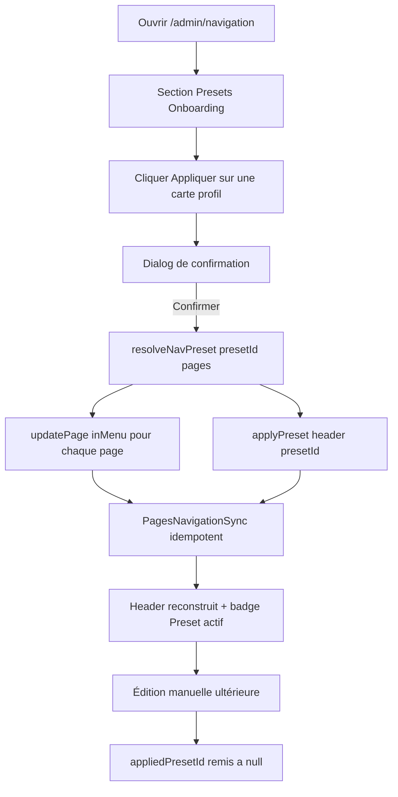

# Plan — ROADMAP Étape 4.4 : Injection des Presets Onboarding de Navigation (Artiste, Commercial, Passionné)

## Objectif

Enrichir l'écran Navigation & Menus (`/admin/navigation`) d'un mécanisme de
**Presets Onboarding** (spec §7.2-D) : le photographe choisit son **profil
d'activité** et le menu principal (Header) est reconstruit selon une structure
« starter » pré-définie :

- *Profil Artiste / Auteur* : Portfolio · Séries · À propos · Contact · Connexion ;
- *Profil Photographe Pro / Commercial* : Accueil · Prestations (Mariage,
  Portrait, Corporate) · À propos · Contact · Connexion ;
- *Profil Passionné / Semi-Pro* : Accueil · Galeries · Contact · Connexion.

**Sémantique validée avec l'utilisateur** : l'application d'un preset **devient
la structure de référence** — le preset positionne aussi le flag `inMenu` des
pages existantes (pages retenues par le preset → `inMenu: true`, pages vitrines
non retenues → `inMenu: false`), puis reconstruit le **Header** à partir des
pages retenues **+ placeholders** pour les cibles sans page correspondante.
L'écran Navigation agit via les **deux stores** (`PagesStore` + `NavigationStore`)
— couplage assumé et documenté. Le **Footer est inchangé**.

## Références projet

- `ROADMAP.md` — Phase 4, Étape 4.4 `[IN_PROGRESS]`.
- `SPECIFICATIONS-V8.md` §7.2-D « Presets de Navigation Onboarding » (3 profils)
  + §8 « Navigation & En-tête … avec sous-menus déroulants ».
- `plans/ROADMAP-4.3-navigation-advanced.md` — arbre `children` Niveau 2,
  `kind: "page" | "custom"`, helpers purs, garde-fous Header/Footer.
- `plans/ROADMAP-4.2-pages-nav-sync.md` — `pageId`, `auto`, `inMenu`,
  `PagesNavigationSync`, Providers globalisés dans le Layout `/admin`.
- `.kilorules` §0.2, §1 (étape par étape, validation, CHANGELOG), §3 (zéro
  `any`, composants clients isolés), §4 (schéma BDD inchangé).

## 0. Décisions d'architecture (à valider)

### 0.1 Présence des pages existantes : mapping du preset

Le preset référence les pages **par slug**. À la résolution, chaque cible de
type `page` est cherchée parmi les pages courantes (`PagesStore`) :

- page **trouvée** → entrée `page` **auto** (`pageId` renseigné, `label` =
  `menuTitle`, `href` = `pageHref(slug)`) et page passée `inMenu: true` ;
- page **absente** → entrée **`custom` manuelle** (`pageId: null`, jamais
  synchronisée) pointant `href = normalizeHref("/" + slug)` (placeholder
  « page à créer » — ex. `/series`, `/galeries`, `/connexion`) ;

les cibles de type `href` (ancres de sous-menu `/prestations#mariages`, …)
produisent **toujours** une entrée `custom` manuelle.

Toute page existante **non retenue** par le preset passe `inMenu: false`
(elle quitte le menu — ses données et sa page sont conservées).

### 0.2 Interaction avec la synchro auto `PagesNavigationSync`

C'est le point structurant. Sans précaution, appliquer un preset qui retire des
pages seed `inMenu` (ex. Artiste retire Accueil/Prestations) serait **aussitôt
annulé** par la règle 1 de `PagesNavigationSync` (ré-ajout d'une entrée auto
pour chaque page `inMenu` sans entrée Header).

Contournement choisi (option validée) : l'application d'un preset est **atomique
sur les deux stores** — elle
1. **remplace** le Header complet par le résultat du preset (via une nouvelle
   action store `replaceHeader`) ;
2. **recalcule `inMenu`** de toutes les pages existantes (via `updatePage` du
   `PagesStore`) pour qu'il corresponde exactement au preset.

Après application, la synchro est **idempotente** : aucune page `inMenu` sans
entrée Header (règle 1), labels/hrefs/hidden à jour (règle 2 — un Contact
`draft` est masqué), aucune entrée auto orpheline (règle 3), aucune cascade
(règle 4). Le tout se **stabilise** sans boucle.

### 0.3 Couplage inter-stores : orchestré côté écran, logique pure côté modèle

Le `NavigationStoreProvider` ne doit **pas** dépendre du `PagesStore` (il est
générique). L'orchestration se fait **dans l'écran** (ou un hook dédié monté
sous les deux Providers, déjà le cas dans le Layout `/admin`) :

- la **résolution preset → structure** reste une **fonction pure du modèle**
  (`src/lib/navigation.ts`) qui reçoit `(presetId, pages)` et retourne
  `{ header, inMenuByPageSlug }` — testable, sans `useState` ;
- l'écran appelle ensuite `updatePage(...)` pour chaque changement `inMenu`,
  puis `replaceHeader(...)` / `applyPreset(...)` du store navigation.

Aucune boucle Pages ↔ Navigation : l'état final appliqué est exactement l'état
que la synchro aurait produit (voir 0.2).

### 0.4 « Preset actif » & invalidation

Le store navigation porte `appliedPresetId: NavPresetId | null` (badge « Preset
actif » dans l'UI). Toute **mutation manuelle** ultérieure (ajout, édition,
suppression, déplacement, relocalisation) **réinitialise** ce champ à `null` :
le menu n'est plus « pur » d'un preset dès que le photographe le personnalise.

### 0.5 Périmètre volontairement exclu (inchangé depuis 4.1 → 4.3)

- **Footer** : jamais modifié par un preset (menus de pied de page hors presets
  de navigation §7.2-D).
- **Front-Office public** (Header `/`) : toujours **non branché** sur le store
  mock (Server Component via `site.ts`) — le branchage viendra avec l'intégration
  BDD/Supabase.
- Aucun **couplage aux modules/ancre des pages** : les ancres de sous-menu sont
  des chaînes libres saisies dans le preset (`/prestations#mariages`).
- Aucune **création automatique de pages** : les cibles absentes deviennent des
  placeholders `custom` (le photographe créera ensuite ses pages depuis
  `/admin/pages` ; l'option « Ajouter au menu » par défaut les ajoutera alors en
  fin de Header — un éventuel doublon avec un placeholder homonyme reste un
  choix manuel du photographe, hors périmètre d'automatisation).
- Schéma BDD **inchangé**.

## 1. Modèle & helpers purs — `src/lib/navigation.ts`

Ajout (à la suite du bloc 4.3) :

```ts
export type NavPresetId = "artiste" | "commercial" | "passionne";

export type NavPresetTarget =
  | { kind: "page"; slug: string }  // page existante recherchée par slug
  | { kind: "href"; href: string }; // placeholder / ancre / URL, jamais résolu

export interface NavPresetNode {
  label: string;            // libellé preset (survolé si page résolue)
  target: NavPresetTarget;
  children?: NavPresetNode[]; // sous-menu Niveau 2 (Header) — racine seulement
}

export interface NavPreset {
  id: NavPresetId;
  profile: string;      // ex. "Artiste / Auteur"
  tagline: string;      // ex. "Portfolio épuré centré sur l'image"
  nodes: NavPresetNode[]; // arborescence du menu principal
}

export const NAV_PRESETS: readonly NavPreset[] = [ /* cf. §2 */ ];
```

Fonction pure de résolution (zéro `any`, aucun `setState`) :

```ts
export interface ResolvedNavPreset {
  header: NavMenuEntry[];                 // nouvelles entrées racine Header
  inMenuByPageSlug: Record<string, boolean>; // pages existantes → nouveau inMenu
}

export function resolveNavPreset(
  presetId: NavPresetId,
  pages: SitePage[]
): ResolvedNavPreset;
```

Règles de `resolveNavPreset` :
- construit une map `slug → SitePage` depuis `pages` (slug vide `""` = Accueil) ;
- pour chaque nœud racine : cible `page` trouvée → entrée `page` **auto**
  (`createNavEntry("page", menuTitle, pageHref, page.id, true)` + `inMenuByPageSlug[slug]=true`) ;
  cible `page` absente → entrée **`custom` manuelle** `createNavEntry("custom",
  label, normalizeHref("/"+slug))` ; cible `href` → entrée **`custom` manuelle**
  `createNavEntry("custom", label, normalizeHref(href))` ;
- nœuds `children` (Niveau 2) rattachés en `children` de l'entrée parente
  (mêmes règles de résolution ; garde-fou profondeur max 2 respecté par
  construction : seuls les nœuds racine portent des enfants) ;
- les pages existantes **non référencées** par une cible `page` → `false`.

## 2. Catalogue des presets (mapping « à valider »)

Pages seed disponibles : `Accueil` (slug `""`), `Portfolio`, `Prestations`
(page « Prestations & Tarifs », slug `prestations`), `À propos`, `Contact`
(draft). Lecture de la spec adaptée au jeu de pages mock :

| Preset | Structure proposée (racine → résolution) |
|---|---|
| **artiste** | Portfolio → page `portfolio` · Séries → placeholder `/series` · À propos → page `a-propos` · Contact → page `contact` · Connexion → placeholder `/connexion` |
| **commercial** | Accueil → page `""` · Prestations → page `prestations` (parent) avec enfants Mariage/Portrait/Corporate → `custom` `/prestations#mariages`, `#portraits`, `#corporate` · À propos → page `a-propos` · Contact → page `contact` · Connexion → placeholder `/connexion` |
| **passionne** | Accueil → page `""` · Galeries → placeholder `/galeries` · Contact → page `contact` · Connexion → placeholder `/connexion` |

Notes documentées (reprises en commentaire du catalogue) :
- spec « Tarifs » distinct de « Prestations » → **fusionné** dans la page seed
  « Prestations & Tarifs » déjà en menu (aucun placeholder `/tarifs`) ;
- spec « RDV / Contact (Bouton CTA) » → représenté par l'item **Contact** (le
  RDV/CTA est un futur module public, hors périmètre navigation) ;
- « Connexion » est un item final (futur lien compte/bouton d'en-tête) — le
  Header public (non branché) possède déjà son bouton de connexion (2.1) ;
  l'item sert de placeholder structurant dans l'éditeur.
- Conséquence `inMenu` : artiste → `portfolio`, `a-propos`, `contact` ; autres
  pages vitrines retirées. commercial → `accueil`, `prestations`, `a-propos`,
  `contact`. passionne → `accueil`, `contact`.

Ces mappings sont **modifiables avant validation** (labels, slugs, enfants).

## 3. Store Navigation — `NavigationStoreProvider.tsx`

Nouvelles expositions (l'état passe à `{ header, footer, appliedPresetId }`) :

```ts
appliedPresetId: NavPresetId | null;   // badge « Preset actif » (0.4)
applyPreset: (header: NavMenuEntry[], presetId: NavPresetId) => void;
// → remplace navigation.header ET pose appliedPresetId
```

Toutes les actions de **mutation manuelle** existantes (`addEntry`, `updateEntry`,
`removeEntry`, `relocateEntry`, `moveNavItem`, `moveEntry`) **réinitialisent**
`appliedPresetId` à `null` dans la même mise à jour d'état (fonctionnel pur
`withoutPreset(state)` au début de chaque `setNavigation` mutateur).

## 4. Orchestration & UI — `NavigationManager.tsx` (+ composant panel)

### 4.1 Orchestration « Appliquer un preset »

Dans l'écran (monté sous les deux Providers globalisés du Layout `/admin`) :

```ts
const { pages, updatePage } = usePagesStore();
const { applyPreset } = useNavigationStore();

function handleApplyPreset(presetId: NavPresetId) {
  const { header, inMenuByPageSlug } = resolveNavPreset(presetId, pages);
  for (const page of pages) {
    const next = inMenuByPageSlug[page.slug] === true;
    if (page.inMenu !== next) {
      updatePage(page.id, { title, menuTitle, slug, status, inMenu: next }); // spread fidèle du draft
    }
  }
  applyPreset(header, presetId); // remplace le Header + badge
}
```

Le changement `inMenu` déclenche la synchro auto, qui est **idempotente** avec
le Header déjà remplacé (0.2). Pas de boucle.

### 4.2 Composant d'affichage — `PresetOnboardingPanel.tsx` (nouveau)

- **Section « Presets Onboarding »** au-dessus des zones Header/Footer :
  3 **cartes de profil** (nom, tagline, aperçu en ligne type
  `Portfolio · Séries · À propos · Contact`) issues de `NAV_PRESETS` ;
- bouton **« Appliquer »** par carte → **Dialog de confirmation** expliquant le
  remplacement (« remplace le menu principal actuel et réorganise les pages
  affichées au menu ») — action destructrice du menu courant ;
- **badge « Preset actif »** sur la carte correspondant à `appliedPresetId`
  (ou « personnalisé » si `null` après édition manuelle).

### 4.3 Rendu

`NavigationManager` affiche `<PresetOnboardingPanel />` en tête (nouveau fichier
isolé, zéro `any`, mêmes patterns shadcn/ui que l'existant : `Card`/`Dialog`/
`Button`/`Badge` déjà présents ou ajoutés si besoin). Le montage sans SSR
(`NavigationManagerScreen`) est **inchangé** (4.3) — les deux stores étant déjà
fournis par le Layout.

## 5. Diagramme de flux



## 6. Tâches (ordre d'exécution — mode Code)

1. `src/lib/navigation.ts` — types `NavPreset*`, `NAV_PRESETS`, `resolveNavPreset`
   (helpers purs) + commentaires de mapping.
2. `NavigationStoreProvider.tsx` — état `appliedPresetId`, action `applyPreset`,
   réinitialisation du badge sur toute mutation manuelle.
3. `src/components/backoffice/navigation/PresetOnboardingPanel.tsx` (nouveau) —
   cartes profils + aperçu + Dialog de confirmation + badge « Preset actif ».
4. `NavigationManager.tsx` — intégration du panel + `handleApplyPreset`
   (orchestration `updatePage` + `applyPreset`).
5. Vérifications : `npx tsc --noEmit`, `npm run build`, `npm run lint`.
6. `ROADMAP.md` (4.4 → `[x]`) + `CHANGELOG.md` (après validation interactive).

## 7. Vérifications & validation manuelle attendue

- `npm run dev` → `/admin/navigation` : appliquer chaque preset, vérifier que le
  Header correspond au mapping (§2), que le badge « Preset actif » s'affiche,
  que les pages retirées disparaissent (et que leur case « Ajouter au menu »
  dans `/admin/pages` est décochée), que **rien ne réapparaît** tout seul
  (synchro stable), que le Footer est intact.
- Éditer/supprimer/déplacer un item après preset → le badge s'efface
  (« personnalisé »).
- Ré-appliquer le même preset → structure identique (déterministe).
- `npx tsc --noEmit` OK ; `npm run build` OK ; `npm run lint` OK.

## 8. Risques & mitigations

| Risque | Mitigation |
|---|---|
| La synchro auto « combat » le preset (ré-ajout de pages inMenu) | Application atomique des deux stores : `inMenu` recalé **et** Header remplacé ensemble → synchro idempotente (0.2) |
| Doublon futur placeholder ↔ page créée ensuite | Placeholders `custom` manuels jamais purgés ; doublon = choix du photographe, documenté (0.5) |
| `updatePage` exige un draft complet | `handleApplyPreset` re-spread l'ensemble des champs de chaque page modifiée (title, menuTitle, slug, status, inMenu) |
| Badge « preset actif » obsolète après édition | Invalidation systématique de `appliedPresetId` dans les mutations (0.4) |
| Couplage PagesStore ← NavigationManager | Orchestration localisée dans l'écran ; modèle reste pur et sans dépendance inter-store (0.3) |
