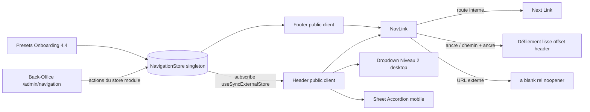

# Plan — ROADMAP Étape 4.5 : Rendu Front-Office dynamique du Header & Footer

## Objectif

Brancher enfin le **Front-Office public** sur le store de navigation construit aux
Étapes 4.1 → 4.4. Le Header et le Footer cessent d'être des composants statiques
alimentés par [`src/lib/site.ts`](src/lib/site.ts) pour **consommer dynamiquement
les zones `header` / `footer`** du `NavigationStore` :

- Header : rendu du **Niveau 1** et des **sous-menus Niveau 2** (Desktop : survol/
  focus ; Mobile : **menu burger Sheet + Accordéon**), **filtrage des items
  masqués** (`hidden !== true`) ;
- Footer : rendu dynamique de la zone `footer` (colonne Navigation) ;
- composant utilitaire **`NavLink`** unifiant les cibles (route Next, ancre
  `#…`, chemin + ancre `/page#…`, URL externe `https://…`) ;
- **Provider partagé** au niveau du layout public racine.

Décision structurante **validée avec l'utilisateur** : le `NavigationStore`
devient un **store partagé au niveau module** (singleton en mémoire + abonnement
`useSyncExternalStore`) consommé **par `/admin` ET `/`** — ainsi les modifications
et Presets Onboarding faits dans le Back-Office sont **visibles immédiatement sur
le site public** au sein d'une même session (démo de bout en bout testable).
Un **rechargement plein du navigateur** réinitialise le store sur le seed
(limite du mock, résolue à l'intégration BDD/Supabase).

## Références projet

- `ROADMAP.md` — Phase 4, Étape 4.5 `[IN_PROGRESS]` (à créer).
- `SPECIFICATIONS-V8.md` §3.1 (En-tête / Footer) + §7.2-D (Navigation, Toggle
  Eye) + §8 (sous-menus déroulants) + §7.2-C (ancres internes, pages, URL
  externes).
- `plans/ROADMAP-4.1..4.4-navigation*.md` — modèle `NavMenuEntry` (kind
  `page`/`custom`, `children` Niveau 2, `hidden`, `pageId`, `auto`), store,
  Presets.
- `plans/ROADMAP-2.1-header.md` — Header fixe « glassmorphism nacré » (chrome).
- `.kilorules` §0.2, §1, §3 (zéro `any`, composants clients isolés), §4 (schéma
  BDD inchangé).

## 0. Décisions d'architecture (à valider)

### 0.1 Store Navigation partagé au niveau module (décision actée)

Aujourd'hui `NavigationStoreProvider` porte son état dans un `useState` local :
chaque layout (`/admin` d'un côté, `/` de l'autre) crée une **instance isolée**.
Or `/admin` et `/` sont des route groups avec layouts distincts — naviguer de
l'un à l'autre **démonte** le Provider admin et **remonte** un Provider public
frais, réinitialisé sur `buildSeedNavigation()`.

Correction retenue : extraire l'**état + actions** dans un **store externe au
niveau module** (une source unique en mémoire), consommé par les deux layouts
via `useSyncExternalStore` :

```ts
// src/lib/navigation-store.ts  (nouveau — cœur partagé, zéro `any`)
type NavigationState = {
  navigation: SiteNavigation;
  appliedPresetId: NavPresetId | null;
};

let state: NavigationState = {
  navigation: buildSeedNavigation(),
  appliedPresetId: null,
};
const listeners = new Set<() => void>();

export function getNavigationSnapshot(): NavigationState { return state; }
export function subscribeNavigation(listener: () => void): () => void { … }
function setNavigationState(updater: (prev: NavigationState) => NavigationState): void { … }
// + toutes les actions, portées tell quelles depuis le Provider :
export const navigationActions = {
  getEntries, addEntry, updateEntry, removeEntry,
  relocateEntry, moveNavItem, moveEntry, applyPreset,
};
```

- `NavigationStoreProvider` devient une **fine couche** qui lit le snapshot via
  `useSyncExternalStore(subscribeNavigation, getNavigationSnapshot)` et expose
  **la même valeur de contexte** (`navigation`, `appliedPresetId`, actions) —
  **aucun consommateur Back-Office ne change** (`PagesNavigationSync`,
  `NavigationManager`, `PresetOnboardingPanel`, `NavEntryForm`…).
- Le montage du Provider dans le layout public racine suffit donc à partager
  l'état avec `/admin` pendant la session.
- `getServerSnapshot` renvoie l'état initial constant → SSR identique et sans
  mismatch d'hydratation.

### 0.2 Comportement attendu (démo de bout en bout)

1. Rechargement sur `/` : seed (Header : Accueil, Portfolio ▾ sous-menu démo
   Mariages/Portraits/Corporate, Prestations, À propos, Contact).
2. Dans `/admin/navigation` : Toggle Eye sur un item ou application d'un Preset
   → navigation (SPA) vers `/` : le Header/Footer **reflètent l'état modifié**.
3. Rechargement plein (`F5`) sur `/` : retour au seed (persistance hors
   périmètre — BDD).

### 0.3 `hidden` = « ne pas afficher » (pas « supprimer »)

Le Header **et** le Footer filtrent les entrées `hidden === true` à chaque
niveau (racine + sous-menu). Un item parent masqué retire aussi son sous-menu de
l'affichage (cohérent avec le Back-Office où la suppression cascade ; ici il
s'agit de ne pas rendre). `hidden` d'une entrée `page` est maintenu = brouillon
par la synchro côté `/admin` (le store étant partagé, le public en hérite).

### 0.4 Rendu public & SEO

Header et Footer restent **SSR** (rendus côté serveur) tout en étant des Client
Components : Next.js fait le SSR des Client Components → le balisage est présent
au premier chargement (pas de flash) et le contenu textuel reste indexable.

### 0.5 Périmètre volontairement exclu (inchangé)

- **Routes de pages publiques** (`/portfolio`, `/a-propos`, …) non créées dans
  cette étape : les liens peuvent pointer vers des routes inexistantes (comme
  l'actuel `site.ts`). Seul le chrome Header/Footer devient dynamique.
- **Persistance BDD/Supabase** : hors périmètre (limite du mock assumée).
- **PagesStore / PagesNavigationSync côté public** : inutiles — le store
  Navigation embarque déjà `href`/`hidden`/`label` résolus ; la synchro reste
  exécutée uniquement quand le layout `/admin` est monté.
- Design Front-Office « Éclat Minéral » : aucun changement de charte ; on ne
  fait que substituer la source de données des liens.
- Schéma BDD inchangé.

## 1. Composant utilitaire `NavLink` — `src/components/common/NavLink.tsx` (nouveau)

**Client Component** qui résout une cible unifiée (`href` de `NavMenuEntry`) :

| Cible | Rendu | Comportement |
|---|---|---|
| `https://…` / `http://…` | `<a>` | `target="_blank"` + `rel="noopener noreferrer"` |
| `/route` (sans ancre) | Next `<Link>` | navigation App Router (préchargement) |
| `#ancre` (même page) | `<a>` + gestionnaire | `scrollIntoView` lisse avec **offset du Header fixe** (`window.scrollTo` calculé, `scroll-margin-top` de secours) |
| `/route#ancre` | Next `<Link>` | si déjà sur `/route` → défilement lisse ; sinon navigation puis défilement après changement de route (`usePathname`/effect) |

- Props : `{ href: string; children; className?; onNavigate?; ariaLabel? }`.
- `onNavigate` : ferme le menu mobile / le dropdown après un clic.
- Active state optionnel (`aria-current="page"`) via `usePathname` comparé à la
  partie route de `href`.
- Zéro `any`, TypeScript strict.

## 2. Refactoring du Header public — `src/components/layout/Header.tsx`

Devient `"use client"` et consomme `useNavigationStore().getEntries("header")`.
La structure visuelle (barre fixe `h-16` glassmorphism nacré, marque serif,
CTA « Connexion ») est **conservée à l'identique** (chrome 2.1).

### 2.1 Desktop (`hidden md:flex`) — Niveau 1 + sous-menus Niveau 2

Pour chaque entrée racine **visible** (`hidden !== true`) :

- **sans enfants** → `<NavLink>` direct ;
- **avec enfants visibles** → item « parent » avec chevron (`ChevronDown`) et
  **menu déroulant** ouvert au survol/focus : conteneur `relative group`,
  panneau `absolute` en `invisible opacity-0` → `group-hover:visible
  group-hover:opacity-100 group-focus-within:visible` (transition douce nacre,
  `backdrop-filter` conforme au thème). À l'intérieur : la liste des **enfants
  visibles** rendus par `<NavLink>`.

### 2.2 Mobile — menu burger `Sheet` + `Accordion`

- Bouton burger (`Menu`, affiché sous `md`) ouvrant un **`Sheet` Radix** (côté
  droit, panneau sur fond nacre). Fermeture sur choix d'un lien (`onNavigate`).
- Contenu :
  - chaque entrée racine **visible sans enfants** → `<NavLink>` pleine largeur ;
  - chaque entrée racine **visible avec enfants** → `Accordion` (`type="single"`
    `collapsible`) : `AccordionTrigger` = libellé + chevron, `AccordionContent`
    = liste des enfants **visibles** via `<NavLink>` ;
  - en pied : CTA « Connexion ».

### 2.3 API

Props optionnelles supprimées (`navItems`, `ctaLabel`, `siteName`) devenues
inutiles (le composant lit le store et `siteName` de `site.ts`). Le CTA
« Connexion » reste un lien `/login` (bouton du cadre — l'authentification est
hors périmètre).

## 3. Refactoring du Footer public — `src/components/layout/Footer.tsx`

Devient `"use client"` et consomme `useNavigationStore().getEntries("footer")` :

- la colonne **« Navigation »** liste les entrées `footer` **visibles**
  (`hidden !== true`) via `<NavLink>` ;
- les colonnes **marque + réseaux sociaux** et **mentions légales** restent
  alimentées par la config `site.ts` (`socialLinks`, `legalLinks` — non gérées
  par le store navigation, hors périmètre) ;
- structure, styles et copyright inchangés.

## 4. Exposition du Provider au Front-Office — `src/app/(front-office)/layout.tsx`

Le layout public (Server Component) monte le Provider autour du chrome :

```tsx
<NavigationStoreProvider>
  <Header />
  <main className="flex-1 pt-20">{children}</main>
  <Footer />
</NavigationStoreProvider>
```

- Grâce au store **module partagé** (§0.1), cette instance et celle du layout
  `/admin` lisent **le même état** pendant la session.
- Le `<main>`/`children` (pages Server) passent au travers du Provider sans
  coût.

## 5. Diagramme de flux



## 6. Tâches (ordre d'exécution — mode Code)

1. `src/lib/navigation-store.ts` (nouveau) — cœur partagé (état + abonnements +
   actions portées depuis le Provider). Réécriture de
   `NavigationStoreProvider.tsx` en fine couche `useSyncExternalStore` (même
   surface `NavigationStoreValue`/hook → Back-Office inchangé).
2. `src/components/common/NavLink.tsx` (nouveau) — résolution unifiée des
   cibles (§1).
3. `src/components/layout/Header.tsx` — `"use client"`, store `header`,
   sous-menus Desktop, Sheet/Accordéon mobile, filtre `hidden`.
4. `src/components/layout/Footer.tsx` — `"use client"`, store `footer`,
   filtre `hidden`.
5. `src/app/(front-office)/layout.tsx` — montage du `NavigationStoreProvider`.
6. Vérifications : `npx tsc --noEmit`, `npm run lint`, `npm run build`.
7. Validation visuelle sur `/` (voir §8) puis `ROADMAP.md` + `CHANGELOG.md`.

## 7. Fichiers touchés (prévision)

- Créés : `src/lib/navigation-store.ts`, `src/components/common/NavLink.tsx`,
  `plans/ROADMAP-4.5-front-navigation.md`.
- Modifiés : `src/components/backoffice/navigation/NavigationStoreProvider.tsx`,
  `src/components/layout/Header.tsx`, `src/components/layout/Footer.tsx`,
  `src/app/(front-office)/layout.tsx`, `ROADMAP.md`, `CHANGELOG.md`.
- Aucune dépendance nouvelle (Sheet/Accordéon shadcn déjà présents), aucune
  route publique ajoutée, schéma BDD inchangé.

## 8. Vérifications & validation manuelle

- `npx tsc --noEmit` OK ; `npm run lint` OK ; `npm run build` OK.
- `npm run dev` → `/` :
  - Header seed : Niveau 1 + **sous-menu déroulant Portfolio** (Mariages /
    Portraits / Corporate) au survol/focus (Desktop) ;
  - redimensionner sous `md` : **burger** → Sheet avec accordéon Niveau 2,
    navigation depuis le Sheet ;
  - **ancre** : un lien `#…`/`/page#…` déclenche un défilement fluide sans que
    le contenu ne passe sous le Header fixe ; **URL externe** : ouverture
    `_blank` ;
  - aller sur `/admin/navigation` : masquer un item (Toggle Eye) ou appliquer un
    **Preset** → revenir sur `/` (navigation SPA) : le Header/Footer publics
    reflètent l'état ; Footer colonne Navigation dynamique ;
  - `F5` sur `/` : retour au seed (limite mock documentée).

## 9. Risques & mitigations

| Risque | Mitigation |
|---|---|
| État isolé par layout (modifs /admin invisibles sur /) | Store **module partagé** + `useSyncExternalStore` (§0.1) |
| Mismatch SSR/hydratation (ids `randomUUID` côté serveur vs client) | ids non sérialisés dans le DOM ; `getServerSnapshot` constant ; même ordre/labels au seed |
| Défilement d'ancre masqué par le Header fixe | `NavLink` compense la hauteur du Header (offset) |
| Items « brouillon »/masqués visibles par erreur | Filtre `hidden !== true` appliqué Header ET Footer, racine ET sous-menu (§0.3) |
| Doublon CTA « Connexion » vs item menu du même nom (Presets) | CTA = chrome fixe du cadre ; l'item éventuel du menu reste un lien normal — documenté, non bloquant |
| Menu mobile non fermé après navigation | `onNavigate` propage la fermeture du Sheet |
