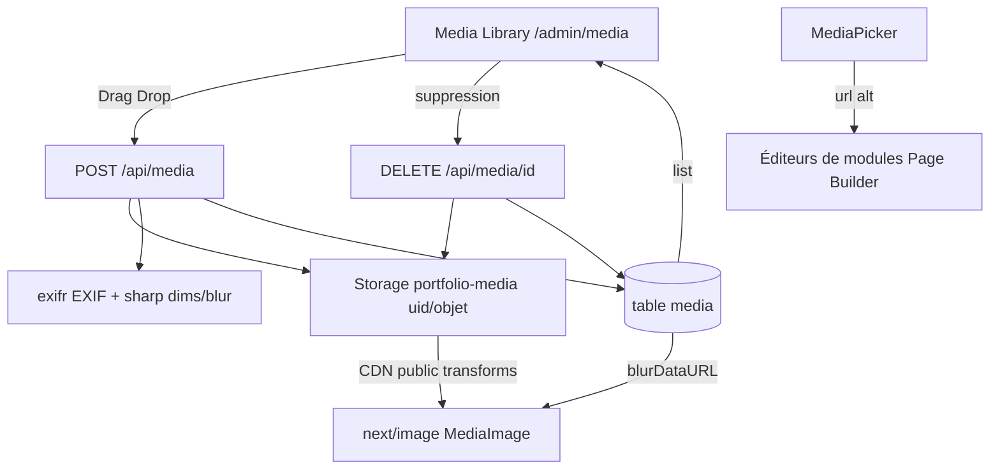

# Plan — ROADMAP Étape 6.1 : Supabase Storage, Media Library Back-Office & Métadonnées EXIF

## Objectif

Couvrir le **cœur de métier** du photographe : la gestion et l'optimisation de
ses images. L'Étape 6.1 pose le socle **médias** :

1. Table PostgreSQL **`media`** (Drizzle) + bucket **Supabase Storage**
   `portfolio-media` avec politiques RLS (Upload Owner / Lecture publique) ;
2. **Media Library** Back-Office (dépose Drag & Drop, vignettes, suppression,
   extraction **EXIF** : focale, ouverture, vitesse, ISO, boîtier, objectif) ;
3. Optimisation **Next.js `<Image>`** (WebP/AVIF via `next/image`) + **blur
   placeholders** générés ;
4. **Sélecteur d'images** réutilisable pour les modules du Page Builder ;
5. **Fallback démo** quand Supabase Storage n'est pas configuré.

## Références

- `../ROADMAP.md` — Phase 6, Étape 6.1 `[IN_PROGRESS]` (à créer).
- `../ARCHITECTURE.md` — §1 (Stockage : « Cloudflare R2 + Sharp ») — **écart à
  arbitrer** : l'utilisateur choisit **Supabase Storage** pour cette phase
  (cf. §0.1). `../SPECIFICATIONS-V8.md` §8 (modules galerie/hero : médias avec
  alt SEO), §9.2 (pgvector).
- Draft historique `../-----PourMémoSQLeditor-CreationTable.md` — table
  `media_assets` (r2_url…) — **réconciliée** en table `media` (cf. §0.2).
- Étapes 5.1 → 5.4 : schéma/migrations, hydration, CRUD persisté, **Auth/RLS
  (`photographer_id = auth.uid()`, `profiles.id`)** — fondations réutilisées.
- Modèles modules : `MediaField { url, alt }`, `GalleryImage { id,url,alt }`
  ([`src/lib/pages.ts`](../src/lib/pages.ts)), éditeurs
  [`form-fields.tsx`](../src/components/backoffice/pages/modules/form-fields.tsx)
  (MediaFields), [`ModuleGalleryEditor.tsx`](../src/components/backoffice/pages/modules/ModuleGalleryEditor.tsx).

## 0. Décisions d'architecture (à valider)

### 0.1 Backend de stockage : **Supabase Storage** (décision utilisateur)

- Bucket **`portfolio-media`** ; objets rangés sous le préfixe
  `{photographer_id}/…` (isolation multi-tenant).
- Politiques Storage (SQL, `storage.objects`) :
  - **Upload / suppressions** : authentifié dont `bucket_id =
    'portfolio-media'` ET `storage.foldername(name)[1] = auth.uid()::text`
    (Owner) ;
  - **Lecture** : publique (`anon` SELECT sur le bucket) — images publiques du
    site.
- Écart documenté : `ARCHITECTURE.md` mentionne Cloudflare R2 — **différé** ;
  R2 reste une alternative future (interface storage-adapter prévue).

### 0.2 Table `media` (Drizzle) — remplace le draft `media_assets`

| Colonne | Type | Note |
|---|---|---|
| `id` | `uuid` PK `defaultRandom()` | |
| `photographer_id` | `uuid` NN → `profiles(id)` ON DELETE CASCADE | owner = `auth.uid()` |
| `url` | `text` NN | URL publique Storage (transformée) |
| `filename` | `text` NN | nom d'origine |
| `size` | `integer` NN `default 0` | octets |
| `mime_type` | `text` NN | image/jpeg, image/png, image/webp… |
| `width` / `height` | `integer` NULL | dimensions (EXIF/lecture) |
| `exif_data` | `jsonb` NOT NULL default `{}` | focale, ouverture, vitesse, ISO, boîtier, objectif… |
| `blur_data_url` | `text` NULL | placeholder flou (data URI) |
| `created_at` | `timestamptz` | |

- MIME restreint aux images (`jpg/jpeg`, `png`, `webp`, `avif`, `gif`) —
  refus des autres à l'upload.
- RLS : Owner RW (`photographer_id = auth.uid()`), Public RO (contenu public).

### 0.3 Pipeline d'upload & métadonnées (serveur)

- **Route Handler** `POST /api/media` (upload multipart) : `photographerId` de
  session (réutilisation `resolvePhotographerId`), upload Storage sous
  `{uid}/{uuid}.{ext}`, **dimensions + EXIF** (bibliothèque **`exifr`**),
  **blur placeholder** (bibliothèque **`sharp`** serveur : resize 8-16 px →
  `blurDataURL` base64), insertion ligne `media`, retour de l'objet.
- **Route Handler** `DELETE /api/media/[id]` : supprime l'objet puis la ligne
  (Owner uniquement).
- URL **CDN Supabase** avec transformations (`?width=&height=&quality=&
  format=webp|avif`) → `next/image` ne retravaille pas les octets.
- **Sharp toléré** : si la génération blur échoue, `blur_data_url` reste null
  et `<Image>` est rendu sans placeholder (jamais bloquant).

### 0.4 Optimisation `<Image>` & fallback

- `next.config.ts` : `images.remotePatterns` autorisant l'hôte Supabase
  (`*.supabase.co`) et les URLs de démo ;
- Composant utilitaire **`MediaImage`** (wrapper `next/image` + `blurDataURL`
  optionnel, `sizes` responsive) ;
- Les URLs de démo (sans ligne `media`) continuent d'être rendues.

### 0.5 Fallback démo / mock

- Si **Supabase Storage non configuré** (clés invalides/absentes) ou pas de
  ligne `media` pour le tenant :
  - la Media Library affiche un **jeu de démo** (URLs d'exemple) **en lecture
    seule** + bannière « mode démo » ;
  - l'upload/la suppression sont **désactivés** (message explicite) ;
  - l'application ne casse jamais (aucune dépendance réseau au build).

## 1. Couche données

- `src/db/schema.ts` : table `media` (+ types dérivés `MediaInsert`).
- Migration `0002_media_storage` (drizzle-kit generate + éditions SQL pour les
  **politiques RLS** de `media` et les **politiques Storage**
  `storage.objects` — non exprimables en Drizzle).
- Repository `src/db/repositories/media.repository.ts` :
  - `listMedia(photographerId)` (tri `created_at` desc) ;
  - `createMedia(photographerId, data)` ;
  - `deleteMedia(photographerId, mediaId)` (vérifie l'appartenance).

## 2. Storage & RLS

- SQL : création du bucket (si absent) + policies `storage.objects` (Owner
  upload/suppression via préfixe `auth.uid()`, Public read) + policies RLS de
  `media`.
- Réutilisation de `isSupabaseConfigured` + nouveau flag `storageConfigured`.

## 3. Upload / Suppression (Route Handlers)

- `POST /api/media` — `exifr.parse(File)`, dimensions (sharp `metadata()`),
  blur (sharp `resize` → base64), upload Storage + insertion `media`.
- `DELETE /api/media/[id]` — Owner ; suppression Storage + ligne.
- Validation : type MIME, taille max (ex. 15 Mo), zéro `any`.

## 4. Media Library Back-Office

- Route `/admin/media` (page serveur + composants clients sous
  `src/components/backoffice/media/`) :
  - `MediaLibrary` : grille responsive (vignettes), upload **Drag & Drop**,
    suppression (Dialog de confirmation), affichage des **métadonnées EXIF**
    (focale · ouverture · vitesse · ISO · boîtier · objectif) et dimensions ;
  - `MediaPicker` : **sélecteur d'images** (Dialog) retournant `{ url, alt }` ;
    branchement minimal dans les éditeurs de modules (via `MediaFields`/
    galerie) — `media` en BDD (ou liste de démo en fallback) ;
  - entrée SidebarNav `/admin` (« Médias »).
- Style Back-Office neutre conservé (chrome `.admin`, shadcn/ui).

## 5. Optimisation & rendu

- `next/image` configuré ; `MediaImage` utilisé dans la Media Library (et en
  6.2 dans le rendu public des modules galerie/hero) ;
- `blurDataURL` servi depuis la colonne `media.blur_data_url`.

## 6. Diagramme de flux

## 7. Tâches (ordre — mode Code)

1. Dépendances : `exifr` (+ `sharp` serveur) ; config `next/image`
   (remotePatterns Supabase) ;
2. `src/db/schema.ts` (table `media`) + `drizzle-kit generate` → migration
   0002 (RLS `media` + policies Storage SQL éditées à la main, journal
   enregistré) ;
3. Repository `media.repository.ts` (list/create/delete) ;
4. Helpers Storage (`src/lib/supabase/storage.ts` : bucket, policies, upload,
   delete) ;
5. Route Handlers `POST /api/media`, `DELETE /api/media/[id]` (session Owner,
   exifr, sharp) ;
6. UI : page `/admin/media`, `MediaLibrary`, `MediaPicker` (+ entrée
   SidebarNav), branchement minimal `MediaFields`/galerie ;
7. `MediaImage` (next/image + blur) ; config ;
8. Vérifications : `npx tsc --noEmit`, `npx eslint src`, `npm run build` ;
9. `ROADMAP.md` (Phase 6, 6.1 `[x]`) + `CHANGELOG.md` (après validation).

## 8. Fichiers touchés (prévision)

- Créés : `src/db/repositories/media.repository.ts`,
  `src/lib/supabase/storage.ts`, `src/components/backoffice/media/*`,
  `src/components/common/MediaImage.tsx`, route `/admin/media/page.tsx`,
  `src/app/api/media/route.ts`, `src/app/api/media/[id]/route.ts`, migration
  0002, `plans/ROADMAP-6.1-media-storage.md`.
- Modifiés : `src/db/schema.ts`, `next.config.ts` (remotePatterns),
  `src/components/backoffice/SidebarNav.tsx` (entrée Médias),
  `src/components/backoffice/pages/modules/form-fields.tsx` (MediaFields →
  MediaPicker), `package.json` (exifr, sharp), `ROADMAP.md`, `CHANGELOG.md`.
- Aucune modification des contrats des modules existants (`MediaFields` reste
  `{url, alt}` — le Picker pré-remplit).

## 9. Vérifications & validation

- Sans Supabase Storage : build OK ; `/admin/media` affiche le **mode démo**
  (upload/suppression désactivés) ;
- Avec Supabase (Auth + Storage configurés) :
  - upload JPG/PNG → objet Storage `{uid}/…` + ligne `media` (EXIF, dimensions,
    blur) ; RLS Owner : un autre utilisateur ne voit/supprime pas ;
  - lecture publique de l'URL CDN ; `<Image>` rendu WebP/AVIF avec placeholder ;
  - suppression → objet + ligne retirés ;
  - `MediaPicker` insère `{url, alt}` dans un module (héro/galerie).

## 10. Risques & mitigations

| Risque | Mitigation |
|---|---|
| Dépendance native `sharp` en build | sharp en dépendance serveur (optionnel), erreurs attrapées (blur absent toléré) |
| EXIF absent (WebP/export sans EXIF) | `exif_data` = `{}` ; colonnes nullable |
| Upload trop lourd | taille max + validation MIME ; limites `next/image` |
| URLs externes de démo vs CDN | `remotePatterns` Supabase + démo ; `MediaImage` accepte les deux |
| Politiques Storage complexes | prefix `{auth.uid()}` + policies SQL testées dans la migration 0002 |
| Fallback démo cassé | flag `storageConfigured` réutilisé ; mode lecture seule |
| Sélecteur dans chaque éditeur = lourd | `MediaPicker` partagé branché sur `MediaFields` (point unique) |

## 11. Points d'arbitrage

1. **Stockage** : Supabase Storage (retenu) vs R2 (ARCHITECTURE, différé) ;
2. **Table** `media` (retenu) vs draft `media_assets` ;
3. **Blur** : `sharp` serveur à l'upload (data URI stocké) vs génération à la
   volée par `next/image` ;
4. **Périmètre module éditeurs** : brancher le Picker dans `MediaFields`
   (tous modules) dès 6.1 (recommandé) ;
5. **Sharp/exifr** en dépendances (acceptées).
