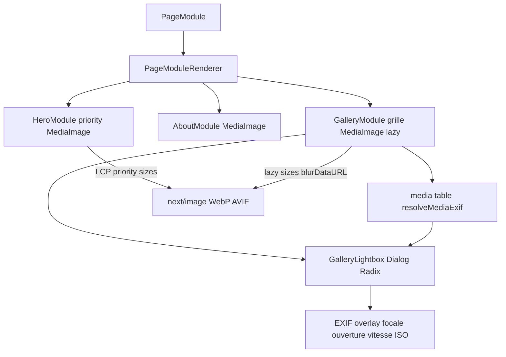

# Plan — ROADMAP Étape 6.2 : Rendu Public Optimisé des Galeries & Performance Médias

## Objectif

Sublimer le **rendu Front-Office** des contenus du Page Builder (héro, galerie,
blocs image-texte, …) en s'appuyant sur la médiathèque (6.1) :

1. **Intégration systématique de `MediaImage`** dans les modules publics
   (Hero, Galerie, About « image-texte », …) → **lazy loading**, format
   **WebP/AVIF** et placeholder **Blur** au chargement ;
2. **Lightbox / visualiseur d'images** (galerie) avec **EXIF** (vitesse,
   ouverture, ISO, focale) au survol ou en plein écran ;
3. **Optimisation LCP / CLS** du site vitrine ;
4. Validation `tsc` / lint / build.

## État actuel (constats d'entrée)

- **6.1** fournit la médiathèque + [`MediaImage`](../src/components/common/MediaImage.tsx)
  (`next/image`, blur) et la table `media` (EXIF, blur_data_url).
- Le **Front-Office ne rend pas encore les pages du Page Builder** : `/`
  est un placeholder statique et il n'existe **aucun renderer public**
  (`HeroModule`, `GalleryModule`, …). Les modules sont seulement édités côté
  Back-Office (contenu typé `ModuleContent` dans
  [`src/lib/pages.ts`](../src/lib/pages.ts)).
- Il n'y a **pas de route publique par page** (`/portfolio`, `/a-propos`…)
  alimentée par la BDD (la navigation publique pointe vers des routes futures).

## 0. Décisions d'architecture (à valider)

### 0.1 Créer la couche « modules publics » (renderers)

Point structurant : 6.2 suppose des modules publics qui n'existent pas. Deux
lectures :

- **Option A (recommandée, complète)** : créer la **bibliothèque de renderers
  publics** sous `src/components/modules/` (spec : `/components/modules/`) pour
  les 7 familles existantes — `hero`, `about` (image-texte), `services`,
  `cta-banner`, `gallery`, `faq`, `contact` — consommant `MediaImage` (et la
  **Lightbox** pour `gallery`), **+ une route publique de démonstration**
  (`/demo-gallery` ou rendu d'une page seed) pour la validation visuelle ;
- **Option B (restreinte)** : livrer **uniquement** les composants
  `HeroModule`, `AboutModule` (texte-image) et `GalleryModule` (+ Lightbox
  EXIF) **sans route** — réutilisables dès l'étape « pages publiques » ultérieure.

Arbitrage proposé : **Option A** — la 6.2 pose ainsi le fondement de rendu
public des pages (indispensable pour valider performance/Lightbox), le
branchement général « routes des pages depuis la BDD » restant une étape dédiée
(6.3 « Pages publiques dynamiques »).

### 0.2 Rendu & données EXIF

- Les renderers reçoivent les **`PageModule`** (contenu typé) ; les images
  portent `url`/`alt` (média) **et éventuellement l'id média** ;
- Pour la galerie, l'**EXIF** est affiché **au survol** (tooltip/overlay) et
  dans la **Lightbox plein écran** (Dialog/Radix) : on lit l'EXIF depuis la
  ligne `media` (résolue par id ou par l'URL) — fallback : pas d'EXIF
  (l'aperçu est optionnel, jamais bloquant).
- `MediaImage` enrichi : `priority` (image LCP du Hero), `sizes` adaptatifs,
  `blurDataURL` déjà porté.

### 0.3 Performance (LCP/CLS)

- **Hero** : `MediaImage priority` (préchargement LCP) + dimensions
  explicites / `fill` dans un conteneur ratio fixe (`aspect-ratio`) pour
  éviter le **CLS** ;
- **Galerie/About** : `lazy` par défaut (défaut `next/image`), `sizes`
  adaptatifs (`100vw`→`50vw`→`33vw`…) selon les breakpoints, pas de `Layout
  Shift` (placeholders flous + dimensions) ;
- suppression des animations coûteuses au-dessus du fold ;
- audit : LCP/CLS améliorés sur la page de démo (axe « vitrine »).

### 0.4 Périmètre exclu

- Routes publiques dynamiques génériques (`/portfolio`…) : **6.3** ;
- rendu des « pages » réelles : **6.3** ;
- optimisation des pages Back-Office : hors périmètre.

## 1. Renderers publics (`src/components/modules/`)

- Contrat commun : `({ module }: { module: PageModule })` → rendu Server
  Component (statique) sauf Lightbox (Client) ;
- `PageModuleRenderer` (ou switch) : aiguillage par `module.type` ;
- Modules visuels :
  - `HeroModule` : fond/`MediaImage` hero `priority` + titre/CTA (content hero) ;
  - `AboutModule` : image-texte (MediaImage) + texte ;
  - `GalleryModule` : grille (MediaImage lazy + overlay EXIF) + **Lightbox** ;
  - `ServicesModule`, `CtaBannerModule`, `FaqModule`, `ContactModule` :
    rendus typographiques/Carte/FAQ/CTA (aucun média ou CTA simple).
- style : design system « Éclat Minéral & Nacre » (variables CSS), `prefers-reduced-motion`.

## 2. Lightbox EXIF (`src/components/modules/lightbox/`)

- `GalleryLightbox` (Client, Dialog/Radix shadcn) :
  - ouverture depuis un visuel de la galerie (clic, `aria-haspopup`) ;
  - navigation précédent/suivant au clavier (+ boutons), Échap ferme ;
  - overlay **EXIF** en plein écran (si disponible) ; focus accessible ;
- `ExifChip` / ligne « 50 mm · f/1.8 · 1/200 s · ISO 100 » sur le visuel
  (optionnel, `prefers-reduced-motion` OK).

## 3. Intégration données (EXIF/blur depuis `media`)

- Résolution média : helper `resolveMediaExif(url | mediaId)` consulté côté
  serveur (si BDD `media` dispo) pour la galerie ; fallback sans EXIF ;
- `MediaImage` gère déjà `blurDataUrl`.

## 4. Page de démonstration

- Route `/demo` (ou route d'une page seed) montant `HeroModule` +
  `AboutModule` + `GalleryModule` (grille + Lightbox) avec les contenus seed
  (module gallery enrichi d'images démo/médiathèque) pour valider
  lazy/WebP/placeholder/EXIF/LCP/CLS — **option A**.

## 5. Diagramme

## 6. Tâches (ordre — mode Code)

1. `MediaImage` : props `priority`, `sizes` documentés (déjà partiels) ;
2. Bibliothèque `src/components/modules/` : `PageModuleRenderer` + 7 renderers
   (Hero/About/Gallery prioritaires ; Services/Cta/Faq/Contact basics) ;
3. `GalleryLightbox` + overlay EXIF + ligne visuel (EXIF résolu via `media`) ;
4. Page `/demo` (contenus seed) validant l'ensemble ;
5. Ajustements perf (sizes, aspect-ratio, priority, `prefers-reduced-motion`) ;
6. Vérifications : `npx tsc --noEmit`, `npx eslint src`, `npm run build` ;
7. `ROADMAP.md` (6.2 `[x]`) + `CHANGELOG.md` (après validation).

## 7. Fichiers touchés (prévision)

- Créés : `src/components/modules/PageModuleRenderer.tsx`,
  `src/components/modules/{HeroModule,AboutModule,GalleryModule,ServicesModule,CtaBannerModule,FaqModule,ContactModule}.tsx`,
  `src/components/modules/lightbox/{GalleryLightbox,ExifChips}.tsx`,
  `src/lib/media-resolve.ts` (EXIF/blur résolus), route `/demo/page.tsx`,
  `plans/ROADMAP-6.2-gallery-optimization.md`.
- Modifiés : `src/components/common/MediaImage.tsx` (si besoin),
  `next.config.ts` (si hôte de démo/images supplémentaires), `ROADMAP.md`,
  `CHANGELOG.md`.
- Aucune table ni modification des éditeurs Back-Office (contrats `PageModule`
  inchangés) ; aucune route publique dynamique générique (réservée 6.3).

## 8. Vérifications & validation

- `npx tsc --noEmit` OK ; `npx eslint src` OK ; `npm run build` OK (sans BDD) ;
- `/demo` : Hero préchargé (LCP), galerie lazy WebP/AVIF avec blur, clic →
  Lightbox (clavier/Échap), EXIF affiché (si média) ou absent (toléré), pas de
  CLS visible, `prefers-reduced-motion` respecté ;
- Avec BDD `media` : EXIF & blur réellement chargés depuis la médiathèque.

## 9. Risques & mitigations

| Risque | Mitigation |
|---|---|
| Modules publics inexistants | Option A : création `src/components/modules/` + page `/demo` |
| Lightbox/EXIF inaccessibles | Dialog Radix accessible (focus, clavier, `aria-label`) |
| Images lointaines/optimizer | `MediaImage` + `remotePatterns` ; dégradation `` sûre |
| CLS / LCP | `aspect-ratio` + `sizes` + `priority` Hero |
| EXIF non disponible | `resolveMediaExif` nullable ; rendu sans EXIF |
| Trop large | scoping : Hero/About/Gallery complets, autres renderers simples |

## 10. Points d'arbitrage

1. **Périmètre** : Option A (bibliothèque renderers + route `/demo`) vs
   Option B (composants seuls, sans route) ;
2. **EXIF** : affiché dans la Lightbox uniquement vs aussi au survol de la
   grille (recommandé : les deux, overlay au survol léger) ;
3. **Route de démo** : `/demo` dédiée vs rendre une page seed existante ;
4. **`media`** : résolution EXIF par id média (si lié) vs par URL.
