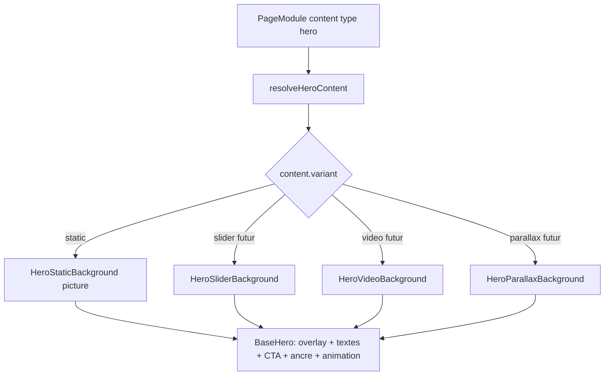

# Plan — ROADMAP Étape 7.1 : Rubrique Héro — HeroStatic & base commune `BaseHero`

## Objectif

Construire la **rubrique Héro « prête à l'emploi »** du Page Builder en partant du
module **HeroStatic** (art-direction responsive, overlay, textes, CTA, animations)
tout en posant une **fondation `BaseHero` réutilisable** pour les futurs modules de
la rubrique (**HeroSlider**, **HeroVideo**, **HeroParallax**).

Ce document répond aux **3 questions d'architecture** posées avant transmission à
Kilo Code :

1. **Valider l'interface TypeScript / schéma JSON** des props du module HeroStatic ;
2. **Vérifier l'inscription de ce schéma dans une architecture `BaseHero` partagée**
   avec les futurs modules Héro ;
3. **Valider le format d'injection des valeurs par défaut / placeholders**.

---

## 0. Décisions d'architecture (validées / à valider)

### D-1 — Une famille `hero` unique, discriminée par une propriété `variant` ✅ VALIDÉ

Conformément au choix exprimé :

- L'enum BDD `module_type` reste **inchangé** (`"hero"`) → **aucune migration
  d'enum** (cf. [`schema.ts`](../src/db/schema.ts:51)).
- Le contenu JSONB porte désormais un discriminant **`variant`** :
  `"static" | "slider" | "video" | "parallax"`.
- Le `ModuleContent` hero actuel (heading/subheading/cta/media unique) est
  **migré/interprété comme `variant: "static"`**.
- Le catalogue « + Ajouter une section » expose **plusieurs cartes distinctes**
  (« Hero Statique », plus tard « Hero Slider », …) qui **injectent toutes un
  module `type: "hero"` pré-configuré** avec sa variante.

**Impact catalogue / store** : l'entrée de catalogue doit pouvoir porter une
variante et l'action `addModule` doit l'accepter (voir §3).

### D-2 — Nommage des champs : camelCase groupé (dérivation de la fiche) — À VALIDER

La fiche technique utilise des noms plats en snake_case
(`image_desktop` + `alt_desktop` séparés). Le codebase est en **camelCase
groupé** (précédent : [`MediaField`](../src/lib/pages.ts:200) `{ url, alt }`).

**Recommandation** : adopter la forme TS/JSON **camelCase groupée** — un objet
image par breakpoint contient `{ url, alt }`. Cela élimine la redondance
`image_*`/`alt_*`, réduit les erreurs et reste 1:1 avec le JSONB. Table de
correspondance avec la fiche :

| Fiche (fiche technique) | Implémentation TS |
| --- | --- |
| `image_desktop` / `alt_desktop` | `media.desktop.url` / `media.desktop.alt` |
| `image_mobile` / `alt_mobile` | `media.mobile.url` / `media.mobile.alt` |
| `image_tablet` / `alt_tablet` | `media.tablet.url` / `media.tablet.alt` (`null` si absent) |
| `title_h2`, `subtitle_h3`, `description_text` | `titleH2`, `subtitleH3`, `descriptionText` |
| `weight_h2`, `weight_h3`, `weight_text` | `weightH2`, `weightH3`, `weightText` |
| `cta_show`, `cta_label`, `cta_link`, `cta_style` | `ctaShow`, `ctaLabel`, `ctaHref`, `ctaStyle` |
| `text_color` | `textTone` (« light »/« dark », voir D-7) |
| `animation` (rubrique Animations) | **réutilise** `module.animation` (voir D-3) |

### D-3 — Animation d'entrée : source unique `module.animation` (pas de doublon) — À VALIDER

`PageModule.animation` existe déjà ([`pages.ts`](../src/lib/pages.ts:170)) avec
exactement les valeurs voulues (`none | fade-up | fade-in | scale-in` + `default`).
La fiche redemande une `animation` **dans le contenu**.

**Recommandation** : ne **pas** dupliquer l'animation dans le JSONB. La rubrique
éditeur « 🎬 Animations & Effets » pilote **le même scalaire**
`module.animation`. `BaseHero` applique l'animation d'entrée via
IntersectionObserver (GPU `opacity`/`transform` uniquement, `will-change-transform`,
respect `prefers-reduced-motion` — directive `.kilorules` §3).

> Note : l'animation est aujourd'hui stockée mais **pas rendue** côté Front
> (aucun renderer ne l'applique). HeroStatic est l'occasion de la rendre effective
> pour la famille Héro (le générique « tous modules » restant hors périmètre).

### D-4 — Normalisation & défauts : pattern `resolve*` (comme `resolveGalleryLayout`) ✅ RECOMMANDÉ

Le JSONB existant d'un `hero` « simple » (heading/subheading/media) doit rendre
un HeroStatic complet sans plantage, et les contenus partiels doivent être
complétés. On réutilise le **précédent maison**
[`resolveGalleryLayout`](../src/lib/pages.ts:300) : un résolveur
`resolveHeroContent(raw)` fusionne le contenu stocké (y c. forme legacy) avec
les défauts typés → réponse à la **question 3** (injection des défauts).

**Double mécanisme d'injection (à conserver ensemble) :**

1. **Fabriques de défauts riches** (`createModuleContent("hero")` /
   `createHeroStaticContent()`) : fournissent les **placeholders** et textes de
   démo pour les modules **nouvellement créés** et les **seeds**.
2. **Résolveur à la lecture** (`resolveHeroContent`) : `upgrade` legacy
   (heading→`titleH2`, subheading→`subtitleH3`, `media.url`→dupliqué
   desktop/mobile, overlay `medium`, poids par défaut, CTA repris) **et** complète
   les champs manquants d'un JSONB partiel → rendu robuste sans migration de
   données.

Les placeholders par défaut (démo) utilisent `picsum.photos` (hôte déjà autorisé
dans [`MediaImage`](../src/components/common/MediaImage.tsx:29)), avec seeds
stables et **bons ratios** :

| Breakpoint | Ratio | URL démo (seed stable) | `alt` par défaut |
| --- | --- | --- | --- |
| `media.desktop` | 16:9 | `https://picsum.photos/seed/hero-desktop/1920/1080` | « Vue d'ensemble en grand format — univers du photographe » |
| `media.tablet` | 4:3 | `https://picsum.photos/seed/hero-tablet/1200/900` | « Composition intermédiaire (tablette) » |
| `media.mobile` | 9:16 | `https://picsum.photos/seed/hero-mobile/720/1280` | « Cadrage vertical (mobile) » |

### D-5 — HeroStatic ≠ seul renderer : `BaseHero` consomme les champs partagés ✅ RECOMMANDÉ

Le composant `BaseHero` reçoit **uniquement ce qui est commun** à toutes les
variantes (structure section, overlay, bloc textes, CTA, ancre, animation) et
délègue le **médium de fond** à un composant dédié injecté selon `variant`.
→ réponse à la **question 2** (voir §4 pour la structure).

### D-6 — Rendu art-direction : balise `<picture>` native ✅ RECOMMANDÉ

`next/image` ne produit pas `<picture>`. Pour le HeroStatic on utilise une
**balise `<picture>` native** (Server Component `HeroStaticBackground`) avec
`<source media="(min-width:1024px)">` (desktop), `<source
media="(min-width:768px)">` (tablet si renseignée, sinon **fallback desktop**) et
`` portrait mobile en dernier enfant. Conteneur `absolute inset-0` + `object-cover`,
dimensions/ratios stables pour éviter le CLS (LCP : `` en `fetchpriority="high"`).

> Nuance : l'optimisation `next/image` par source est orthogonale et déjà
> assurée en amont (conversion WebP/Sharp). Les URLs non autorisées retombent
> naturellement sur `` natif (cf. `canUseNextImage`). Pour rester 100 % dans
> l'esprit `next/image`, on note en option une implémentation « images séparées
> show/hide par breakpoint » — **écartée** car télécharge toutes les images.

### D-7 — Overlay & couleur de texte : valeurs sémantiques mappées (thème dynamique) ✅ RECOMMANDÉ

- `overlayLevel` : `none` (0) | `light` (0.20) | `medium` (0.40) | `strong` (0.60)
  → rendu `rgba(0,0,0, <niveau>)` (remplace le `bg-black/45` dur actuel
  [`PublicModules.tsx`](../src/components/modules/PublicModules.tsx:41)).
- `textTone` sémantique (`light` par défaut = couleur la plus claire du thème)
  plutôt qu'une classe Tailwind figée : mappage vers `text-white`/token clair du
  thème dans le renderer — robuste aux 15 palettes dynamiques.

### D-8 — Contenu type `hero` : ouverture de l'union + normalisation (pas d'`any`) ✅

Le membre `hero` de `ModuleContent` devient une **union imbriquée discriminée par
`variant`**. Aucun `any` : les consumers narrow par `content.variant`. Les
helpers existants qui lisent `content.media.url` / `content.subheading`
([`public-page.ts`](../src/lib/public-page.ts:35)) passent par le résolveur ou un
accesseur `heroImageSources(content)`.

---

## 1. Schéma TypeScript validé (dans [`src/lib/pages.ts`](../src/lib/pages.ts))

Types de la rubrique Héro (base commune + variante static) :

```ts
/* ============ Rubrique Héro : base commune `BaseHero` ============ */

/** Variantes de la rubrique Héro (layout switcher famille). */
export type HeroVariant = "static" | "slider" | "video" | "parallax";

/** Niveau d'assombrissement de l'overlay (contraste des textes). */
export type HeroOverlayLevel = "none" | "light" | "medium" | "strong";

/** Ton du texte sur l'image (sémantique, mappé aux tokens du thème). */
export type HeroTextTone = "light" | "dark";

/** Graisses de police (utilitaires Tailwind, poids réglables par bloc). */
export type FontWeightClass =
  | "font-normal"
  | "font-medium"
  | "font-semibold"
  | "font-bold";

/** Style visuel du bouton CTA. */
export type HeroCtaStyle = "primary" | "secondary" | "outline";

/** Image de fond d'un breakpoint (URL + alt SEO). */
export type ArtSource = MediaField; // { url: string; alt: string }

/** Médias art-direction du Hero Static — rendu <picture>. */
export interface HeroStaticMedia {
  desktop: ArtSource;        // 16:9 — OBLIGATOIRE
  mobile: ArtSource;         // 9:16 — OBLIGATOIRE
  tablet: ArtSource | null;  // 4:3 — OPTIONNEL (fallback auto = desktop)
}

/**
 * Champs PARTAGÉS par toutes les variantes Héro — c'est la « surface »
 * consommée par le composant `BaseHero`.
 */
export interface HeroBaseShared {
  variant: HeroVariant;
  overlayLevel: HeroOverlayLevel;
  textTone: HeroTextTone;      // défaut : "light"
  titleH2: string;             // H2 — typographie fluide clamp()
  subtitleH3: string;          // H3
  descriptionText: string;     // Paragraphe
  weightH2: FontWeightClass;   // défaut : "font-medium"
  weightH3: FontWeightClass;   // défaut : "font-normal"
  weightText: FontWeightClass; // défaut : "font-normal"
  ctaShow: boolean;
  ctaLabel: string;
  ctaHref: string;
  ctaStyle: HeroCtaStyle;
}

/** Contenu d'un Hero STATIQUE (fiche HeroStatic). */
export interface HeroStaticContent extends HeroBaseShared {
  variant: "static";
  media: HeroStaticMedia;
}

/* Les futures variantes ajoutent leur médium :
 *   HeroSliderContent   → { variant: "slider"; slides: HeroSlide[]; … }
 *   HeroVideoContent    → { variant: "video";  video: {…}; … }
 *   HeroParallaxContent → { variant: "parallax"; image…; speed…; … }
 */
```

Ouverture du membre `hero` de `ModuleContent` (union imbriquée) :

```ts
export type HeroContent =
  | HeroStaticContent
  | HeroSliderContent   // futur — non encore défini (type placeholder interdit : déclaré à l'implémentation)
  | HeroVideoContent
  | HeroParallaxContent;

export type ModuleContent =
  | { type: "hero" } & HeroContent     // 1 seul type "hero", discriminant content.variant
  | { type: "about"; … }               // inchangé
  | { type: "services"; … }            // inchangé
  | /* … 5 autres familles inchangées … */;
```

> Seule la branche `static` est livrée à cette étape. Pour éviter un `never`,
> on n'ajoute **que** `HeroStaticContent` dans l'union pour l'instant (les
> variantes futures viendront étendre `HeroContent` sans toucher aux autres
> familles).

Valeurs par défaut & fabriques (mêmes constantes/fonctions qu'aujourd'hui,
cf. [`createModuleContent`](../src/lib/pages.ts:446)) :

```ts
export const HERO_OVERLAY_OPACITY: Record<HeroOverlayLevel, number> = {
  none: 0, light: 0.2, medium: 0.4, strong: 0.6,
};

export const DEFAULT_HERO_SHARED: Omit<HeroBaseShared, "variant"> = {
  overlayLevel: "medium",
  textTone: "light",
  titleH2: "Bienvenue dans mon univers",
  subtitleH3: "L'émotion de vos plus beaux instants",
  descriptionText:
    "Photographe professionnel, je raconte votre histoire entre lumière et émotion.",
  weightH2: "font-medium",
  weightH3: "font-normal",
  weightText: "font-normal",
  ctaShow: true,
  ctaLabel: "Découvrir mon portfolio",
  ctaHref: "/portfolio",
  ctaStyle: "primary",
};

export function createHeroStaticContent(): HeroStaticContent {
  return {
    ...DEFAULT_HERO_SHARED,
    variant: "static",
    media: { desktop, mobile, tablet }, // = placeholders D-4 (nouvelles instances)
  };
}

/** Lecture robuste : upgrade legacy + fusion des défauts (réponse Q3). */
export function resolveHeroContent(raw: unknown): HeroStaticContent { … }
```

Le membre `hero` de `createModuleContent(type)` retourne désormais
`createHeroStaticContent()`. Les seeds (`buildSeedModules`/`withContentOverride`)
sont mis à jour vers la nouvelle forme (le résolveur couvre le legacy).

### Schéma JSON (wire) — extrait pour validation

```jsonc
{
  "type": "hero",
  "content": {
    "variant": "static",
    "overlayLevel": "medium",
    "textTone": "light",
    "titleH2": "…", "subtitleH3": "…", "descriptionText": "…",
    "weightH2": "font-medium", "weightH3": "font-normal", "weightText": "font-normal",
    "ctaShow": true, "ctaLabel": "…", "ctaHref": "/portfolio", "ctaStyle": "primary",
    "media": {
      "desktop": { "url": "…", "alt": "…" },
      "mobile":  { "url": "…", "alt": "…" },
      "tablet":  { "url": "…", "alt": "…" } // ou null → fallback desktop
    }
  }
}
```

### Catalogue « cartes par variante » (D-1)

Évolution du `moduleCatalog` vers des **entrées à variante** (la `ModuleMeta`
actuelle est préservée ; `AddSectionSheet` ne dépend plus que du type) :

```ts
export interface ModuleCatalogEntry extends ModuleMeta {
  /** id stable d'entrée (ex. "hero-static") — clé React du bouton. */
  id: string;
  type: PageModuleType;       // "hero" pour toutes les cartes Héro
  /** Variante de contenu pré-configurée à l'ajout. */
  variant?: HeroVariant;      // "static" ; absence = variante par défaut du type
  icon?: …;
}
```

- [`AddSectionSheet`](../src/components/backoffice/pages/AddSectionSheet.tsx:40)
  : `onAdd(entry.id / entry)` + clé `entry.id` (au lieu de `meta.type`) pour
  permettre 2 cartes de même type.
- Store `addModule(pageId, type, variant?)` : construit le contenu via
  `createModuleContentForVariant(type, variant)` → pour `hero` +
  `"static"` ⇒ `createHeroStaticContent()`. Ajout d'une branche dans
  [`PagesStoreProvider`](../src/components/backoffice/PagesStoreProvider.tsx).
- `moduleCatalog` : la rubrique « Héro & accroche » affiche une carte
  « Hero Statique » (description « Une image de fond adaptative avec titre et
  appel à l'action. »). Les cartes Slider/Video/Parallax viendront avec leur
  étape respective (désactivées / non listées tant qu'elles ne sont pas
  implémentées).

---

## 2. Rendu Front-Office & responsive

### 2.1 Arborescence cible

```
src/components/modules/
  hero/
    BaseHero.tsx               // Section + overlay + bloc textes/CTA + ancre + animation (consommateur des champs HeroBaseShared)
    BaseHeroBackground.tsx     // Aiguillage du médium selon content.variant (abstraction D-5)
    hero-static/
      HeroStaticBackground.tsx // <picture> art-direction (Server, LCP) + fallback tablet→desktop
    reveal/
      RevealHero.tsx           // Client — IntersectionObserver, GPU opacity/transform, prefers-reduced-motion
```

- `PublicModules.tsx` garde son rôle d'aiguillage : `case "hero"` → `HeroModule`
  (nouvel orchestrateur dans `hero/HeroModule.tsx` ou directement `BaseHero` +
  `HeroStaticBackground`). Le code actif de l'ancien `HeroModule`
  ([`PublicModules.tsx`](../src/components/modules/PublicModules.tsx:22)) y est
  déplacé/réécrit.
- `module.content.type === "hero"` : le renderer appelle `resolveHeroContent`
  (upgrade legacy/partiel) puis selon `content.variant` compose `BaseHero`.

### 2.2 Rendu HeroStatic

```tsx
<section id={module.anchorId} className="relative flex min-h-[…] items-center justify-center overflow-hidden …">
  {/* Fond : <picture> art-direction (D-6) */}
  <HeroStaticBackground media={content.media} priority />
  {/* Overlay d'assombrissement (D-7) */}
  <div className="absolute inset-0" style={{ backgroundColor: `rgba(0,0,0,${HERO_OVERLAY_OPACITY[content.overlayLevel]})` }} aria-hidden="true" />
  {/* Bloc textes + CTA (BaseHero) */}
  <div className="relative … px-4 …">
    <h2 style={{ fontFamily: "var(--font-heading)" }} className={cn("text-[clamp(2.2rem,6vw,4.5rem)] …", content.weightH2)}>
      {content.titleH2}
    </h2>
    <h3 … className={cn(…, content.weightH3)}>{content.subtitleH3}</h3>
    <p … className={cn(…, content.weightText)}>{content.descriptionText}</p>
    {content.ctaShow ? <Button variant={content.ctaStyle} asChild …>…</Button> : null}
  </div>
</section>
```

- **Typographie fluide** : `clamp()` sur `titleH2` (garde anti-casse des mots
  longs), `text-wrap: balance` déjà global
  ([`globals.css`](../src/app/globals.css:228)).
- **Mobile-first / fluide** : aucune largeur fixe en `px` de conteneur ; paddings
  de sécurité `px-4`/`sm:px-6` ; empilement vertical naturel du bloc textes.
- **LCP** : image desktop/mobile `fetchpriority="high"` + conteneur ratio stable
  (pas de CLS). Lazy différé pour tablet.
- **Animation d'entrée (D-3)** : `RevealHero` applique `module.animation`
  (`fade-up` : `translateY(20px)`+opacity, `fade-in` : opacity, `scale-in` :
  `scale(.98)`+opacity, `none`/`default` : statique) avec `will-change-transform`.

---

## 3. Interface Admin / Sidebar — 3 rubriques (fiche HeroStatic)

L'éditeur [`ModuleHeroEditor`](../src/components/backoffice/pages/modules/ModuleHeroEditor.tsx)
devient **conscient de la variante** et, pour `static`, s'organise en **3
rubriques** (accordéon/sections avec titres + icônes + tooltip « i »). Il reste
contrôlé par le store (pattern existant : `content` + `onChangeContent` → commit).

### 3.1 Nouveau composant champ image réutilisable

`ArtSourceField` (Back-Office) : pour un breakpoint donné —

- **vignette de prévisualisation** (`` quand `url` renseignée, sinon zone
  en pointillés) ;
- `MediaUploadButton` pour remplacer la photo (upload local existant
  [`MediaUploadButton`](../src/components/backoffice/media/MediaUploadButton.tsx)) ;
- champ **alt SEO** + **tooltip « i »** expliquant le rôle (`alt` = accessibilité
  + Google) ;
- **badge ratio** (16:9 / 9:16 / 4:3) et mention « tablette : laissée vide ⇒
  repli auto sur l'image desktop ».

À ajouter : composant **Tooltip** shadcn/Radix
(`src/components/ui/tooltip.tsx` — absent aujourd'hui de `/ui`) ou variante
légère maison accessible, puis helper `FieldWithTip`.

### 3.2 Rubriques de l'éditeur

**Rubrique 1 — 🖼️ Images de fond**
- `media.desktop` (16:9, obligatoire) + `alt_desktop` → `ArtSourceField`.
- `media.mobile` (9:16, obligatoire) + `alt_mobile` → `ArtSourceField`.
- `media.tablet` (4:3, **optionnel**, fallback desktop) + `alt_tablet` →
  `ArtSourceField`.
- 3 images de démonstration par défaut (D-4) avec `alt` déjà renseignés.

**Rubrique 2 — 📝 Textes & Bouton**
- `overlayLevel` (Select `none|light|medium|strong`) + tooltip « sert à garantir
  le contraste et la lisibilité des textes sur la photo ».
- `titleH2`, `subtitleH3`, `descriptionText` (Text/TextArea).
- `textTone` (couleur du texte, défaut = plus claire du thème) + tooltip.
- `weightH2/H3/Text` (3 Selects : `font-normal|medium|semibold|bold`).
- `ctaShow` (Switch) + si actif : `ctaLabel`, `ctaHref` (ancre `/slug` ou URL),
  `ctaStyle` (Select `primary|secondary|outline`).

**Rubrique 3 — 🎬 Animations & Effets**
- Sélecteur d'animation d'entrée **branché sur `module.animation`** (D-3) :
  `default|fade-up|fade-in|scale-in|none` — un seul point de vérité, tooltip
  « animation basée sur la transparence et les transformations (GPU) ».

> Les champs génériques `title`/`anchorId` restent dans le panneau « Réglages du
> module » existant ([`ModuleSettingsForm`](../src/components/backoffice/pages/modules/ModuleSettingsForm.tsx)).

---

## 4. Architecture `BaseHero` (réponse à la question 2)



- **`HeroBaseShared`** = le « contrat » que toute variante doit fournir → c'est ce
  que `BaseHero` consomme (overlay, textes, poids, tone, CTA, `variant`).
- **`BaseHeroBackground`** = point d'extension : chaque variante y branche son
  propre composant de fond. Ajouter HeroSlider/Video/Parallax = **ajouter une
  branche `variant` + un composant de fond**, sans toucher `BaseHero`.
- Les textes/CSS/accessibilité/animations du bloc commun ne sont écrits **qu'une
  fois** dans `BaseHero`.

---

## 5. Fichiers impactés (inventaire pour Kilo Code)

**Domaine (cœur)**
- [`src/lib/pages.ts`](../src/lib/pages.ts) : types Héro + union `ModuleContent`,
  `HeroOverlayLevel/…`, `DEFAULT_HERO_SHARED`, `createHeroStaticContent`,
  `resolveHeroContent`, `createModuleContentForVariant`, `moduleCatalog`
  (entrées à variante), `createModule(type, seq, variant?)`,
  `buildSeedModules`/`withContentOverride`.
- [`src/components/backoffice/PagesStoreProvider.tsx`](../src/components/backoffice/PagesStoreProvider.tsx) :
  `addModule(pageId, type, variant?)`.
- [`src/components/backoffice/pages/PageEditor.tsx`](../src/components/backoffice/pages/PageEditor.tsx) +
  [`AddSectionSheet.tsx`](../src/components/backoffice/pages/AddSectionSheet.tsx) :
  `onAdd(entry)` + clé `entry.id`.

**Rendu public**
- [`src/components/modules/PublicModules.tsx`](../src/components/modules/PublicModules.tsx) :
  aiguillage `hero` → `hero/HeroModule` (déplacement/réécriture de l'actuel).
- `src/components/modules/hero/*` : nouveaux (voir §2.1).
- [`src/lib/public-page.ts`](../src/lib/public-page.ts) : `collectImageUrls`,
  `publicDescription`, `publicOgImage` lisent le hero via résolveur/accesseur
  (multi-URLs desktop/mobile/tablet).
- [`src/components/common/MediaImage.tsx`](../src/components/common/MediaImage.tsx) :
  inchangé (utilisé pour vignettes/aperçus BO + autres modules).

**Back-Office éditeur**
- [`ModuleHeroEditor.tsx`](../src/components/backoffice/pages/modules/ModuleHeroEditor.tsx) :
  réécriture en 3 rubriques + variante.
- `ArtSourceField.tsx` (nouveau) + `src/components/ui/tooltip.tsx` (nouveau).
- [`form-fields.tsx`](../src/components/backoffice/pages/modules/form-fields.tsx) :
  éventuels champs génériques réutilisés (Select poids/overlay).

**Non modifié** : enum BDD `module_type` ([`schema.ts`](../src/db/schema.ts:51)),
`moduleTypeSchema` Zod ([`persistence.ts`](../src/lib/schemas/persistence.ts:20)) —
le type reste `hero`.

---

## 6. Étapes d'implémentation Kilo Code (ordre)

1. **Domaine** : types Héro + union `ModuleContent` + défauts/placeholders +
   `resolveHeroContent` + catalogue à variantes + `addModule(variant?)` +
   migration des seeds.
2. **Back-Office** : `AddSectionSheet` multi-cartes + `PageEditor` +
   Tooltip ui + `ArtSourceField` + réécriture `ModuleHeroEditor` en 3 rubriques.
3. **Front** : `BaseHero` + `HeroStaticBackground` (`<picture>`), `RevealHero`
   (animation GPU + reduced-motion), aiguillage `PublicModules`, mise à jour
   `public-page.ts`.
4. **Validation** : `tsc --noEmit` + `eslint` + `next build` ; contrôle visuel du
   HeroStatic sur la page seed (desktop/mobile/tablet) — art-direction,
   overlay, clamp, CTA, animation.

## 7. Périmètre exclu (étapes ultérieures)

- HeroSlider / HeroVideo / HeroParallax (extensions `HeroContent` +
  `BaseHeroBackground` futures).
- Animation d'entrée « tous modules » (au-delà de la famille Héro).
- Sélecteur de médiathèque (upload direct conservé) ; picker = étape média dédiée.
- Multi-boutons CTA (0-2) et décalage (delay) : hors fiche HeroStatic actuelle.

---

## 8. Verdicts d'architecture (synthèse pour validation)

| Question | Verdict |
| --- | --- |
| 1. Interface TS / schéma JSON HeroStatic | **Validée** avec normalisation camelCase groupée (D-2), union imbriquée `type:hero` + `variant:"static"` (D-1, D-8), overlay/tone/poids sémantiques (D-7) |
| 2. Inscription dans `BaseHero` partagé | **Validée** : `HeroBaseShared` = contrat commun ; `BaseHero` + `BaseHeroBackground` extensibles pour Slider/Video/Parallax sans toucher au bloc commun (§4) |
| 3. Injection défauts / placeholders | **Validée** : double mécanisme « fabrique riche (placeholders ratios) + résolveur `resolveHeroContent` à la lecture » aligné sur `resolveGalleryLayout` (§0 D-4) |

---

## 9. Addendum — Ajustement sémantique & typographique (post-validation)

La section Héro porte le **titre principal de la page** : la hiérarchie des
balises et des champs est corrigée (le code livré reflète ce schéma) :

| Champ (schéma final) | Balise | Style typographique |
| --- | --- | --- |
| `titleH1` | `<h1>` | Titre principal de la page — géant fluide `clamp()` |
| `subtitleH2` | `<h2>` | Sous-titre d'accroche |
| `descriptionText` | `<p>` | Paragraphe |
| `weightH1` | — | Graisse du titre H1 |
| `weightH2` | — | Graisse du sous-titre H2 |
| `weightText` | — | Graisse de la description |

> Les exemples de schéma des §0-3 (initialement libellés `titleH2`/`subtitleH3`)
> sont **remplacés par `titleH1`/`subtitleH2`** dans l'implémentation ;
> `resolveHeroContent` migre toujours le legacy (`heading`/`subheading`).
