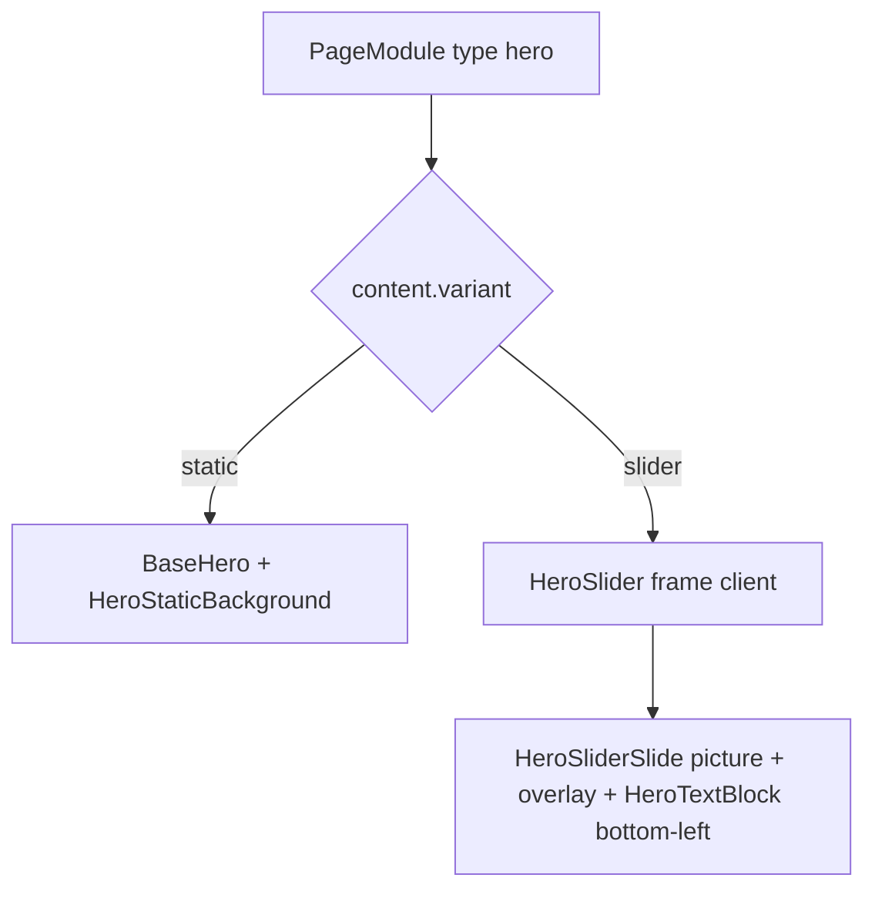

# Plan — ROADMAP Étape 7.2 : Rubrique Héro — HeroSlider (`variant: "slider"`)

## Objectif

Construire le module **Hero Slider** « prêt à l'emploi » de la rubrique Héro,
en s'appuyant sur l'architecture validée en 7.1 ([`plans/ROADMAP-7.1-hero-static-basehero.md`](ROADMAP-7.1-hero-static-basehero.md)) :
même famille `type: "hero"`, discriminent `variant: "slider"`, aucune migration
d'enum BDD, catalogue multi-cartes, `BaseHero` partagé, tooltips/vignettes.

La nouveauté majeure du slider : **contenu multi-slides** (3 slides par défaut),
chacune portant son **art-direction `<picture>`** et son **bloc texte/CTA
propre**, plus des **réglages de défilement** (autoplay, transition, flèches,
puces) et une **ergonomie tactile mobile** (swipe / scroll-snap).

---

## 0. Décisions d'architecture (recommandations — à valider)

### D-1 — `variant: "slider"` : extension de `HeroContent` (sans toucher `hero-static`) ✅ STRUCTURE VALIDÉE
- `HeroContent` (union) devient `HeroStaticContent | HeroSliderContent`.
- Les branches existantes (`hero` static) restent inchangées ; `BaseHero` static
  n'est **pas** modifié fonctionnellement.
- L'aiguillage public et l'éditeur discriminent d'abord `content.type ===
  "hero"` puis `content.variant`.

### D-2 — Refactor minimal : extraction d'un `HeroTextBlock` partagé — À VALIDER
`BaseHero` (static) rend un bloc texte **unique centré** ; le slider a un bloc
texte **par slide** et un alignement **bas-gauche (desktop)** / centré (mobile).

**Recommandation** : extraire de `BaseHero` la partie « textes + CTA + graisses +
tone » dans un composant présentational **`HeroTextBlock`** réutilisable :
- **static** : `BaseHero` = section + fond + overlay + `HeroTextBlock`
  (alignement `center`) → comportement inchangé ;
- **slider** : chaque slide = fond `<picture>` + overlay + `HeroTextBlock`
  (alignement `bottom-left` desktop, `center` mobile).

Résultat : la typographie (`h1` géant `clamp()`, `h2`, `<p>`, poids) n'est
écrite **qu'une fois** (règle d'architecture « zéro duplication » du bloc
commun). `HeroStaticBackground` (composant sans logique serveur) est réutilisé
tel quel dans les slides du slider (importable côté client).

### D-3 — Portée des réglages (module vs slide) — À VALIDER
La fiche hésite entre « overlay global ou par slide » et « textes/CTA par
slide ». Recommandation (cohérente avec le découpage 7.1) :

| Réglage | Portée | Justification |
| --- | --- | --- |
| `overlayLevel` | **par slide** | lisibilité propre à chaque visuel (contraste local) |
| `textTone` | **par slide** | défaut `light` ; certain slides peuvent être clairs |
| `titleH1` / `subtitleH2` / `descriptionText` / CTA | **par slide** | contenu éditorial distinct |
| `weightH1` / `weightH2` / `weightText` | **module (globaux)** | harmonie typographique du slider (fiche « globaux ») |
| `autoplay`, `autoplaySpeedMs`, `transition`, `showArrows`, `showDots` | **module** | réglages du moteur |

### D-4 — Réordonnancement des slides : boutons ↑/↓ (et non DnD imbriqué) — À VALIDER
Le canvas de page utilise `@hello-pangea/dnd` ([`ModuleRow`](../src/components/backoffice/pages/ModuleRow.tsx)) ;
un **DnD imbriqué dans l'accordéon du contenu** risque de conflits de
drag-handle et complexifie l'UX no-tech.

**Recommandation** : boutons **« ↑ » / « ↓ »** (déplacer la slide) + suppression
avec confirmation + `+ Ajouter une slide` — accessibles et sans conflit.
> Variante si l'on tient au glisser-déposer : piste légère HTML5 (draggable)
  sur une poignée dédiée — à confirmer.

### D-5 — Moteur du slider : rendu **client** autonome (SSR-safe)
- Un composant client **`HeroSlider`** (frame) reçoit `slides` (résolus &
  sérialisables) + `settings` + `module.animation` ;
- **Transition `slide`** : piste `transform: translateX` GPU (60 FPS,
  `will-change-transform`) **ou** `scroll-snap` natif pour le **swipe tactile**
  mobile (aucun JS de geste requis — 60 FPS natif) ;
- **Transition `fade`** : superposition de slides en `opacity` (GPU) ;
- **Autoplay** : `setInterval` selon `autoplaySpeedMs`, **pause au survol /
  focus / interaction**, arrêt sous `prefers-reduced-motion` ;
- **Flèches** (desktop `showArrows`) et **puces** (`showDots`) accessibles
  (boutons `aria-label`, flèches `←`/`→`, `role="group"`/`aria-roledescription="carrousel"`).

### D-6 — Chevauchement sémantique `h1` : une seule occurrence par page
7.1 a fait du Héro le porteur du `<h1>` de page. Pour un slider multi-slides,
les `titleH1` des autres slides sont rendus en **`<h2>` arborisés** ou les slides
non actifs restent dans le DOM mais **masqués en `aria-hidden`** pendant que
**seule la slide active expose son `h1`**. Le cadre client gère l'état actif →
SEO/A11y propres (une seule balise `h1` visible).

### D-7 — Fichier éditeur dédié par variante
`ModuleHeroEditor` est **l'éditeur static** ; on ajoute **`ModuleHeroSliderEditor`**
(variante `slider`, 3 rubriques + gestion de liste). Le routeur
[`ModuleContentEditor`](../src/components/backoffice/pages/modules/ModuleContentEditor.tsx)
et l'aiguillage `hero` de [`PublicModules`](../src/components/modules/PublicModules.tsx)
basculent sur `content.variant`.

---

## 1. Schéma TypeScript (extension [`src/lib/pages.ts`](../src/lib/pages.ts))

```ts
/** Slide du HeroSlider — art-direction + texte/CTA propres. */
export interface HeroSliderSlide {
  id: string;                       // stable (crypto.randomUUID())
  media: HeroStaticMedia;           // desktop 16:9 / mobile 9:16 / tablet 4:3 (null ⇒ repli desktop)
  overlayLevel: HeroOverlayLevel;   // lisibilité de CE slide
  textTone: HeroTextTone;           // défaut "light" (texte blanc)
  titleH1: string;                  // <h1> de la slide active
  subtitleH2: string;               // <h2>
  descriptionText: string;          // <p>
  ctaShow: boolean;
  ctaLabel: string;
  ctaHref: string;
  ctaStyle: HeroCtaStyle;
}

/** Vitesses d'autoplay autorisées (ms). */
export type HeroAutoplaySpeed = 3000 | 5000 | 7000 | 10000;

/** Type de transition entre slides. */
export type HeroSliderTransition = "slide" | "fade";

/** Réglages du moteur (Rubrique 3 — module). */
export interface HeroSliderSettings {
  autoplay: boolean;                // défaut true
  autoplaySpeedMs: HeroAutoplaySpeed; // défaut 5000
  transition: HeroSliderTransition; // défaut "slide"
  showArrows: boolean;              // défaut true (desktop)
  showDots: boolean;                // défaut true
}

/** Contenu d'un Hero SLIDER. */
export interface HeroSliderContent {
  variant: "slider";
  slides: HeroSliderSlide[];        // 3 par défaut (placeholders)
  weightH1: FontWeightClass;        // globaux (module)
  weightH2: FontWeightClass;
  weightText: FontWeightClass;
  settings: HeroSliderSettings;
}

/** Union Héro étendue. */
export type HeroContent = HeroStaticContent | HeroSliderContent;
```

Défauts & fabriques (réutilisent `DEFAULT_HERO_STATIC_MEDIA` pour chaque slide) :

```ts
/** Fabrique une slide d'exemple (placeholders picsum + alt SEO). */
export function createHeroSliderSlide(): HeroSliderSlide { … }

/** Contenu par défaut : 3 slides pré-chargées (fiche). */
export function createHeroSliderContent(): HeroSliderContent { … }

/** Résolveur variant "slider" (upgrade/partiel → complet). */
export function resolveHeroSliderContent(raw: unknown): HeroSliderContent { … }
```

**Aiguillage des résolveurs** : `resolveHeroContent` reste le résolveur **static** ;
l'orchestrateur Héro choisit `resolveHeroStatic | resolveHeroSlider` selon
`content.variant`.

---

## 2. Catalogue & injection (déjà outillés en 7.1)

- Nouvelle carte : `{ id: "hero-slider", type: "hero", variant: "slider",
  label: "Hero Slider", category: "Héro & accroche", description: "Plusieurs
  visuels qui défilent automatiquement avec titre et appel à l'action." }`
  (le `moduleCatalog` supporte déjà 2 cartes de même type → clé `id`).
- `createModule("hero", seq, "slider")` retrouve la carte par `type+variant` et
  `createModuleContent("hero")` — la fabrique héro doit désormais tenir compte
  de la variante pour générer du contenu slider ou static (variante par défaut
  conservée : `static`).
- Store `addModule(pageId, type, variant?)` : inchangé.

---

## 3. Rendu public



- `PublicModules` `case "hero"` → nouvel orchestrateur `HeroModule` qui bascule
  par `variant` (7.1 : static → `BaseHero`) ; ajout branche slider → client
  [`HeroSlider.tsx`](../src/components/modules/hero/HeroSlider.tsx).
- **HeroTextBlock (refactor D-2)** : alignement `center` (static) vs `bottom-left`
  (desktop slider) ; classes :
  - Desktop : conteneur de texte ancré **bas-gauche** (`items-end`, `text-left`,
    `max-w-xl`, quart inférieur) ;
  - Mobile : retour au **centre / empilement fluide** (`text-center`, `px-4`) ;
  - fond `absolute inset-0` + overlay par slide.
- **Accessibilité** : slide active seule = `h1` ; slides inactives en
  `aria-hidden` ; flèches `aria-label` ; `prefers-reduced-motion` → autoplay
  désactivé et aucune transition.

---

## 4. Interface Admin — 3 rubriques (`ModuleHeroSliderEditor`)

Réutilise les briques 7.1 : `ArtSourceField` (vignette + ratios), `HelpTip`,
`TextField`, `TextAreaField`, `SelectField`, `Switch`.

**Rubrique 1 — 🖼️ Slides & Photos** (tooltip : explication « plusieurs visuels qui
défilent, 3 exemples par défaut, ajout/suppression »)
- Liste des slides ; chaque slide = bloc repliable avec `ArtSourceField`
  desktop/mobile/tablet + alt SEO (tooltips) ; boutons `↑`/`↓`/supprimer ;
  `+ Ajouter une slide` ; vignettes générées.

**Rubrique 2 — 📝 Textes & Boutons par Slide** (tooltip : « texte positionné en
bas à gauche à l'écran d'ordinateur »)
- Par slide : `overlayLevel` (boutons segmentés Aucun/Léger/Moyen/Fort),
  `titleH1`, `subtitleH2`, `descriptionText`, `textTone`, CTA
  (`ctaShow` + label/lien/style).
- Globaux (module) : `weightH1` / `weightH2` / `weightText` (Selects).

**Rubrique 3 — ⚙️ Réglages du Slider** (tooltip : « vitesse et manière de
défiler »)
- `autoplay` (Switch, activé), `autoplaySpeedMs` (Select 3 s / **5 s défaut** /
  7 s / 10 s), `transition` (radio Glissement | Fondu), `showArrows` (Switch),
  `showDots` (Switch).

---

## 5. Fichiers impactés (pour Kilo Code)

**Domaine** : [`src/lib/pages.ts`](../src/lib/pages.ts) (`HeroSliderSlide`,
`HeroSliderSettings`, `HeroSliderContent`, `HeroContent` élargie, fabriques,
`resolveHeroSliderContent`, catalogue carte `hero-slider`, `createModuleContent`
conscient de la variante).

**Front** : [`BaseHero.tsx`](../src/components/modules/hero/BaseHero.tsx) (extraction
`HeroTextBlock`), `src/components/modules/hero/HeroTextBlock.tsx` (nouveau),
`src/components/modules/hero/HeroSlider.tsx` (client), orchestrateur
[`HeroModule.tsx`](../src/components/modules/hero/HeroModule.tsx) (bascule
variant), [`PublicModules.tsx`](../src/components/modules/PublicModules.tsx).

**Back-Office** : `ModuleHeroSliderEditor.tsx` (nouveau),
[`ModuleContentEditor.tsx`](../src/components/backoffice/pages/modules/ModuleContentEditor.tsx)
(bascule variant), briques 7.1 réutilisées ; `ModuleSettingsForm` : le sélecteur
d'animation générique reste masqué pour **static** uniquement (slider garde sa
rubrique 3 dédiée).

**Helpers publics** : [`public-page.ts`](../src/lib/public-page.ts)
(`collectImageUrls`/`publicDescription`/`publicOgImage` : lire les images/texte de
chaque slide slider, première slide pour l'OG).

**Non modifié** : enum BDD `module_type`, `moduleTypeSchema` Zod (`hero`),
[`schema.ts`](../src/db/schema.ts).

---

## 6. Étapes d'implémentation (ordre)

1. **Domaine** : types + union + fabriques (3 slides) + `resolveHeroSliderContent`
   + carte catalogue + `createModuleContent(type, variant?)`.
2. **Refactor Front** : `HeroTextBlock` extrait + `BaseHero` static inchangé
   (alignement centre) ; branche `slider` dans l'orchestrateur.
3. **Rendu slider client** : frame autoplay/transition/flèches/puces/swipe
   tactile (scroll-snap) + reduced-motion + A11y.
4. **Back-Office** : `ModuleHeroSliderEditor` 3 rubriques + gestion liste slides.
5. **Helpers/démo** : multi-slides dans `public-page.ts`, seeds/démo.
6. **Validation** : `tsc --noEmit` + `eslint` + `next build` ; contrôle visuel
   desktop/mobile (autoplay, transition, swipe, overlay, alignement).

## 7. Périmètre exclu

- HeroVideo / HeroParallax (futures étapes).
- DnD imbriqué des slides (décision D-4 : ↑/↓ par défaut).
- Pause au survol optionnelle / lecture infinie / mode écran partagé : non spécifié.

---

## 8. Verdicts d'architecture

| Question | Verdict |
| --- | --- |
| Inscription dans `variant: "slider"` compatible `BaseHero` | **Validée** : même famille `hero`, enum inchangé ; refactor `HeroTextBlock` pour partager la typographie sans duplication (D-2) |
| Contenu multi-slides (texte/CTA par slide) | **Validée** : `HeroSliderSlide[]` (media + overlay + textes + CTA par slide) ; poids globaux au module ; réglages moteur au module (D-3) |
| UI 3 rubriques no-tech | **Validée** : slides/photos (vignettes, alt, réordonnancement ↑/↓), textes/boutons par slide, réglages du slider |
| Responsive/tactile | **Validée** : texte bas-gauche desktop / centré mobile ; swipe tactile natif `scroll-snap` (GPU) ; flèches desktop ; `prefers-reduced-motion` |
| SEO/A11y | **Validée** : un seul `h1` actif par page ; slides inactives `aria-hidden` ; flèches/puces accessibles |
